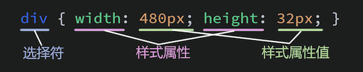

- HTML：结构层
- CSS：渲染层
- JavaScript：行为层

# # 简介

CSS，全称“Cascading Style Sheets （层叠样式表）”，用于设置HTML标签的样式，它的基本结构如下：



> 1. 语法解释：
>
> - 选择符：用于选取要设置样式的标签
> - 样式属性：要设置什么样式
> - 样式属性值：要设置的样式呈现什么效果
>
> 2. 注意：每一条样式后面必须加分号`;`

# # 引入方式

使用样式表主要 有4种方式，即，“行内样式”、“内嵌样式”、“外链样式”、“导入式”。

## 1、行内样式 *

是将 “style” 作为一个标签的属性，然后通过它的值来设置样式。写法如下：

```html
<div style="width: 300px; height: 300px; background-color: red;"></div>
```

## 2、内嵌样式 *

是将 **style** 作为一个标签，然后在标签内通过样式选择符设置样式。

```html
<!DOCTYPE html>
<html lang="zh-CN">
<head>
	<meta charset="UTF-8">
	<title>Document</title>
	<!-- 内嵌样式 -->
	<style type="text/css">
		div { width:  300px; height: 300px; background-color: red; }
	</style>
</head>
<body>
	<div></div>
</body>
</html>
```

## 3、外链样式 *

将样式单独放置在一个`.css`文件，然后在页面中通过 `<link>` 标签的 `href` 属性引入该样式文件。这样做的目的为了抽离CSS，便于维护和管理。

```html
<!-- index.html -->
<!DOCTYPE html>
<html lang="zh-CN">
<head>
	<meta charset="UTF-8">
	<title>Document</title>
	<!-- 外链样式 -->
	<link rel="stylesheet" href="./css/index.css">
</head>
<body>
	<div></div>
</body>
</html>
```

```css
/*index.css*/

@charset "UTF-8";

div {
	width:  300px;
	height: 300px;
	background-color: red;
}
```

> 注意：css文件第一行代码需指定字符编码格式，防止出现乱码：`@charset "utf-8";`

## 4、导入式

该方法是在\<style>标签的内容里通过 `@import` 方法来导入外部CSS文件，这点和通过\<link>标签导入外部样式是一样的，但其它方面却有很大不同。这种方式的写法是：

```html
<!DOCTYPE html>
<html lang="zh-CN">
<head>
	<meta charset="UTF-8">
	<title>Document</title>
	<style type="text/css">
		@import("./css/index.css");
	</style>
</head>
<body>
	<div></div>
</body>
</html>
```

\# 外链（ `link` ）与导入（ `@import` ）同是外部引用的方式，但他们却有以下区别:

1. \<link> 除了加载 CSS 文件以外，它还能加载其它类型文件，如“icon”、“index”、“rss”等，它还能通过将“rel”的值设置为“prefetch”执行文件的预加载，而“@import”只能加载CSS文件。
2. \<link> 在现代的浏览器中是多线程加载的，也就是说在通过该标签加载一个文件的时候\<body>标签内的 DOM（文档对象模型） 也在执行同步的加载。而“@import”是一种“线性”的加载，加载效率不如\<link>的方式。
3. 无论在老版本的浏览器中，或者在一些非主流的浏览器中，页面都是会首先加载\<link>标签引用的样式并渲染，而“@import”在这些浏览器中会最后才去渲染CSS的样式，这样会让用户首先看到一个无样式的HTML界面，等CSS渲染完成之后才能最终看到完整样式的界面，导致用户体验不佳。
4. \<link>作为一个标签，也就是一个DOM元素，是可以通过JavaScript进行操作的（如增加、删除\<link>标签，修改\<link>的属性值等）。而“@import”写在\<style>标签内部或CSS文件内（写在\<style>标签内和CSS文件内的写法一致），是无法通过JavaScript进行操作的。

> 结论：
>
> 通过上述对比可以知道，\<link>无论是性能上、显示顺序上还是在可操作性上来讲都是优于“@import”的。所以，如果我们要使用外部样式，那基本上都是通过\<link>标签来引用的。

# # 通过< link >标签引用CSS文件

在实际的项目开发过程中，我们一般都是将CSS单独存放在一个文件夹中，然后在HTML页面中通过 如下形式进行引用。

```html
<link rel="stylesheet" href="样式表路径+名称.css">
```

引用后CSS文件仍然是独立的，不会受到包括HTML和JavaScript任何方法和函数的影响，如果CSS文件中涉及到文件路径的相对位置，那么也是以CSS文件所在的文件路径位置为准，而非引用它的HTML文件的文件路径位置。

相对于“行内样式”和“内嵌样式”而言，“外链样式”即通过\<link>标签引用CSS样式有以下好处：

1. 简化了DOM结构，实现了内容和表现的分离，使HTML和CSS文件结构更加清晰，利于维护
2. 大大减少了CSS代码的编写量。项目越大，这一点体验得越明显
3. \<link>可以和其它\<link>、JS文件以及\<body>内的内容进行多线程加载，使得加载速度更快
4. 利于项目整体风格的调整，维护起来也更加便捷。单文件修改，全网站（应用）生效
5. 浏览器会将CSS文件进行缓存，进一步地减少了加载所需时间
6. 可以根据需要利用JavaScript或Media动态的组合所需的CSS文件
7. 对搜索引擎友好，有利于SEO

# # 引用优先级

以上四种样式的引用方式，按照优先级从高到低排列分别是：

```
行内样式 > 内嵌样式 > 外链样式 > 导入样式
```

为了便于记忆，我们可以这样理解：越是离我们要设置样式标签元素近的CSS样式，那优先级越高，反之，优先级越低。当然在这里需要明白的是，CSS样式的引用优先级没有优先级越高越好或者优先级越低越好的说法，我们是要利用样式优先级这一特性，在是我们写更少的CSS代码同时，又使我们的Web页面表现力更加丰富。

另外，通过 `!important` 可以提升样式的优先级，如下所示：

```css
.title {
  	color: blue !important;
}
```


