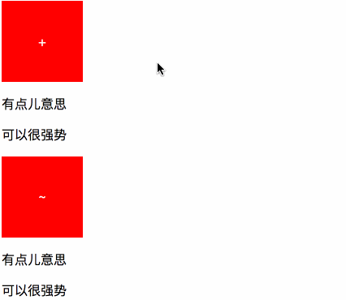

# # 概述

在 CSS 中，选择器（ `Selector` ）是一种模式，用于选择需要添加样式的元素。

# # 基础选择器

## 01. 标签选择器

一个完整的HTML页面是有很多不同的标签组成，而标签选择器，则是决定哪些标签采用相应的CSS样式，写法如下：

```css
div  { width:  300px; height: 300px; background-color: red; }
p    { text-indent: 2em; color: blue; }
span { letter-spacing: 5px; font-size: 20px; }
```

## 02. 类选择器

类选择器（ *“class 选择器”* ）根据类名来选择，而这个类名是自定义的，但我们在定义这个类名的时候也应该尽量能反应被设置元素的实际功能。同一个类名的选择器理论上可以被任意多的标签元素使用。在CSS中，定义类名选择器应该以 `.` 作为开头，否则，浏览器将视为你自定义的标签名，写法如下：

```css
.box  { width:  300px; height: 300px; background-color: red; }
p.des { text-indent: 2em; color: blue; }
```

需要注意的是，由于类名可以被任意多的标签元素使用，因此当你需要为特定标签类名设置样式的时候，可以在 `.` 之前指定标签名，这样就可以选中你要设置的对应的标签名中拥有该class的元素了，如上述示例中的 *“p.des { … }”*  即表示选择所有p标签中类名为`des`的元素。

## 03. ID 选择器

ID 选择器即根据元素的ID属性值来选取元素，和类选择器类似，但值得注意的是，ID表示唯一标识符，即同一个页面只能出现一个ID。定义一个ID选择器以`#` 开头，如下所示：

```css
#box { width:  300px; height: 300px; background-color: red; }
#des { text-indent: 2em; color: blue; }
```

## 04. 通用选择器

通用选择器使用 `*`  表示，它的作用是选择页面中所有的标签元素。但业内很多Web前端优化师都认为该选择符存在性能问题，而且它一旦使用后父选择器与后代选择器的搭配容易出现浏览器不能解析的情况，所以一般在高质量的Web页面中基本是看不到该选择符的，就算是平时也不推荐大家使用。

## 05. 后代选择器

后代选择器是对某元素所嵌套的指定元素进行选择，每个选择符之间用 **空格** 进行分割，多个嵌套层次应该以多个空格进行分割。如下所示：

```html
<div class="container">
    <article>
        <h1>Napoléon Bonaparte</h1>
        <p>Adversity is the midwife of genius.</p>
    </article>
</div>
```

```css
/*index.css*/
.container article { text-align: center; }
.container h1 { color: #000000; }
.container p  { color: #008800; }
```

## 06. 子类选择器

子选择器区别于后代选择器的地方就是，后代选择器可以选择嵌套在标签内部任意层级的标签元素，而子选择器只能选择当前标签往内一层的元素，即直接子元素。每个选择符之间用 `>` 进行分割，如下示例：

```html
<header>
	
	<nav>
		<ul class="menu-list">
			<li><a href="javascript:;">首页</a></li>
			<li><a href="javascript:;">新闻</a></li>
			<li><a href="javascript:;">科技</a></li>
			<li><a href="javascript:;">社会</a></li>
		</ul>
	</nav>
</header>
```

```css
/*index.css*/
header > img { width:  80px; height: 30px; }
header > nav > ul.menu-list { list-style: none; }
```

## 07. 伪类选择器

伪类选择器和其它选择器有所不同，它是通过触发一定的事件来实现效果，也就是说如果不进行任何操作是看不到该选择器的CSS样式设置的。以Google Chrome浏览器开发者工具为例，要想看到所设置的伪类选择器样式需通过：点击 **Element** 选项栏下 **Style** 选项栏中的  **:hov** 按钮，然后勾选需要查看的操作事件进行样式查看。目前支持的操作事件有，“hover”, “active”，“visited”和“focus”:

- :hover  -> 鼠标悬浮于该元素上设置的样式
- :active  -> 鼠标悬点击时该元素上设置的样式
- :visited -> 鼠标悬点击后该元素上设置的样式（不建议使用）
- :focus   -> 表单元素获得焦点后设置的样式

```css
a { text-decoration: none; }		
a:hover { text-decoration: underline;}
```

## 08. 群组选择器

群组选择器的使用范畴是，多个选择器使用同一个样式或者同一组样式。这在做CSS样式初始化，CSS框架设计以及后期CSS代码优化时会经常使用。

```html
<a href="javascript:;">超链接</a>
<div>布局标签</div>
<span>文本标签</span>
<p>段落标签</p>
```

```css
/*index.css*/
a, div, span, p { font-size: 20px; }
div, p { margin:  0; padding: 0; }
```

## 09. 同级元素选择器

该选择器能选定当前选择器同级的其它指定选择器，平时虽使用的不多，但配合伪类选择器经常可以做出一些很有“新意”的效果，也能减少对JavaScript的依赖。同级元素有两种：

- `+` ：选择该选择器相邻的下一个选择器。
- `~`：选择该选择器后的所有同级选择器。

```html
<!-- + -->
<section class="t1">
	<div class="box">+</div>
	<p>有点儿意思</p>
	<p>可以很强势</p>
</section>

<!-- ~ -->
<section class="t2">
	<div class="box">~</div>
	<p>有点儿意思</p>
	<p>可以很强势</p>
</section>
```

```css
/*index.css*/
section div.box { 
	width:  100px;
	height: 100px;
	background-color: red;

	/*文本水平居中对齐*/
	text-align: center;
	/*line-height = height：文本垂直居中对齐*/
	line-height: 100px;
	/*字体颜色*/
	color: white;
	/*设置光标样式*/
	cursor: pointer;
}

section p {
	/*转场效果*/
	transition: all .25s linear;
}

.t1>.box:hover + p {
	/*左边距*/
	margin-left: 200px;
}

.t2>.box:hover ~ p {
	/*左边距*/
	margin-left: 200px;
}
```

  效果示例：



## 10. 属性选择器

该选择器所针对的既不是某个标签，也不是类名，或者ID，它是将一个标签的属性作为选择器来使用，最常用的地方就是涉及到属性多而杂的表单元素。其语法形式为：

```css
[attr] {
    ....
}
```

该选择器的定义方式如下：

- `[attr] {…}`：用于选取带有指定属性的元素
- `[attr  = val] {…}`：用于选取带有指定属性和值的元素
- `[attr ~= val] {…}`：用于选取属性值中包含指定词汇的元素
- `[attr |= val] {…}`：用于选取带有以指定值开头的属性值的元素，该值必须是整个单词
- `[attr ^= val] {…}`：匹配属性值以指定值开头的每个元素
- `[attr $= val] {…}`：匹配属性值以指定值结尾的每个元素
- `[attr *= val] {…}`：匹配属性值中包含指定值的每个元素


