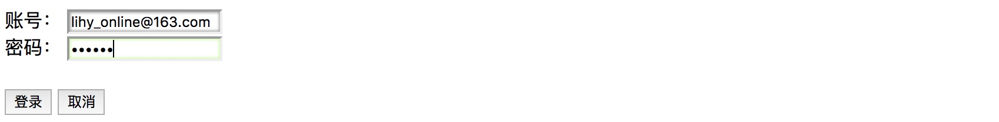
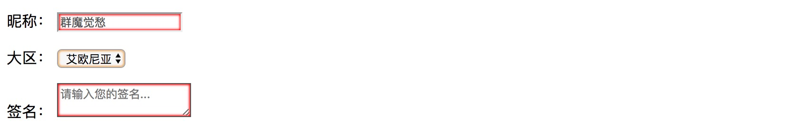
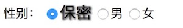
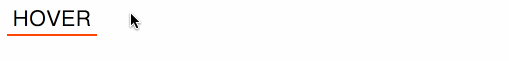
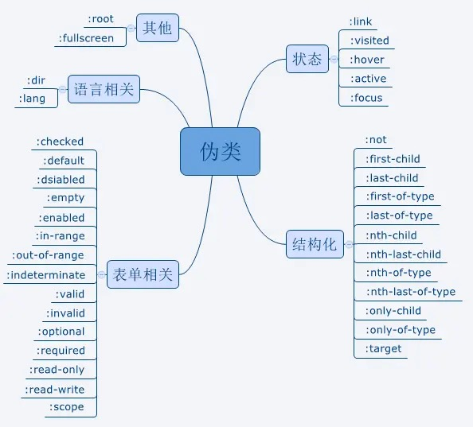

# 概述

CSS 高级选择器不同于普通选择器，它通过更复杂的条件（如结构、索引、状态等）选择元素，而不仅仅依赖可见的标签名、属性或简单操作条件（如悬浮、点击等）。

高级选择器大多诞生于 CSS3，旨在简化精准选择元素，提升 HTML 的语义化和可读性，同时优化 SEO。正确运用这些选择器，不仅增强网站功能和表现力，还能改善用户体验，留下深刻印象。

# 伪类选择器

CSS **[伪类](https://developer.mozilla.org/zh-CN/docs/Web/CSS/Pseudo-classes)** 是添加到选择器的关键字，用于指定所选元素的特殊状态。例如，伪类 :hover 可以用于选择一个按钮，当用户的指针悬停在按钮上时，设置此按钮的样式。

伪类选择器不同于其他选择器，它通过触发特定事件（如悬浮、点击、焦点等）来应用样式，未触发时无法直接看到效果。在 Google Chrome 开发者工具中，可以通过点击 **Element** 面板的 **Style** 选项卡下的 **:hov** 按钮，勾选对应的伪类事件来查看样式。

伪类由冒号（`:`）后跟着伪类名称组成（例如，`:hover`）。函数式伪类还包含一对括号来定义参数（例如，`:dir()`）。附上了伪类的元素被定义为锚元素（例如，`button:hover` 中的 `button`）。

> **备注**： 相较于伪类，伪元素可用于设置元素特定部分的样式。

## 鼠标操作伪类

- `:hover`：当鼠标悬浮在元素上时应用的样式。
- `:active` ：鼠标按下激活元素时应用的样式。
- `:visited`：当链接被访问后应用的样式（仅适用于 \<a> 元素）。

比如：

```css
div:hover {
    color: blue;
}
```

> 解读：当鼠标悬浮在div元素上时，字体颜色变成蓝色。

## 结构化伪类

结构化伪类选择器用于根据元素的“索引值”或“匹配类型”精准定位到同级中的指定元素。它的格式通常是“基本选择器”（如后代选择器、自选择器、同级选择器）或“属性选择器”（包括带条件的属性选择器）与“结构性伪类选择器”的组合。主要形式包括以下几种：

### :first-child *

对该类所有父元素中的首个子元素进行选择。

```html
<section>
    <p>江山如此多娇，引无数英雄竞折腰。</p>
    <p>江山如此多娇，引无数英雄竞折腰。</p>
    <p>江山如此多娇，引无数英雄竞折腰。</p>
</section>
```

```css
section {
    border: 1px solid #808080;
    border-radius: 5px;

    text-align: center;
}
section > p:first-child {
    color: #800080;
    font-size: 18px;
    letter-spacing: 5px;
}
```


### :last-child *

对该类所有父元素中的最后一个子元素进行选择。

```html
<section>
    <p>江山如此多娇，引无数英雄竞折腰。</p>
    <p>江山如此多娇，引无数英雄竞折腰。</p>
    <p>江山如此多娇，引无数英雄竞折腰。</p>
</section>
```

```css
section {
    border: 1px solid #808080;
    border-radius: 5px;

    text-align: center;
}
section > p:last-child {
    color: #800080;
    font-size: 18px;
    letter-spacing: 5px;
}
```


### :first-of-type

对该类所有父元素中的首个匹配到类型的子元素进行选择。

```html
<div class="wrap">
    <section>
        <h3>江山如此多娇，引无数英雄竞折腰。</h3>
        <p>江山如此多娇，引无数英雄竞折腰。</p>
        <p>江山如此多娇，引无数英雄竞折腰。</p>
    </section>
    <hr width="80%" color="red">
    <article>
        <h3>江山如此多娇，引无数英雄竞折腰。</h3>
        <p>江山如此多娇，引无数英雄竞折腰。</p>
        <p>江山如此多娇，引无数英雄竞折腰。</p>
    </article>
</div>
```

```css
div.wrap {
    border: 1px solid #808080;
    border-radius: 5px;

    text-align: center;
}
section > h3:first-of-type {
    color: #800080;
    letter-spacing: 5px;
}
article > p:first-of-type {
    color: #800080;
    font-size: 18px;
    letter-spacing: 5px;
}
```


### :last-of-type

对该类所有父元素中的最后一个匹配到类型的子元素进行选择。

```html
<div class="wrap">
    <section>
        <h3>江山如此多娇，引无数英雄竞折腰。</h3>
        <p>江山如此多娇，引无数英雄竞折腰。</p>
        <h3>江山如此多娇，引无数英雄竞折腰。</h3>
    </section>
    <hr width="80%" color="red">
    <article>
        <p>江山如此多娇，引无数英雄竞折腰。</p>
        <h3>江山如此多娇，引无数英雄竞折腰。</h3>
        <p>江山如此多娇，引无数英雄竞折腰。</p>
    </article>
</div>
```

```css
div.wrap {
    border: 1px solid #808080;
    border-radius: 5px;

    text-align: center;
}
section > h3:last-of-type {
    color: #800080;
    letter-spacing: 5px;
}
article > p:last-of-type {
    color: #800080;
    font-size: 18px;
    letter-spacing: 5px;
}
```


### :only-child

对该类所有父元素中只含有唯一所匹配（不包含同级元素/只有一个子元素）的子元素进行选择。

```html
<div class="wrap">
    <section>
        <p>江山如此多娇，引无数英雄竞折腰。</p>
    </section>
    <hr width="80%" color="red">
    <section>
        <p>江山如此多娇，引无数英雄竞折腰。</p>
        <p>江山如此多娇，引无数英雄竞折腰。</p>
    </section>
</div>
```

```css
div.wrap {
    border: 1px solid #808080;
    border-radius: 5px;

    text-align: center;
}

section > p:only-child {
    color: #800080;
    font-size: 18px;
    letter-spacing: 5px;
}
```


### :only-of-type

对该类所有父元素中只含有唯一所匹配类型的子元素进行选择。

```html
<div class="wrap">
    <section>
        <p>江山如此多娇，引无数英雄竞折腰。</p>
        <h3>江山如此多娇，引无数英雄竞折腰。</h3>
        <p>江山如此多娇，引无数英雄竞折腰。</p>
    </section>
    <hr width="80%" color="red">
    <article>
        <h3>江山如此多娇，引无数英雄竞折腰。</h3>
        <p>江山如此多娇，引无数英雄竞折腰。</p>
        <h3>江山如此多娇，引无数英雄竞折腰。</h3>
    </article>
</div>
```

```css
div.wrap {
    border: 1px solid #808080;
    border-radius: 5px;

    text-align: center;
}
section > h3:only-of-type {
    color: #800080;
    letter-spacing: 5px;
}
article > p:only-of-type {
    color: #800080;
    font-size: 18px;
    letter-spacing: 5px;
}
```


### :nth-child(n) *

对其父元素的第 `n` 个子元素进行选择，通过设置参数 `n` 指定为第几个元素。

```html
<section>
    <p>江山如此多娇，引无数英雄竞折腰。</p>
    <p>江山如此多娇，引无数英雄竞折腰。</p>
    <p>江山如此多娇，引无数英雄竞折腰。</p>
</section>
```

```css
section {
    border: 1px solid #808080;
    border-radius: 5px;

    text-align: center;
}
section > p {
    font-size: 18px;
    letter-spacing: 5px;
}
section > p:nth-child(1) {
    color: red;
}
section > p:nth-child(2) {
    color: green;
}
section > p:nth-child(3) {
    color: blue;
}
```


该选择器不仅能准确的匹配到第几个指定类型的元素，还能对匹配类型元素的 **奇偶索引值** 进行选择。`odd` 表示奇数，`even` 表示偶数。

```html
<article>
    <section></section>
    <section></section>
    <section></section>
    <section></section>
    <section></section>
    <section></section>
</article>
```

```css
article > section {
    height: 35px;
}
article > section:nth-child(odd) {
    background-color: darkgray;
}
article > section:nth-child(even) {
    background-color: lightgrey;
}
```


除此之外，*`:nth-child(n)`* 这个结构性伪类选择器的参数还具备运算特性，如：

```html
<article>
    <section></section>
    <section></section>
    <section></section>
    <section></section>
    <section></section>
    <section></section>
</article>
```

```css
article > section {
    height: 35px;
    background-color: lightgrey;
    margin: 1px;
}
article > section:nth-child(3n - 1) {
    background-color: darkgray;
}
```


这样的参数我们叫做 **带增量计算** 的参数，参数内的 `n` 是一个增量，它从 `0` 开始计数，每次 `+1`。如上代码：

- 第一次生效时机是“3 \* 0 - 1”（计算结果小于1），无效；
- 第二次生效时机是“3 \* 1 - 1”，为第2个；
- 第三次生效时机是“3 * 2 - 1”，为第5个，
- 以此类推...

### :nth-last-child(n)

该选择器和 *`:nth-child(n)`*  的特性基本一致，唯一的不同点就是该选择器的索引值是从该选择器匹配到的元素的同级元素中的最后一个开始进行计算的。主要运用范畴是，当这些标签元素是动态生成的，也就是说生成数量不固定的时候，用 *`:nth-last-child(n)`* 能精确的定位到同级元素中的最后一个（这里使用 *`:last-child`* 会更简便）、最后几个，或从最后开始有选择地进行计数选择。

###  :nth-of-type(n)

如果你对 *`:first-of-type`*、*`:last-of-type`*、*`:only-of-type`* 以及 *`:nth-child(n)`* 这几个选择器已经有足够深的理解了，现在应该不难猜到 *`:nth-of-type`* 的作用了，该选择器是对匹配标签类型的同级元素进行选择。

```html
<article>
    <section></section>
    <p></p>
    <section></section>
    <p></p>
    <section></section>
    <p></p>
    <section></section>
</article>
```

```css
article {
    height: auto;
    border: 1px solid #808080;
    border-radius: 5px;

  	overflow: hidden;
  
    display: flex;
    justify-content: space-between;
}

article > section, article > p {
    width:  100px;
    height: 45px;

    margin: 0; padding: 0;
    background-color: red;
}

article > p:nth-of-type(2) {
    background-color: blue;
}
```


###  :nth-last-of-type(n)

该选择器和 *`:nth-of-type(n)`* 的特性基本一致，不过计算方式也和 *`nth-last-child(n)`* 一样，是从最后一个开始计数，这里就不再赘述。

### :root

该选择器选择HTML页面的根节点元素，也就是\<html>标签。该选择符不能选择任何其它HTML文档内的标签，只能单独使用，对应的CSS代码如下：

```css
:root {
  	...
}
```

### :empty

该选择器会匹配所有，或指定基本选择器内没有元素（没有子节点）的标签元素。

```html
<article>
    <p>曾经沧海难为水，除却巫山不是云。</p>
</article>
<div></div>
<section>
    <p>曾经沧海难为水，除却巫山不是云。</p>
</section>
```

```css
div.wrap {
    border: 1px solid #808080;
    border-radius: 5px;

    display: flex;
    flex-flow: column wrap;
    justify-content: center;
    align-items: center;
}

:empty {
    width: 400px;
    height: 30px;
    border: 1px solid red;
    border-radius: 5px;
}
```


### :not(selector) *

该选择器是用于排除指定元素的选择器。

```html
<div class="wrap">
    <p>曾经沧海难为水，除却巫山不是云。</p>
    <p class="special">曾经沧海难为水，除却巫山不是云。</p>
    <p>曾经沧海难为水，除却巫山不是云。</p>
</div>
```

```css
div.wrap {
    border: 1px solid #808080;
    border-radius: 5px;

    text-align: center;
}

div.wrap > p:not(.special) {
    font-size: 18px;
    letter-spacing: 5px;
    color: #800080;
}
```


## 表单类

该类选择器的选择依据主要是页面内标签元素的状态发生改变时所触发的选择状态改变。如：表单元素的“**读写状态**”、“**值状态**”，各类元素的“**选中状态**”等。“UI元素状态伪类选择器” 主要有以下内容：

### :focus

表单元素获得焦点后设置的样式

### :read-only/:read-write

当标签元素为只读状态时，触发 *`:read-only`* 选择器。当标签元素为可写状态时，触发 *`:read-write`* 选择器。通常用于 *`<input />`* 和 *`<textarea />`*。在FireFox（火狐）浏览器中的写法为 *`-moz-read-only`*。

```html
<form action="#" name="myForm">
    <label for="">账号：</label>
    <input type="text" value="lihy_online@163.com" readonly><br>
    <label for="">密码：</label>
    <input type="password" value="123456"><br><br>

    <button type="submit">登录</button>
    <button type="button">取消</button>
</form>
```

```css
[name="myForm"] > input:read-only {
    box-shadow: 0px 0px 2px 1px rgba(0, 0, 0, .35) inset;
}
[name="myForm"] > input:read-write {
    outline: none;
    box-shadow: 0px 0px 2px 1px rgba(134, 234, 34, .35) inset;
}
```



### :enabled/:disabled

当标签元素为可用状态时，触发 *`:enabled`* 选择器，当标签元素为不可用状态时，触发 *`:disabled`* 选择器，通常用于 *`<input />`* 、 *`<textarea />`* 和 *`<select />`* 标签。

```html
<form action="#" name="myForm">
    <p>
        <label for="">昵称：</label>
        <input type="text" value="群魔觉愁" disabled>
    </p>

    <p>
        <label for="">大区：</label>
        <select>
            <option value="0">艾欧尼亚</option>
            <option value="1">诺克萨斯</option>
            <option value="2">班德尔城</option>
            <option value="3">战争学院</option>
        </select>
    </p>

    <p>
        <label for="">签名：</label>
        <textarea placeholder="请输入您的签名..." disabled></textarea>
    </p>
</form>
```

```css
[name="myForm"]  input:disabled, [name="myForm"] textarea:disabled {
    box-shadow: 0px 0px 2px 1px #ff0000 inset;
}

[name="myForm"] select:enabled {
    box-shadow: 0px 0px 2px 1px rgba(234, 134, 34, .75) inset;
}
```



### :checked

当表单元素的值处于 `checked`（被选中）状态时，触发该选择器，通常用于 \<input> 标签的 `type` 属性为 `checkbox` 和 `radio` 的表单元素。在FireFox浏览器中的写法为 *`-moz-checked`*。

```html
<form action="#" name="myForm">
    <label>性别：</label>
    <input type="radio" name="gender" id="secret" checked><label for="secret">保密</label>
    <input type="radio" name="gender" id="male"><label for="male">男</label>
    <input type="radio" name="gender" id="women"><label for="women">女</label>
</form>
```

```css
[name="myForm"]  > [type="radio"]:checked + label {
    font-size: 20px;
    text-shadow: 1px 1px 2px #000;
}
```



### :default

当表单元素的值处于默认选中状态时，触发该选择器，通常用于\<input> 标签的 `type` 属性为 `checkbox` 和 `radio` 的表单元素。老版本的webkit和IE（edge）不支持该选择器，其它主流浏览器均支持该选择器。

### :indeterminate

当一个\<input>标签的 `type` 属性为 `checkbox` 或 `radio` 的表单元素都处于 **半选中** 状态时，触发该选择器。该状态选择器的值目前只能通过JavaScript进行设置。

# 伪元素

[伪元素]((https://developer.mozilla.org/zh-CN/docs/Web/CSS/Pseudo-elements)) 是一个附加至选择器末的关键词，允许你对被选择元素的特定部分修改样式。下例中的 ::first-line 伪元素可改变段落首行文字的样式。

## ::first-letter *

选择“块级元素”文本段落中的首个字符，只能对“块级元素”生效。

```html
<p>天将降大任于斯人也，必先苦其心志，劳其筋骨，饿其体肤，空乏其身，行拂乱其所为也，所以动心忍性，增益其所不能。 </p>
```

```css
p::first-letter {
    border: 1px solid #808080;
    border-radius: 5px;
    padding: 5px 10px;
    font-size: 30px;
    text-shadow: 2px 2px 3px #000;
    margin: 10px;
}
```


## ::first-line

选择“块级元素”文本段落中的首行文本，只能对“块级元素”生效。

```html
<p>天将降大任于斯人也，必先苦其心志，劳其筋骨，饿其体肤，空乏其身，行拂乱其所为也，所以动心忍性，增益其所不能。 </p>
```

```css
p::first-line {
    font-size: 36px;
    letter-spacing: 10px;
    color: #800080;
    text-shadow: 1px 1px 2px #000;
    text-decoration: underline;
}
```


## ::before *

在指定的选择器之前插入一段内容。插入的内容默认为“行内元素”，可以通过“display”强制转换显示类型。

```html
<p>蜡笔小新</p>
```

```css
p {
    letter-spacing: 5px;
    font-size: 25px;
    color: #ff4500;
    text-shadow: 1px 1px 2px #000;
}
p::before {
    /*插入内容，这里以插入图片为例*/
    content: url('xiaoxin.jpg');

    position: relative;
    top: 20px;
}
```


> 提示：如果需要插入文本字符串，则直接将字符串赋值给 `content` 属性，如：`content: 'Hello, world!'`

## ::after *

在指定的选择器之后插入一段内容，使用方式和“::before”一样。插入的内容默认也是为“行内元素”，同样可以通过“display”强制装换显示类型。

```html
<p>蜡笔小新</p>
```

```css
p {
    letter-spacing: 5px;
    font-size: 25px;
    color: #ff4500;
    text-shadow: 1px 1px 2px #000;
}
p::after {
    /*插入内容，这里以插入图片为例*/
    content: url('xiaoxin.jpg');

    position: relative;
    top: 20px;
}
```


> 提示：如果需要插入文本字符串，则直接将字符串赋值给 `content` 属性，如：`content: 'Hello, world!'

使用“::before”和“::after”伪元素选择器不仅能为指定的元素添加文字、图片和各种利用“width”、“height”、“border”制作出来的形状，甚至还能添加音频、视频这些多媒体文件，而且具有高度自定义性。

## ::selection

该选择器是用于当页面内的各种元素被选中时所触发的样式。在FireFox浏览器中的写法为“::-moz-selection”，且不能用群组选择器的方式来使用。（用鼠标选择该段查看效果）

## ::input-plachehoder

修改表单占位符颜色

```css
::-webkit-input-placeholder {
    color: #769bff;
}
```

## ::-webkit-scrollbar

```css
/*设置滚动条*/
body::-webkit-scrollbar {
    width: 20px;
}
/*设置滚动条拇指元素*/
body::-webkit-scrollbar-thumb:vertical {
    border-radius: 5px;
    background: #d3d3d3;
}

/*设置滚动条背景元素*/
body::-webkit-scrollbar-track-piece:vertical  {
    border-radius: 5px;
    background: #808080;
}
```

# 扩展 *

## content 属性 attr 

```html
<div data-msg="Open this file in Github Desktop.">HOVER</div>
```

```css
div {
    position: relative;

    width: 100px;
    padding-bottom: 1px;
    border-bottom: 2px solid #ff4500;

    font-size: 1.5em;
    letter-spacing: 1px;
    text-align: center;
    cursor: pointer;
}
div:hover:after {
    position: absolute;
    top: calc(100% + 5px);
    left: 0;

    width: 250%;

    font-size: .5em;
    background: #ff4500;
    content: attr(data-msg);
}
```



> 代码解读：在设置伪类 `:after` 内容时，通过 *`attr()`* 抓取标签属性值。

## **CSS 选择器优先级权重规则**

| 选择器类型   | 示例                  | 权重             |
| ------------ | --------------------- | ---------------- |
| 内联样式     | `style="color: red;"` | 1000             |
| id 选择器    | `#id`                 | 100              |
| 类选择器     | `.classname`          | 10               |
| 属性选择器   | `input[type='text']`  | 10               |
| 伪类选择器   | `li:last-child`       | 10               |
| 标签选择器   | `div`                 | 1                |
| 伪元素选择器 | `li::after`           | 1                |
| 组合选择器   | `ul > li a`           | 累加子选择器权重 |
| 通配符选择器 | `*`                   | 0                |

### 优先级规则

1. **权重相加**

   选择器的权重是各组成部分的权重累加。例如：

   ```css
   div.classname#id { color: red; }
   ```

   权重为 1（标签选择器） + 10（类选择器） + 100（id 选择器） = 111。

2. **最后定义的规则生效**

   如果权重相同，则后定义的样式优先级更高。

3. `!important` **的优先级**

   `!important` 声明的样式会覆盖所有非 `!important` 的样式。

   如果多个 `!important` 样式冲突，则按权重和来源规则解析。

### 注意点

1. **通配符选择器（*****）** 本身没有权重，权值为 0。

2. **组合选择器** 如 >（子选择器）、+（相邻兄弟选择器）、~（普通兄弟选择器）不增加权重，但它们的组成部分会累加。例如：

   ```css
   ul > li { color: red; }
   ```

   ul 是标签选择器，权重为 1。

   li 是标签选择器，权重为 1。

   权重为 1 + 1 = 2。

3. **伪类和伪元素选择器的区别**

   **伪类选择器**（如 :hover、:nth-child）的权重是 10。

   **伪元素选择器**（如 ::before、::after）的权重是 1。

# 总结




