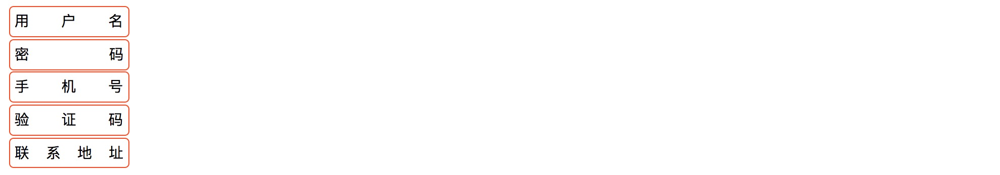
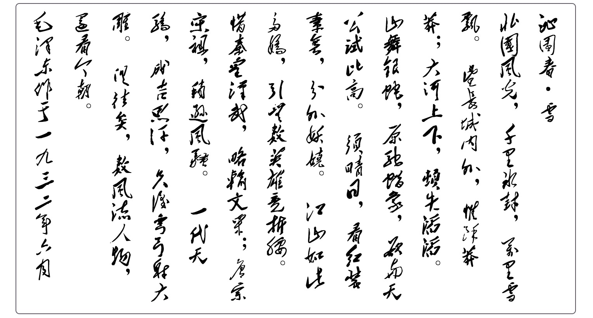

# # 概述

文本在HTML页面中是最基本的表现形式，通过文本能最有效而详细的说明网页中的内容。但若不对页面中的文本做任何处理，那会给用户浏览带来一些不好的体验。如果通过CSS对文本进行设置后，不仅让用户浏览体验更佳的好，也会让页面的美观程度提升一个高度。

# # 文本设置 *

## 01. [text-align](https://developer.mozilla.org/zh-CN/docs/Web/CSS/text-align)

文本对其方式

```css
text-align: left | right | center;
```

## 02. [text-indent](https://developer.mozilla.org/zh-CN/docs/Web/CSS/text-indent)

段落首行缩进2个字符

```css
 text-indent: 2em;
```

## 03. [text-decoration](https://developer.mozilla.org/zh-CN/docs/Web/CSS/text-decoration)

文本装饰线

```css
text-decoration: none | underline | overline | line-through;
```

## 04. [text-transform](https://developer.mozilla.org/zh-CN/docs/Web/CSS/text-transform)

大小写转换

```css
text-transform:none | capitalize | uppercase | lowercase;
```

## 05. [text-shadow](https://developer.mozilla.org/zh-CN/docs/Web/CSS/text-shadow)

文本阴影

```css
text-shadow: H V blur color;
```

- H：水平偏移，“0”表示维持原位，正数为向右偏移，负数为向左偏移。单位为像素“px”。
- V：垂直偏移，“0”表示维持原位，正数为向下偏移，负数为向上偏移。单位为像素“px”。
- blur  ：模糊距离，用 **正数** 表示阴影模糊的单位距离，距离越大模糊程度越高。单位为像素“px”。
- color：阴影颜色，支持Web技术中的常用颜色模式：“颜色英文单词”、“HEX”、“RGBa”、“HSLa”。

```html
<p style="text-shadow: 2px 2px 5px #000;">Hello, World!</p>
```

## 06. [line-height](https://developer.mozilla.org/zh-CN/docs/Web/CSS/line-height)

文本行高

```css
line-height: normal | <length>
```

## 07. [word-spacing](https://developer.mozilla.org/zh-CN/docs/Web/CSS/word-spacing) 

单词间距

```css
word-spacing: normal | <length>
```

## 08. [letter-spacing](https://developer.mozilla.org/zh-CN/docs/Web/CSS/letter-spacing)

字符间距

```css
letter-spacing: normal | <length>
```

## 09. [white-space](https://developer.mozilla.org/zh-CN/docs/Web/CSS/white-space) 

空格换行处理

```css
white-space: normal | nowrap | pre | pre-wrap | pre-line | break-spaces
```

## 10. [text-overflow](https://developer.mozilla.org/zh-CN/docs/Web/CSS/text-overflow)

文本裁切

```css
text-overflow: clip | ellipsis;
```

> 提示：该属性不能单独使用，必须要配合文本换行处理属性“white-space”和内容溢出处理属性“overflow”来使用，否则会达不到所期望的效果。


## 11. [overflow-wrap](https://developer.mozilla.org/zh-CN/docs/Web/CSS/overflow-wrap)

用来说明当一个不能被分开的字符串太长而不能填充其包裹盒时，为防止其溢出，浏览器是否允许这样的单词中断换行。

```css
overflow-wrap: normal | break-word;
```

## 12. [color](https://developer.mozilla.org/zh-CN/docs/Web/CSS/color)

文本颜色

```css
color: <named-color> | <hex-color> | <rgb()> | <hsl()> | transparent | inherit
```

## 13. [word-break](https://developer.mozilla.org/zh-CN/docs/Web/CSS/word-break)

单词内断行

```css
word-break：normal | break-all | keep-all
```

# # 字体设置 *

## 01. [font-style](https://developer.mozilla.org/zh-CN/docs/Web/CSS/font-style) 

字体样式

```css
font-style: normal | italic | oblique
```

## 03. [font-weight](https://developer.mozilla.org/zh-CN/docs/Web/CSS/font-weight)

字体粗细

```css
font-weight: normal | bold | lighter | bolder | <number>
```

## 04. [font-size](https://developer.mozilla.org/zh-CN/docs/Web/CSS/font-size) 

字体大小

```css
font-size: <number> | <percent> [px | rem | em | vw | vh]
```

## 05. [font-family](https://developer.mozilla.org/zh-CN/docs/Web/CSS/font-family)

```css
font-family: 字体名称;
```

## 06. [font](https://developer.mozilla.org/zh-CN/docs/Web/CSS/font)

`font` 属性用于设置字体样式的组合值写法，其语法形式为：

```css
font: [font-style font-weight] font-size font-family;
font: [font-style font-weight] font-size/line-height font-family;
```

其中，font-style 与 font-weight 为可选项，如果不设置即为默认值 `normal`。

## 07. 自定义字体

语法形式：

```css
@font-face {
  	font-family: '设置字体名称';
  	src: url('字体路径');
}
```

代码示例：

```html
<!--CSS 部分-->
<style type="text/css">

    <!--自定义字体-->
    @font-face {
        /*字体名称*/
        font-family: '经典隶变简';
        /*字体路径*/
        src: url('fonts/经典隶变简.TTF');
    }
    @font-face {
        /*字体名称*/
        font-family: '华文行楷';
        /*字体路径*/
        src: url('fonts/华文行楷.ttf');
    }
    .box {
        width:  200px;
        height: 50px;

        border: 1px solid gray;
        border-radius: 5px;
        margin: 30px auto;

        text-align: center;

    }

    div.t1 {
        font: normal bold 20px/50px '经典隶变简';
    }
    div.t2 {
        font: 20px/50px '华文行楷';
    }

</style>

<!--HTML 部分-->
<div class="box t1">为中华之崛起而编程</div>
<div class="box t2">为中华之崛起而编程</div>
```


> 提示：可以再 [这里](http://font.chinaz.com/) 下载您想要的字体。

## 07. 在线字体/图标

- 有字库：https://www.youziku.com/

- 阿里矢量图：http://www.iconfont.cn/

- Font Awesome：http://fontawesome.dashgame.com/

# # 扩展
## 01. 文字两端对齐 *

  ```html
  <div>用户名</div>
  <div>密码</div>
  <div>手机号</div>
  <div>验证码</div>
  <div>联系地址</div>
  ```

  ```css
  div {

      width: 120px;
      padding: 5px;
      margin:  2px;
      border:  1px solid #ff4500;
      border-radius: 5px;

      text-align-last: justify; /*两端对齐*/
  }
  ```

  

## 02. 纵向显示文字 *

纵向显示文字可通过 `writing-mode` 属性设置，其语法形式为：

```
writing-mode：horizontal-tb | vertical-rl | vertical-lr
```

默认值为：`horizontal-tb`

- horizontal-tb：水平方向自上而下的书写方式。即 left-right-top-bottom（类似IE私有值lr-tb）
- vertical-rl：垂直方向自右而左的书写方式。即 top-bottom-right-left（类似IE私有值tb-rl）
- vertical-lr：垂直方向自左而右的书写方式。即 top-bottom-left-right

```html
<p>
    沁园春·雪<br/>
    北国风光，千里冰封，万里雪飘。
    望长城内外，惟余莽莽；大河上下，顿失滔滔。
    山舞银蛇，原驰蜡象，欲与天公试比高。
    须晴日，看红装素裹，分外妖娆。
    江山如此多娇，引无数英雄竞折腰。
    惜秦皇汉武，略输文采；唐宗宋祖，稍逊风骚。
    一代天骄，成吉思汗，只识弯弓射大雕。
    俱往矣，数风流人物，还看今朝。<br>
    毛泽东作于一九三二年六月
</p>
```

```css
@charset "UTF-8";

@font-face {
    font-family: 'maozedong';
    src: url(../fonts/maozedong.ttf);
}

p {
    width: 700px;
    height: 380px;
    border-radius: 5px;
    border: 1px solid rgba(18,5,25,0.67);
    margin: 0 auto;
    padding: 10px;
  
  
    /*竖排显示文字*/
    /*right to left(从右向左), 从左向右是 writing-mode: vertical-lr;*/
    writing-mode: vertical-rl;  
    /*IE浏览器的从右向左，从左向右是 writing-mode: lr-tb;*/
    writing-mode: tb-rl; /*兼容 IE*/       
    -webkit-writing-mode: vertical-rl; /*兼容 Safari*/
  
    font-family: maozedong;
    /*文字竖排显示的情况下，相当于设置列宽*/
    line-height: 50px;
    letter-spacing: 3px;
    font-size: 26px;
}
```



## 03. 文本溢出 *

```css
div {
  overflow: hidden;
  white-space: nowrap;
  text-overflow: ellipsis;
}

div {
  display: -webkit-box;
  -webkit-box-orient: vertical;
  -webkit-line-clamp: 5; /*显示行数*/
  overflow: hidden;
}
```


