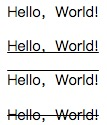
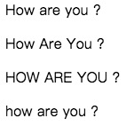
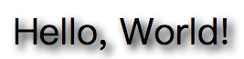
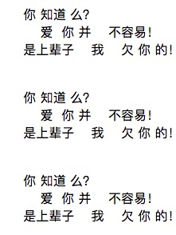
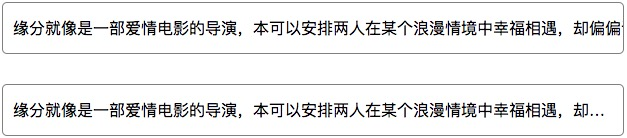
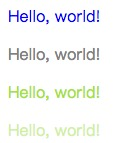
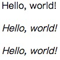
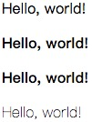
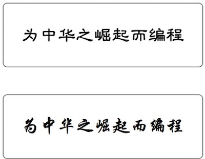

# 一、概述

  文本在HTML页面中是最基本的表现形式，通过文本能最有效而详细的说明网页中的内容。但若不对页面中的文本做任何处理，那会给用户浏览带来一些不好的体验。如果通过CSS对文本进行设置后，不仅让用户浏览体验更佳的好，也会让页面的美观程度提升一个高度。

# 二、文本设置

## 1、文本对齐方式

  `text-align` 属性用于控制“行内块元素”、“块元素”或“行内元素”（文本元素）的居中方式，包含三个值：

- left：局左对齐
- right：居右对齐
- center：居中对齐

## 2、段落首行缩进

  `text-indent` 属性是用于设置每个段落首行缩进数量值的属性，CSS字体大小（font-size）可以设置的数值和单位在该属性的值中都可以使用（除了百分比）。如果是用于中文布局，一般会使用“2em”的数值和单位来为每个段落的首行缩进“两个字符”。如：

```css
p { text-indent: 2em;}
```

> 提示：2em == 40px == 30pt，其中 `em`、`px` 以及 `pt` 度量单位。

## 3、文本装饰线

  `text-decoration` 属性是为文本上添加一根装饰线，带"href"属性的\<a>标签默认会带有一根下划线，就是由该属性的值“underline”设置的。“text-decoration”属性有以下值：

- none（默认）：不显示任何装饰线
- underline：在文本下方显示装饰线
- overline：在文本上方显示装饰线
- line-through：在文本中间显示装饰线，相当于删除线

```html
<p style="text-decoration: none;">Hello，World!</p>
<p style="text-decoration: underline;">Hello，World!</p>
<p style="text-decoration: overline;">Hello，World!</p>
<p style="text-decoration: line-through;">Hello，World!</p>
```



## 4、大小写转换

  `text-transform` 属性能将“行内元素”中的英文文本进行大小写转换，以满足网站对规范性的要求。该属性有以下属性值：

- none（默认）：保持文本中英文单词的默认大小写
- capitalize：每个英文单词首字母为大写字母，其它为小写字母
- uppercase：将所有英文单词转换为大写字母
- lowercase：将所有英文单词转换为小写字母

```html
<p style="text-transform: none;">How are you ?</p>
<p style="text-transform: capitalize;">How are you ?</p>
<p style="text-transform: uppercase;">How are you ?</p>
<p style="text-transform: lowercase;">How are you ?</p>
```



## 5、文本阴影

  `text-shadow` 属性的作用是给文本添加阴影效果。该属性最初是在CSS2.0中被定义的，但在CSS 2.1被删除了，不知道是出于什么考虑，在CSS3.0中又重新被写进了规范。目前除了IE9及之前版本不支持该属性外，其它主流浏览器钧支持该属性。该属性有4个值，具体如下：

- H：水平偏移，“0”表示维持原位，正数为向右偏移，负数为向左偏移。单位为像素“px”。
- V：垂直偏移，“0”表示维持原位，正数为向下偏移，负数为向上偏移。单位为像素“px”。
- blur  ：模糊距离，用正数表示阴影模糊的单位距离，距离越大模糊程度越高。单位为像素“px”。
- color：阴影颜色，支持Web技术中的常用颜色模式：“颜色英文单词”、“HEX”、“RGBa”、“HSLa”。

```html
<p style="text-shadow: 2px 2px 5px #000;">Hello, World!</p>
```



## 6、文本行高

  `line-height` 属性是用于设置“行内元素”中文本元素在一行中所占据的高度，可以使用的值也和字体大小设置一样，而且同样能够使用百分比，或不带单位的浮点数（“1”表示“100%”，“1.5”表示“150%”，以此类推）。该属性除字面上的意思外，很多时候还有一个小妙用，就是当文本元素只有一行时，可以将该行的文本行高设为和父容器元素高度一致，以此到达文本垂直居中的效果。使用场景如：表格、导航按钮、自定义样式按钮、标题栏等。

```html
<!-- HTML 部分 -->
<div class="txt">CHINA</div>

<!-- CSS 部分 -->
<style type="text/css">
    .txt {
        width:  260px;
        height: 260px;
        background-color: #000;

        color: #fff;
        text-align: center;
        line-height: 260px;

        /*字符间距*/
        letter-spacing: 5px;
        /*字体大小*/
        font-size: 36px;
        /*文本阴影*/
        text-shadow: 3px 3px 5px skyblue;
    }
</style>
```


## 7、单词间距

  `word-spacing` 属性用于设置英文单词之间的间距，中文则是设置文本中空格的距离，单位为Web技术的常用度量单位，如“像素（px）”，“字符（em）”，“点（pt）”等，可以为负数。

## 8、字符间距

  和“word-spacing”有所不同，`letter-spacing` 属性是用于控制字符间的间距，即无论单词或词语中含有空格（该属性对空格字符无效），该属性都会生效，单位同样为Web技术的常用度量单位，同样为可以为负数。

## 9、空格换行处理

  `white-space` 属性设置如何处理元素内的空格符和换行符，它主要有以下值：

- normal（默认）：由浏览器处理空格和换行
- pre：段落里所有的空格符和换行符都会被保留（类似于\<pre>标签）
- nowrap：段落内的文本不会换行（相当于normal）
- pre-wrap：段落里所有的空格符序列和换行符序列都会被保留（除了在某些编码格式下和“pre”有所差距，大多数时候可以说它和“pre”这个值是等价的）
- pre-line：多空格会合并成一个，但换行符会保留

```html
<p style="white-space: nowrap">
    你 知道 么？
    爱  你 并    不容易！
    是上辈子    我    欠 你 的！
</p>
<p style="white-space: pre;">
    你 知道 么？
    爱  你 并    不容易！
    是上辈子    我    欠 你 的！
</p>
<p style="white-space: pre-wrap;">
    你 知道 么？
    爱  你 并    不容易！
    是上辈子    我    欠 你 的！
</p>
<p style="white-space: pre-line;">
    你 知道 么？
    爱  你 并    不容易！
    是上辈子    我    欠 你 的！
</p>
```



## 10、文本裁切

  `text-overflow` 属性规定当文本溢出包含元素时进行的处理。该属性主要包含两个值：

- clip：裁切文本
- ellipsis：显示省略符号来代表被裁剪的文本

> 提示：该属性不能单独使用，必须要配合文本换行处理属性“white-space”和内容溢出处理属性“overflow”来使用，否则会达不到所期望的效果。

```html
<!--CSS 部分-->
<style type="text/css">
    .box {
        width:  600px;
        height: 30px;

        line-height: 30px;

        /*设置边框*/
        border: 1px solid gray;
        border-radius: 5px;
        margin: 30px auto;
        padding: 10px;

        white-space: nowrap;
        overflow: hidden;
    }

    .clip {
        text-overflow: clip;
    }
    .ellipsis {
        text-overflow: ellipsis;
    }
</style>
<!--HTML 部分-->
<div class="box clip">缘分就像是一部爱情电影的导演，本可以安排两人在某个浪漫情境中幸福相遇，却偏偏设计留下巧合又高傲的转身，擦肩错过的画面；本可以安排两人来一场无忧无虑、甜蜜的热恋，却偏偏设计“当现实不给爱情让路”时心塞无奈的桥段；本可以安排两人开始“从此王子与公主过上幸福生活”童话般的旅程，却偏偏设计小家庭里因柴米油盐而起的矛盾、吵吵闹闹的情景。但爱情何尝不是这样的呢？冥冥之中让人遗憾又让人看到些许期待与希望，酸中带甜，苦中作乐。不得不说，缘分真的是非常奇妙。一边看着别人的故事，体会别人爱情里的心酸、甜蜜和幸福，一边回忆和感悟自己的爱情。</div>
<div class="box ellipsis">缘分就像是一部爱情电影的导演，本可以安排两人在某个浪漫情境中幸福相遇，却偏偏设计留下巧合又高傲的转身，擦肩错过的画面；本可以安排两人来一场无忧无虑、甜蜜的热恋，却偏偏设计“当现实不给爱情让路”时心塞无奈的桥段；本可以安排两人开始“从此王子与公主过上幸福生活”童话般的旅程，却偏偏设计小家庭里因柴米油盐而起的矛盾、吵吵闹闹的情景。但爱情何尝不是这样的呢？冥冥之中让人遗憾又让人看到些许期待与希望，酸中带甜，苦中作乐。不得不说，缘分真的是非常奇妙。一边看着别人的故事，体会别人爱情里的心酸、甜蜜和幸福，一边回忆和感悟自己的爱情。</div>
```



# 三、字体设置

## 1、 字体颜色

  在目前的浏览器标准中，要想改变浏览器默认字体的颜色（#000000）唯一的途径就是通过CSS的 `color` 属性进行设置。颜色属性可以设置4种类型的值，有以下类型：

- 颜色英文单词
- HEX（16进制颜色）
- RGBa/ARGB（Alpha的三原色）
- HSLa（Alpha的Hue、Saturation、Lightness）
- Transparent（透明）

```html
<p style="color: blue">Hello, world!</p>
<p style="color: #808080">Hello, world!</p>
<p style="color: rgb(166, 226, 46)">Hello, world!</p>
<p style="color: rgba(166, 226, 46, .5)">Hello, world!</p>
```



## 2、字体样式

  `font-style` 用于设置字体类型，可设置以下值：

- normal：普通字体
- italic：斜体
- oblique：倾斜字体

```html
<p style="font-style: normal">Hello, world!</p>
<p style="font-style: italic">Hello, world!</p>
<p style="font-style: oblique">Hello, world!</p>
```



## 3、字体粗细

  `font-weight` 用于设置字体粗细，可设置以下值：

- normal：正常粗细
- bold：粗体
- bolder：更粗的字体
- lighter：更细的字体
- 100~900：步长为100，400 等同于 normal，而 700 等同于 bold

```html
<p style="font-weight: normal">Hello, world!</p>
<p style="font-weight: bold">Hello, world!</p>
<p style="font-weight: bolder">Hello, world!</p>
<p style="font-weight: lighter">Hello, world!</p>
```



## 4、字体大小

  `font-size` 用于设置字体大小的，可设置的值可以是任意正整数和浮点数，但考虑到Chrome等主流浏览器不支持12像素以下的字体，若字号以像素为单位，或通过设置其它单位转换为的像素值不应该小于12像素。常用的字号单位有：

- px（像素）
- em（当前父元素内的默认字体大小）
- %（相对于浏览器默认字体大小的百分比）
- pt（点）
- ex（相当对于字母“x”的高度）
- pc（派卡）
- mm（毫米）
- cm（厘米）
- in（英寸）

> 提示：目前浏览器的主流的字号都是采用16像素（px）的字体。

## 5、字体名称

  `font-family` 用于设置字体系列，就是我们通常说的“所用字体”。设置字体有以下规则，使用中文字体，或带空格的英文字体名，需要用“引号”将该字体名扩起来，单个单词的字体名称则无需加上引号。“font-family”可以有多个值，多个值设置的作用是，当浏览用户本地计算机没有找到设置的第一个值所表示的字体时，会去找第二个，以此类推，若找到最后一个值都没有找到匹配的字体，浏览器则会用自己的默认字体。考虑到网页最终显示效果在不同设备上的一致性，我们通常使用的中文字体只有：“宋体”、“微软雅黑”、“黑体”、“楷体”、“幼圆”等，而目前以“微软雅黑”为最常用设计字体。常用的英文字体有：“Arial”、“Helvetica”、“Tahoma”、“Verdana”、“Lucida Grande”、“Times New Roman”、“Georgia”等。

## 6、字体组合值

  `font` 属性用于设置字体样式的组合值写法，其语法形式为：

```css
font: [font-style font-weight] font-size font-family
font: [font-style font-weight] font-size/line-height font-family
```

  其中，font-style 与 font-weight 为可选项，如果不设置即为默认值 `normal`。

```html
<!--CSS 部分-->
<style type="text/css">

    <!--自定义字体-->
    @font-face {
        /*字体名称*/
        font-family: '经典隶变简';
        /*字体路径*/
        src: url('fonts/经典隶变简.TTF');
    }
    @font-face {
        /*字体名称*/
        font-family: '华文行楷';
        /*字体路径*/
        src: url('fonts/华文行楷.ttf');
    }
    .box {
        width:  200px;
        height: 50px;

        border: 1px solid gray;
        border-radius: 5px;
        margin: 30px auto;

        text-align: center;

    }

    div.t1 {
        font: normal bold 20px/50px '经典隶变简';
    }
    div.t2 {
        font: 20px/50px '华文行楷';
    }

</style>

<!--HTML 部分-->
<div class="box t1">为中华之崛起而编程</div>
<div class="box t2">为中华之崛起而编程</div>
```



> 提示：“.ttf” 字体可自行在百度搜索下载。

## 7、在线字体

- 有字库：https://www.youziku.com/

- 阿里矢量图：http://www.iconfont.cn/

- Font Awesome：http://fontawesome.dashgame.com/

- 自定义字体

  ```css
  @font-face {
    	font-family: 设置字体名称;
    	src: url('字体路径');
  }
  ```

  ​


