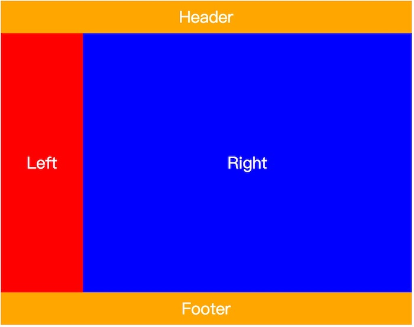
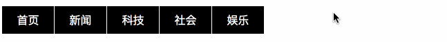
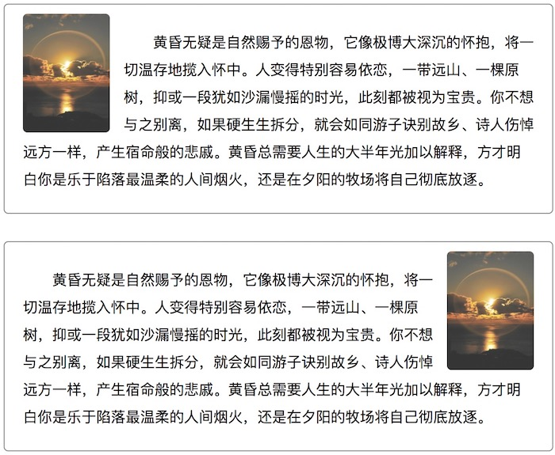
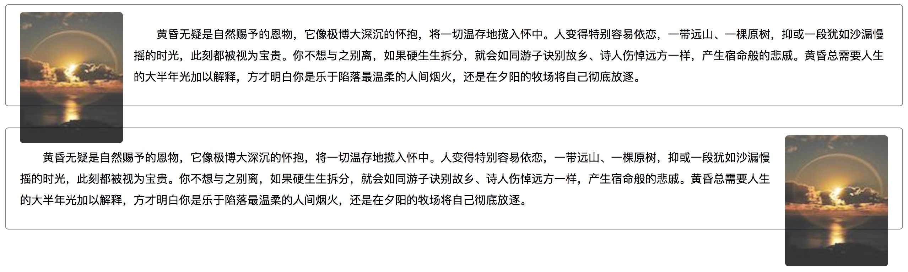
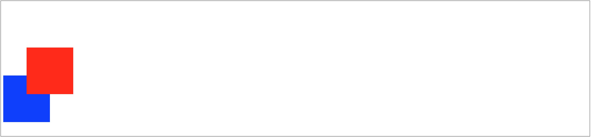
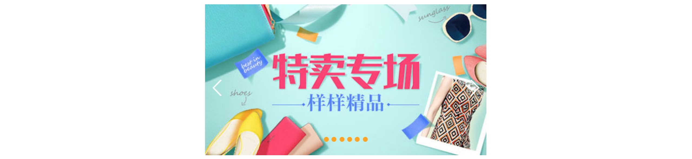
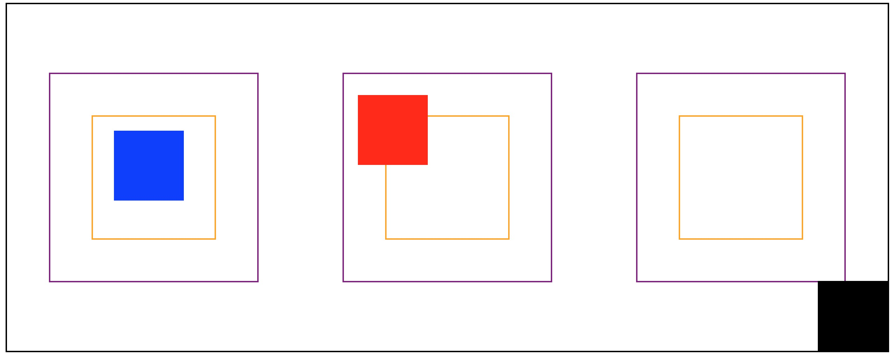
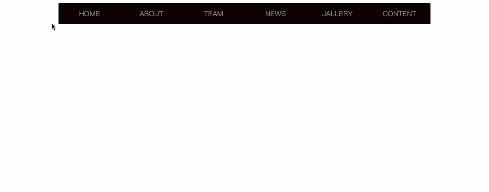

# # 概述

在HTML中，元素会按照标准的“文档流”布局方式进行布局，即“从左到右，从上到下”的方式进行布局，而通过CSS里面的部分定位和显示方式的设置可以使元素脱离“文档流”，采用特殊的布局方式进行布局，或者在页面中进行“隐藏”，而“隐藏”在CSS中又有两种定义方式，一种可以脱离“文档流”，一种仍然存在于“文档流”的布局中。

# # 显示

## 1、元素显示方式 

`display` 属性规定元素的显示方式。元素类型可分为块级元素（`block`）、行内元素（`inline`）以及行内块元素（`inline-block`），各类型的元素在呈现方式上也不尽相同。HTML文档中自带的标签元素的“显示类型”已经被定义，如果考虑到布局需要，有的时候我们会强制的将“显示类型”进行转换，在进行转换后，该元素的功能和特性（如将\<div>标签转换为“inline-block”之后，也不能嵌套在\<p>里和转换为“block”的\<span>里）也不会产生变化。所以，在元素页面布局的时候，若对“行内元素”、“行内块级元素”和“块级元素”已经理解得比较透彻了，根据需要完全可以大胆地对“显示类型”进行转换。

该属性可以设置以下值：

| 值                     | 描述                             |
| :-------------------- | :----------------------------- |
| 01、none               | 将元素设定为不显示，使元素完全地脱离“文档流”。*（主要）* |
| 02、inline             | 将元素设定为“行内元素”。*（主要）*            |
| 03、inline-block       | 将元素设定为“行内块元素”。*（主要）*           |
| 04、block              | 将元素设定为“块元素”。*（主要）*             |
| 05、list-item          | 将元素设置为列表项。                     |
| 06、run-in             | 根据上下文作为“行内块元素”或“块元素”显示。        |
| 07、table              | 将元素作为table显示。                  |
| 08、inline-table       | 将元素作为行内的table显示。               |
| 09、table-row-group    | 将元素作为一个tbody元素来显示。             |
| 10、table-header-group | 将元素作为一个thead元素来显示。             |
| 11、table-footer-group | 将元素作为一个tfoot元素来显示。             |
| 12、table-row          | 将元素作为一个tr元素来显示。                |
| 13、table-column-group | 将元素作为一个colgroup元素来显示。          |
| 14、table-column       | 将元素作为一个col元素来显示。               |
| 15、table-cell         | 将元素作为一个table单元格元素来显示。          |
| 16、table-caption      | 将元素作为一个table标题显示。              |
| 17、flex               | 弹性布局                           |

## 2、元素可见性

`visibility`  用于设置元素是否可见，该属性即使元素不可见，也不会脱离文档流，仍会占据空间，该属性可以设置以下值：

- visible：（默认），元素可见。
- hidden：元素不可见，仍会占据空间。
- collapse：在表格元素中使用时，此值可删除一行或一列，但是它不会影响表格的布局。被行或列占据的空间会留给其他内容使用。如果此值被用在其他的元素上，会呈现为“hidden”。

> 提示：要隐藏元素，可以使用 `display: none;` 或 `visibility: hidden;`，但值得注意的是，将 `visibility` 的属性值设置为 `hidden`，元素虽然不可见了，但仍未脱离“文档流”，在页面显示中占据着原本的位置。而通过将 `display` 的属性值设置为 `none` ，元素不可见了，而且在页面中占据的位置也让与“文档流”内布局的其它元素了。通过这两个属性的这一特性，我们可以更加灵活地进行元素的显隐操作，以达到更理想的页面布局效果。

## 3、元素不透明度

`opacity` 用于设置元素的不透明度，该属性的值范围为：`0 ~ 1`，可以保留两位小数，设值时可以省略 `0`，如：`.5` 或 `.75`。`0`（相当于 `visibility:hidden;`）表示完全透明，`1`（默认）表示完全不透明。

```html
<div class="wrap">
    <section class="t1"></section>
    <section class="t2"></section>
    <section class="t3"></section>
    <section class="t4"></section>
    <section class="t5"></section>
    <section class="t6"></section>
</div>
```

```css
.wrap {
    margin: 100px 0;
    width:  99%;
    height: 400px;
    background: url("imgs/opacity-bg.jpeg") no-repeat;
    background-size: cover !important;

    display: flex;
    flex-flow: row nowrap;
    justify-content: space-around;
    align-items: center;
}

.wrap section {
    width: 220px;
    height: 160px;
    display: inline-block;

    background: url("imgs/opacity.jpeg");
    background-size: cover !important;
}

.t1 {  opacity:  0; }
.t2 {  opacity: .2; }
.t3 {  opacity: .4  }
.t4 {  opacity: .6; }
.t5 {  opacity: .8; }
.t6 {  opacity:  1; }
```


通过学习过上面的知识需要进行说明的是，将 `opacity` 的值设置为 `0`，和将 `visibility` 的值设置为 `hidden` 在布局表现上几乎一致，但在对待用户*行为*上却有着很大的差别。因为，通过将 `opacity` 的值设置为 `0` 的方式，只是让元素透明了，但仍然是可以让如鼠标悬浮等事件生效的，而将 `visibility` 的值设置为 `hidden` 的方式，是不能触发鼠标悬浮这一类的事件的，这点要注意区分。

## 4、鼠标指针类型

`cursor` 属性规定要显示的鼠标指针的类型（形状）。该属性具备以下值：

| 属性值       | 描述                                       |
| :-------- | :--------------------------------------- |
| url       | 需使用的自定义光标的 URL，注释：请在此列表的末端始终定义一种普通的光标，以防没有由 URL 定义的可用光标。如：`cursor: url("../imgs/custorm.jpeg"), auto;` *（☆）* |
| default   | 默认光标（通常是一个箭头）                            |
| auto      | 默认，浏览器设置的光标                              |
| crosshair | 光标呈现为十字线                                 |
| pointer   | 光标呈现为指示链接的指针（一只手）*（☆）*                   |
| move      | 此光标指示某对象可被移动*（☆）*                        |
| e-resize  | 此光标指示矩形框的边缘可被向右（东）移动                     |
| ne-resize | 此光标指示矩形框的边缘可被向上及向右移动（北/东）                |
| nw-resize | 此光标指示矩形框的边缘可被向上及向左移动（北/西）                |
| n-resize  | 此光标指示矩形框的边缘可被向上（北）移动                     |
| se-resize | 此光标指示矩形框的边缘可被向下及向右移动（南/东）                |
| sw-resize | 此光标指示矩形框的边缘可被向下及向左移动（南/西）                |
| s-resize  | 此光标指示矩形框的边缘可被向下移动（南）                     |
| w-resize  | 此光标指示矩形框的边缘可被向左移动（西）                     |
| text      | 此光标指示文本*（☆）*                             |
| wait      | 此光标指示程序正忙（通常是一只表或沙漏）*（☆）*                |
| help      | 此光标指示可用的帮助（通常是一个问号或一个气球）*（☆）*            |

## 5、修改光标颜色

修改光标颜色使用 `caret-color` 属性。

```html
<input type="text" style="caret-color:blue;" placeholder="请输入文本内容">
```

> 提示：运行效果光标呈蓝色。

# # 浮动

`float` 属性可以使元素脱离文档流，在父容器中进行浮动，停靠到父元素的内容边界或其它浮动元素的边框，浮动的元素会忽略元素间的空格，让同样具有该属性的元素“紧密”地排列在一起。该属性通常用于处理一些需要紧密排列在一起的“块级元素”，如“导航条”、“相册”，或用于处理“图文混排”等。该属性有三个允许的值：

- none：默认，元素不进行浮动。
- left：元素从左到右进行浮动。
- right：元素从右到左进行浮动。


主流网站的两列布局可通过浮动实现，如下所示：

```html
<!--头部-->
<header>Header</header>
<!--主要内容-->
<main>
    <!--侧边栏-->
    <aside class="left">float:left</aside>
    <!--详情-->
    <div class="right">float:right</div>
</main>
<!--尾部-->
<footer>Footer</footer>
```

```css
html, body { height: 100%; }
header, main, footer {
    width: 70%;
    margin: 0 auto;
}
header, footer {
    height: 15%;
    background-color: #808080;
}
main { height: 70%; }
header, footer, .left, .right {

    letter-spacing: 2px;
    font-size: 18px;
    color: #fff;

    display: flex;
    display: -webkit-flex;
    justify-content: center;
    align-items: center;
}

.left {
    width: 20%;
    height: 100%;
    background-color: pink;
    float: left;
}
.right {
    width: 80%;
    height: 100%;
    background-color: #d3d3d3;
    float: right;
}
```

​	


接下来我们看如何通过浮动设置一个横向的菜单栏的示例：

```html
<nav>
    <ul class="menu-list">
        <li><a href="javascript:void(0);">首页</a></li>
        <li><a href="javascript:void(0);">新闻</a></li>
        <li><a href="javascript:void(0);">科技</a></li>
        <li><a href="javascript:void(0);">社会</a></li>
        <li><a href="javascript:void(0);">娱乐</a></li>
    </ul>
</nav>
```

```css
ul.menu-list {
    /*清除项目标号*/
    list-style: none;

    margin:  0;
    padding: 0;
}

ul.menu-list > li {
    width:  75px;
    height: 40px;
    background-color: #000;
    margin-right: 1px;

    text-align: center;

    /*左浮动 -> 横向显示*/
    float: left;
}

ul.menu-list > li:hover {
    background-color: #800080;
}

ul.menu-list > li > a {
    color: #fff;
    text-decoration: none;
    line-height: 40px;
}
```



接下来我们再看一组图文混排的示例：

```html
<div class="wrap">
    <!--左浮动-->
    <section class="box t1">
        
        <p>黄昏无疑是自然赐予的恩物，它像极博大深沉的怀抱，将一切温存地揽入怀中。人变得特别容易依恋，一带远山、一棵原树，抑或一段犹如沙漏慢摇的时光，此刻都被视为宝贵。你不想与之别离，如果硬生生拆分，就会如同游子诀别故乡、诗人伤悼远方一样，产生宿命般的悲戚。黄昏总需要人生的大半年光加以解释，方才明白你是乐于陷落最温柔的人间烟火，还是在夕阳的牧场将自己彻底放逐。</p>
    </section>
    <!--右浮动-->
    <section class="box t2">
        
        <p>黄昏无疑是自然赐予的恩物，它像极博大深沉的怀抱，将一切温存地揽入怀中。人变得特别容易依恋，一带远山、一棵原树，抑或一段犹如沙漏慢摇的时光，此刻都被视为宝贵。你不想与之别离，如果硬生生拆分，就会如同游子诀别故乡、诗人伤悼远方一样，产生宿命般的悲戚。黄昏总需要人生的大半年光加以解释，方才明白你是乐于陷落最温柔的人间烟火，还是在夕阳的牧场将自己彻底放逐。</p>
    </section>
</div>
```

```css
div.wrap { margin: 0 auto; }

div.wrap > .box {
    width:  600px;
    height: 230px;

    box-sizing: border-box;
    padding: 10px 20px;
    margin: 30px auto;
    border: 1px solid #808080;
    border-radius: 5px;
}

div.wrap > .box > p {
    text-indent: 2em;
    line-height: 30px;
}

div.wrap > .box > img {
    width: 95px;
    height: 130px;
    border-radius: 5px;
    filter: opacity(.8);
}

div.wrap > .t1 > img { margin-right: 15px; float: left; }
div.wrap > .t2 > img { margin-left: 15px;  float: right;}
```



在使用浮动 `float` 属性的时候有一个需要特别注意的地方，就是若一个普通的“块级元素”内的子元素全部都具有浮动属性（值必须为 `left` 或 `right` ），那它自身的高度会为 `0` 像素，这是因为它的子元素已经全部脱离了“文档流”，再加上HTML中的普通“块级元素”若不设定 `height` 为大于“0”的像素值，那它在页面中将不能显示，所以这个元素在页面中的高度固然为“0”。

若其子元素全部浮动的元素是独立存在于一个已经参与“定位（本章接下来的内容会讲到）”的元素内的话似乎也没有什么影响，但若它已经参与了“文档流”内的布局了的话，因为其高度为“0”的原因会给后续的元素布局带来些麻烦，如下所示：

```html
<div class="wrap">
    <!--左浮动-->
    <section class="box t1">
        
        <p>黄昏无疑是自然赐予的恩物，它像极博大深沉的怀抱，将一切温存地揽入怀中。人变得特别容易依恋，一带远山、一棵原树，抑或一段犹如沙漏慢摇的时光，此刻都被视为宝贵。你不想与之别离，如果硬生生拆分，就会如同游子诀别故乡、诗人伤悼远方一样，产生宿命般的悲戚。黄昏总需要人生的大半年光加以解释，方才明白你是乐于陷落最温柔的人间烟火，还是在夕阳的牧场将自己彻底放逐。</p>
    </section>
    <!--右浮动-->
    <section class="box t2">
        
        <p>黄昏无疑是自然赐予的恩物，它像极博大深沉的怀抱，将一切温存地揽入怀中。人变得特别容易依恋，一带远山、一棵原树，抑或一段犹如沙漏慢摇的时光，此刻都被视为宝贵。你不想与之别离，如果硬生生拆分，就会如同游子诀别故乡、诗人伤悼远方一样，产生宿命般的悲戚。黄昏总需要人生的大半年光加以解释，方才明白你是乐于陷落最温柔的人间烟火，还是在夕阳的牧场将自己彻底放逐。</p>
    </section>
</div>
```

```css
div.wrap { margin: 0 auto;  }

div.wrap > .box {
    width:  100%;

    box-sizing: border-box;
    padding: 10px 20px;
    margin: 30px auto;
    border: 1px solid #808080;
    border-radius: 5px;
}

div.wrap > .box > p {
    text-indent: 2em;
    line-height: 30px;
}

div.wrap > .box > img {
    width: 145px;
    height: 185px;
    border-radius: 5px;
    filter: opacity(.8);
}

div.wrap > .t1 > img { margin-right: 15px; float: left; }
div.wrap > .t2 > img { margin-left: 15px;  float: right;}
```



通过上面的示例，我们可以清楚地看到，每个区块元素\<section>都没有设置“height”属性，而是想通过该元素内部的子元素自动地“撑起”它的高度，内部的文本的确是撑起了这个\<section>元素的高度，但是意外的是，里面的\元素却超出了其父元素\<section>的下边界。这是因为代码中的两个\元素都设置了 `float` 属性，第一个值的为 `left`，第二个的值为 `right` ，都脱离了“文档流”，也就是不再占据页面内的高度了，所以出现了以上示例中的情况。

浮动会使当前标签产生向上浮的效果，同时会影响到前后标签、父级标签的位置及`width` 及 `height` 属性。而且同样的代码，在各种浏览器中显示效果也有可能不相同，这样让清除浮动更难了。解决浮动引起的问题有多种方法，但有些方法在浏览器兼容性方面还有问题。 

下面总结5种清除浮动的方法（测试已通过 IE Chrome Firefox opera）：

- 1）、父级元素定义 height

  原理：父级元素手动定义 height，就解决了父级元素无法自动获取到高度的问题。 

  优点：简单、代码少、容易掌握 。

  缺点：只适合高度固定的布局，要给出精确的高度，如果高度和父级元素不一样时，会产生问题 。

  建议：不推荐使用，只建议高度固定的布局时使用 。

- 2）、结尾处加空 div 标签，并设置 clear: both

  原理：添加一个空div，利用css提供的clear:both清除浮动，让父级div能自动获取到高度 。

  优点：简单、代码少、浏览器支持好、不容易出现怪问题 。

  缺点：不少初学者不理解原理；如果页面浮动布局多，就要增加很多空div，让人感觉很不好 。

  建议：不推荐使用，但此方法是以前主要使用的一种清除浮动方法 。

- 3）、父级div定义 伪类:after 和 zoom 

  ```html
  <div class="clearFix">
  	<div class="fl">Float Left</div>
  	<div class="fr">Float Right</div>
  </div>
  <div>Hello, world!</div>
  ```

  ```css
  /*清除浮动*/
  .clearFix {zoom: 1;}
  .clearFix:after {
  	content: '';
  	display: block;
  	height: 0;
  	visibility: hidden;
  	clear: both;
  }

  .fl {float: left;}
  .fr {float: right;}
  ```

  原理：IE8以上和非IE浏览器才支持 `:after`，原理和方法2有点类似，`zoom`(IE专有属性)可解决IE6、7浮动问题。 

  优点：浏览器支持好、不容易出现怪问题（目前：大型网站都有使用，如：腾迅，网易，新浪等等） 。

  缺点：代码多、不少初学者不理解原理，要两句代码结合使用才能让主流浏览器都支持。 

  建议：推荐使用，建议定义公共类，以减少CSS代码。 


- 4）、父级元素定义 overflow:hidden 

  原理：必须定义width或zoom:1，同时不能定义height，使用overflow:hidden时，浏览器会自动检查浮动区域的高度 

  优点：简单、代码少、浏览器支持好 。

  缺点：不能和position配合使用，因为超出的尺寸的会被隐藏。 

  建议：只推荐没有使用position或对overflow:hidden理解比较深的朋友使用。 

- 5）、父级div定义 overflow:auto 

  原理：必须定义width或zoom:1，同时不能定义height，使用overflow:auto时，浏览器会自动检查浮动区域的高度 。

  优点：简单、代码少、浏览器支持好 。

  缺点：内部宽高超过父级div时，会出现滚动条。 

  建议：不推荐使用，如果你需要出现滚动条或者确保你的代码不会出现滚动条就使用吧。 

# # 定位

在HTML中，元素的布局可以通过CSS的浮动属性 `float` 和外间距属性 `margin`，甚至是内间距属性 `padding` 去实现，但是这些布局方式都存在着各种各样的局限性，这个时候定位属性 `position` 的出现绝对是对元素布局的一个非常好的补充。而且该属性对所有显示类型的元素适用。

该属性主要有以下值：

- static：默认值，采用元素默认的定位方式。
- relative：相对定位
- absolute：绝对定位
- fixed：固定定位

该属性除了值为 `static` 的情况，通常要配合 `top`、`right`、`bottom` 和 `left` 四个属性去使用，这四个属性允许的值为Web技术中常用的长度单位，如：“像素”、“百分数”、“字符大小”、“点”等。

设置过定位属性的元素，有的时候会根据布局的需要出现重叠，重叠的规则是：在HTML文档中后出现的元素会出现在先出现元素的上方。若要调整元素的层级可以通过 `z-index` 属性进行设置，该属性接受整型数值作为值，值越大的，层级越高，越接近用户视觉，值越小则反之。

`z-index` 属性的取值范围在 `-32767` 至 `32767` 之间，`0` 为默认值。当然，我们通常不会去使用到该属性的最小或最大值，为了便于管理页面内元素的“层级关系”，通常我们都是将该属性的值设置在一个比较便于管理的区间内，如 `0` 到 `10` 之间。

接下来我们开始对每种定位方式进行系统的学习。

## 1、相对定位

当一个元素的 `position` 属性的值为 `relative` 时，元素对其原始位置进行“相对定位”，但元素在“文档流”中所占据的位置仍然保留。

```html
<div class="wrap">
	<div class="box pos"></div>
	<div class="box"></div>
</div>
```

  ```css
div.wrap {
	border: 1px solid #808080;
}

div.box {
	width:  100px;
	height: 100px;
	margin: 30px 0px;
	background-color: blue;
}
div.pos {
	background-color: red;
}
  ```


  上述效果是没有进行任何定位的示例，接下来，我们修改下代码，对红色视图做一个相对定位，如下所示：

```css
div.pos {
	background-color: red;

	position: relative;
	top:  70px;
	left: 50px;
}
```



通过示例我们可以发现，相对定位是相对于自身所在的位置进行定位的，并且，“相对定位”的元素并不会影响到其它元素在“文档流”中的位置，而自身的“文档流”位置也正常保留了的。在实际的开发中，用相对定位的情况比较少，一般用绝对定位会比较多。

## 2、绝对定位

当一个元素的 `position` 属性的值为 `absolute` 时，该属性会相对最近的具有定位属性`position`（值不能够为`static`）的“祖先”级元素进行“相对定位”，没错，这里就是“相对定位”。如果当元素遍历完所有的“祖先”元素都没有找到有“postion”的，那它将对当前的浏览器窗口进行“绝对定位”。

若同级元素都具有“绝对定位”的属性，那这些元素会重叠在一起，除非通过 `z-index` 属性进行层级调整。若某个元素内存在一个唯一的绝对定位的元素，如果没有给它设置“left”、“top”等这一系列的属性，那它将会保持原位，但是一旦设置了“left”或“right”值，那元素将会在水平轴方向去执行绝对定位的规则，但垂直轴方向并不会发生位置变动。若设置了“top”或“bottom”（“left”和“right”值没有设置的情况），那元素将会在垂直轴方向去执行绝对定位的规则。现在很多网站内的“二级导航菜单”就是利用绝对定位这一特性制作的。

需要指出的是，将一个元素设置为“绝对定位”后，它对元素的性质有以下几种改变：

- 元素会从“文档流”中脱离，不再占据页面内“文档流”的显示位置；
- “非块级”的元素会被转化成“块级元素”；
- 元素的宽和高将对内容自适应（不再是“块级元素”默认100%的宽度了）。
- 若一个具有宽和高的元素是其父级元素中唯一的子元素，并且其父元素没有设置高度属性，那父元素内容的高度将会变为“0”。

根据“绝对定位”对元素的改变，记得在页面布局的时候对设置了该属性值的元素做一些针对性的调整，如：不用再给元素显示地设置“display”属性，用于节约代码量，给没有内容的元素及其父级元素设置宽和高等。

我们来看一组示例：

```html
<div class="wrap">
	<div class="box pos"></div>
	<div class="box"></div>
</div>
```

```css
div.wrap {
	border: 1px solid #808080;
	position: relative;
}

div.box {
	width:  100px;
	height: 100px;
	margin: 30px 5px;
	background-color: blue;
}
div.pos {
	background-color: red;

	position: absolute;
	top:  70px;
	left: 50px;
}
```


上述示例中，红色视图为绝对定位，其是相对于父级元素 `div.wrap` 做相对定位的，我们可以看到，红色视图脱离了文档流，不再占据空间，蓝色视图填补红色视图区域，由于没有设置容器高度，因此整个容器的高度只获取到了蓝色视图的高度。

在网页制作中，我们会实现一些类似flash的图片轮播效果，而该效果的实现方案也是通过绝对定位来实现的，直接上代码：

```html
<div class="flash-box">
    <!--图片-->
    <div class="imgs">
        
        <!--此处省略多余的图片-->
    </div>
    <!--左右按钮-->
    <div class="btns">
        <span class="btn prev"></span>
        <span class="btn next"></span>
    </div>
    <!--小圆点-->
    <div class="idots">
        <span class="item"></span>
        <span class="item"></span>
        <span class="item"></span>
        <span class="item"></span>
        <span class="item"></span>
        <span class="item"></span>
    </div>
</div>
```

```css
/*轮播图基本布局*/
.flash-box {
    width:  520px;
    height: 280px;

    margin: 100px auto;

    /*指定position属性，方便后代元素绝对定位*/
    position: relative;
}

.flash-box > .btns > .btn {
    display: inline-block;
    width:  45px;
    height: 30px;

    /*绝对定位*/
    position: absolute;
    top: 50%;
}

.flash-box > .btns > .prev {
    left:  0;
    background: url("../images/left.png") no-repeat center center;
}
.flash-box > .btns > .next {
    right: 0;
    background: url("../images/right.png") no-repeat center center;
}

.flash-box > .idots {
    /*绝对定位*/
    position: absolute;
    /*水平居中*/
    left: 50%;
    transform: translateX(-50%);

    bottom: 20px;
}
.flash-box > .idots > .item {
    display: inline-block;
    width:  9px;
    height: 9px;
    background: #ffa500;
    border-radius: 50%;
}
```



我们再来看一组示例：

```html
<div class="wrap">
    <!--示例1-->
    <article>
        <section class="parent">
            <div class="blue-box"></div>
        </section>
    </article>
  
    <!--示例2-->
    <article class="grandpa">
        <section>
            <div class="red-box"></div>
        </section>
    </article>
  
    <!--示例3-->
    <article>
        <section>
            <div class="black-box"></div>
        </section>
    </article>
</div>
```

```css
/*绝对定位*/
div.wrap {
    border: 2px solid #000;
    height: 500px;

    /*flex 布局，子元素水平垂直居中*/
    display: flex;
    /*水平居中*/
    justify-content: space-around;
    /*垂直居中*/
    align-items: center;
}
div.wrap > article {
    width:  300px;
    height: 300px;
    border: 2px solid #800080;

    /*flex 布局，子元素水平垂直居中*/
    display: flex;
    /*水平居中*/
    justify-content: space-around;
    /*垂直居中*/
    align-items: center;
}

div.wrap > article > section {
    width:  60%;
    height: 60%;
    border: 2px solid #ffa500;
}

div.wrap > article > section > div {
    width:  100px;
    height: 100px;
}


/*示例1：蓝色视图相对于父级元素(橙色边框)定位*/
div.wrap .parent {
    position: relative;
}
div.wrap div.blue-box {
    background-color: blue;

    position: absolute;
    top:  20px;
    left: 30px;
}

/*示例2：红色视图相对于爷爷级元素(紫色边框)定位*/
div.wrap .grandpa {
    position: relative;
}
div.wrap div.red-box {
    background-color: red;

    position: absolute;
    top: 30px;
    left: 20px;
}

/*示例3：黑色视图相对于容器视图(黑色边框)定位*/
div.wrap {
    position: relative;
}
div.wrap div.black-box {
    background-color: black;

    position: absolute;
    bottom: 0;
    right:  0;
}
```



案例分析：

绝对定位是相对最近的具有定位属性`position`（值不能够为`static`）的“祖先”级元素进行“相对定位”。对于蓝色视图所在的区域而言，我们为其父级元素 `.parent` 设置了 `position` 属性，因此，蓝色视图是相对于橙色边框所在的元素定位的；红色视图相对于紫色边框（`.grandpa`）定位，黑色视图相对于黑色边框（`.wrap`）定位。

绝对定位也常用于布局二级导航，下面将贴出通过绝对定位设置二级导航的示例：

```html
<nav>
    <ul class="menu-box">
        <li>
            <a href="javascript:;">HOME</a>
            <ul class="submenu">
                <li><a href="javascript:;">OPTIONS</a></li>
                <li><a href="javascript:;">OPTIONS</a></li>
                <li><a href="javascript:;">OPTIONS</a></li>
                <li><a href="javascript:;">OPTIONS</a></li>
                <li><a href="javascript:;">OPTIONS</a></li>
            </ul>
        </li>
        <li>
            <a href="javascript:;">ABOUT</a>
            <ul class="submenu">
                <li><a href="javascript:;">OPTIONS</a></li>
                <li><a href="javascript:;">OPTIONS</a></li>
                <li><a href="javascript:;">OPTIONS</a></li>
            </ul>
        </li>
        <li>
            <a href="javascript:;">TEAM</a>
        </li>
        <li>
            <a href="javascript:;">NEWS</a>
        </li>
        <li>
            <a href="javascript:;">JALLERY</a>
        </li>
        <li>
            <a href="javascript:;">CONTENT</a>
        </li>
    </ul>
</nav>
```

```css
ul {
    list-style: none;
    margin: 0; padding: 0;
}
li {box-sizing: border-box;}
a  {text-decoration: none;}

/*一级菜单*/
nav > .menu-box {
    width: 100%;
    min-width: 1100px;

    text-align: center;
    /*解决因 inline-block 产生的间距*/
    font-size: 0;
}

nav > .menu-box > li {
    width:  160px;
    height: 55px;
    background-color: #0C0000;

    display: inline-block;

    /*子元素垂直居上对齐*/
    vertical-align: top;

    /*文本水平/垂直居中*/
    text-align: center;
    line-height: 55px;

    position: relative;
}

nav > .menu-box > li > a {
    color: #808080;
    font-size: 18px;
}

nav > .menu-box > li:hover {
    border-left: 2px solid #D40000;
    background-color: #1C1C1C;
}
nav > .menu-box > li:hover > a {
    color: #D40000;
}
nav > .menu-box > li:hover > .submenu {
    display: block;
}


/*二级菜单*/
nav .submenu {
    display: none;

    position: absolute;
    top:   55px;
    left: -2px;
}

nav .submenu li{
    display: block;

    width:  160px;
    height: 55px;
    background-color: #0C0000;

    border-top: 1px solid #181818;
    border-bottom: 1px solid #303030;
}

nav .submenu li > a {
    color: #808080;
    font-size: 18px;
}

nav .submenu li:hover {
    background-color: #1C1C1C;
}
nav .submenu li:hover > a {
    color: #fff;
}
```




## 3、固定定位

当一个元素的 `position` 属性的值为 `fixed` 时，那它会相对于浏览器边界进行定位，并且当页面存在滚动条的时候，页面的滚动也不会对其和浏览器边界之间的相对位置产生影响，就像是“漂浮”在一个固定的地方一样，所以将其称作“固定定位”。除此之外，“固定定位”和“绝对定位”的其它特性都比较相似，而且该定位方式也会脱离“文档流”，它和文档内的元素都不会有任何布局上的互相干扰。针对“固定定位”的这些特性，它通常用于以下情景：

- 弹出框底部的“遮罩层”

  现在的网页设计基本不会再去采用浏览器引擎内自带的那种弹出提示框，而一般是开发者根据美工的要求自定义的弹出框，但自行设计的弹出框并不具备页面事件阻塞功能，为了防止用户“绕过”弹出框去继续对页面元素进行操作，绝大部分时候都会在弹出框下方（通过 `z-index` 设置层级关系）添加一层“遮罩”（这层遮罩可以是透明的，也可以是色彩半透明的），这样用户就不能再通过鼠标点击的方式去操作弹出框“下方”的内容了。

- 页面浮动二维码

  微信公众号是现在各类商家推广自身品牌，自媒体发布的一个非常主流的手段，所以在自己的官方网站的空白处都会“悬浮”着一个二维码，若用户不需要关注这个商家（企业、机构、学院等）点击该二维码旁的关闭按钮即可关闭二维码。

- “回到顶部”按钮

  现在内容稍多的网站，为了顾及到用户体验，几乎都会在页面空白的适当位置加上一个“回到顶部”按钮，需要该按钮的位置不受页面滚动的影响，最高效的办法（也可以利用JavaScript去做，再配以CSS的过渡特效，可以实现一定的动态效果，但相对低效）也就是通过“固定定位”去实现了。

- 网站/应用操作指引

  现在做得较好的互联网网站为了迎合大众的赏美和做功能上的一些调整，时常会涉及到网站风格及内容的改版，这样网站上的功能内容、位置结构都会涉及到改动，会让新老用户都“无从下手”，这个时候利用CSS中“固定定位”元素设计的“指引步骤”，再配以JavaScript的控制，会让用户有一种“这个网站做得很人性化”的感觉。但这种设计也不要滥用，凡事都有个度，用户体验设计亦是如此，若太多地采用这种方式反而会影响一些熟悉该网站的用户的操作流畅度。

- 固定的顶部导航栏

  有些网站希望用户尽可能多地浏览本站的内容，但由于设计风格开阔或者信息内容太多等原因，导致每页的内容都比较多，通过“回到顶部”按钮又增加了操作步骤（在用户体验设计中重要的一环就是要求用户操作数更少，但能实现的交互功能更多），这个时候通过“固定定位”将网站导航栏“浮动固定”在页面的顶部，这样用户无论在页面内容的什么地方，都能更方便地进行页面的跳转了。

以上这些情景用例只是对“固定定位”比较常用的地方进行说明，而创意这个东西是没有边界的，只要愿意多观察、多思考、多总结，就能将很多简单的属性用得不简单。但由于现在是在学习Web前端技术的阶段，还得需要先把基础理论知识掌握牢固。


