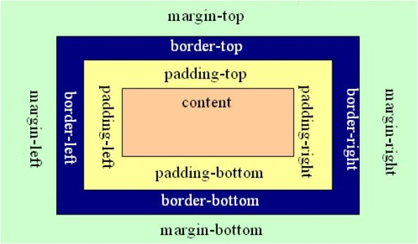
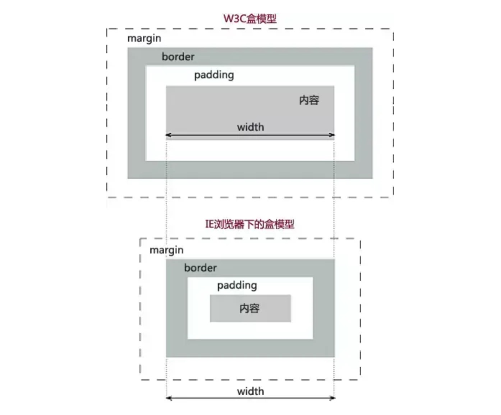
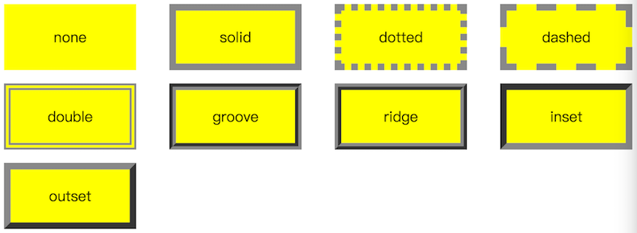
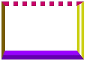
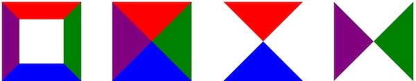
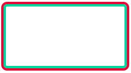
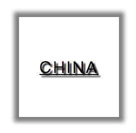

# 一、概述

所谓 [盒子模型 >>](https://developer.mozilla.org/zh-CN/docs/Web/CSS/CSS_Box_Model/Introduction_to_the_CSS_box_model)，即是将网页布局中的元素（行内/行内块元素）进行拟物化的比喻，一个盒子由内容（content）、内间距（padding）、边框（border）以及外边距（margin）组成。如下图所示：



> 提示：只有 **块级元素** 与 **行内块元素** 具备盒子模型。

# 二、盒子类型 *

CSS盒子模型的类型主要有两个：

- **IE浏览器盒子模型**： 元素的宽高大小表现为内容的大小。
- **标准（W3C，其它主流浏览器）盒子模型**（默认）：元素的宽高表现为内容 + 内边距 + 边框的大小。背景会延伸到边框的外沿。



通过 [box-sizing](https://developer.mozilla.org/zh-CN/docs/Web/CSS/box-sizing) 可切换盒子模型类型：

- `content-box`：标准盒子模型
- `border-box`：IE盒子模型

# 三、盒子属性 *

## 1. 宽度

[width >>](https://developer.mozilla.org/zh-CN/docs/Web/CSS/width) 属性用于设置元素的宽度，你需要注意的是，通过该属性设置的宽度有的时候未必就是元素真实的宽度，这是由于盒子模型类型的影响：

- IE盒子模型：$$width = content + padding + boder$$
- 标准盒子模型的：$$width = content$$。

## 2. 高度

[height >>](https://developer.mozilla.org/zh-CN/docs/Web/CSS/height) 属性用于设置元素的高度，它绝大部分特征、度量单位和盒子模型的计算方式基本上和 width 属性一样。

宽度和高度属性的不同之处在于，使用百分比赋值时，宽度可以成功设置，而高度需制定 html/body 的高度：

```css
html, body {
    height: 100%;
}
```

## 3. 内间距

[padding >>](https://developer.mozilla.org/zh-CN/docs/Web/CSS/padding) 属性用于设置盒子内容与边框之间的间距，即内间距（填充）。

## 4. 外边距

[margin >>](https://developer.mozilla.org/zh-CN/docs/Web/CSS/margin) 属性主要用于设置某元素相对于同级元素和父级元素的一个距离值。

关于margin需注意的点是：

1. 当相连两个元素同时设置margin时：
   - 垂直方向：两个元素的距离取最大值；
   - 水平方向：两个元素的距离取间距之和；
2. 首个子元素设置margin-top属性相当于设置成父元素距离上方元素的距离（*解决方案：父元素设置 overflow:hidden*）
3. 最后一个子元素设置margin-bottom属性相当于给父元素设置了一个下间距（padding-bottom），若父元素已经设置了“padding-bottom”，则与父元素的该值相加取和作为与页面底部的间距。

## 5. 边框

[border >>](https://developer.mozilla.org/zh-CN/docs/Web/CSS/border) 属性的作用是为设定该属性的元素添加边框。

该属性有三个分支属性：border-width border-style border-color

边框效果如下图所示：



当然我们也可以单独设置某一边的边框效果：


```html
<!-- HTML 部分 -->
<div class="box"></div>

<!-- CSS 部分 -->
<style type="text/css">
    .box {
        width:  160px;
        height: 100px;

        border-top: 10px dotted #CC0066;
        border-right: 15px double #CCCC00;
        border-bottom: 20px ridge #9933FF;

        border-left-width: 8px;
        border-left-style: inset;
        border-left-color: #CC9900;
    }
</style>
```



除此之外，`border` 还有一个很有趣的“玩”法，就是通过将元素的宽高都设为 `0`，然后设置“border”的各分支属性的值将它作为一个“形状”来使用。我们来看这样一个例子：

```html
<!-- HTML 部分 -->
<div class="wrap">
	<section class="t1"></section>
	<section class="t2"></section>
	<section class="t3"></section>
	<section class="t4"></section>
</div>

<!-- CSS 部分 -->
<style type="text/css">

	section {
		display: inline-block;
		margin: 0 15px;
	}

	.t1 {
		width:  50px;
		height: 50px;

		border-top: 20px solid red;
		border-right: 20px solid green;
		border-bottom: 20px solid blue;
		border-left: 20px solid purple;
	}

	.t2 {
		width:  0px;
		height: 0px;

		border-top: 45px solid red;
		border-right: 45px solid green;
		border-bottom: 45px solid blue;
		border-left: 45px solid purple;
	}

	.t3 {
		width:  0px;
		height: 0px;

		border-top: 45px solid red;
		border-right: 45px solid transparent;
		border-bottom: 45px solid blue;
		border-left: 45px solid transparent;
	}

	.t4 {
		width:  0px;
		height: 0px;

		border-top: 45px solid transparent;
		border-right: 45px solid green;
		border-bottom: 45px solid transparent;
		border-left: 45px solid purple;
	}
</style>
```



> **提示：**通过 [border-collapse](https://developer.mozilla.org/zh-CN/docs/Web/CSS/border-collapse) 可决定表格的边框是分开的还是合并的。

## 6. 圆角

[border-radius >>](https://developer.mozilla.org/zh-CN/docs/Web/CSS/border-radius) 属性可以设置盒子圆角，其实现原理是根据该属性所设置的值，在元素内建立一个以该值为半径的“看不见的圆”，并以该圆的边缘形状来设置边角的圆度。

下面请看示例：

```css
<div class="wrap">
	<section class="t1"></section>
	<section class="t2"></section>
	<section class="t3"></section>
	<section class="t4"></section>
	<section class="t5"></section>
</div>
```

```css
div.wrap > section {
    width:  100px;
    height: 100px;
    background-color: purple;

    display: inline-block;
    margin: 0 10px;
}

.t1 { border-radius: 50%; }
.t2 { border-radius: 10px/50px; }
.t3 {
    border-top-right-radius: 30%;
    border-top-left-radius: 100px;
    border-bottom-left-radius: 30%;
    border-bottom-right-radius: 100px;
}
.t4 {
    border-top-right-radius: 50%;
    border-bottom-right-radius: 50%;
}
```


## 7. 轮廓

[outline >>](https://developer.mozilla.org/zh-CN/docs/Web/CSS/outline) 属性用于设置一个元素的轮廓线。

border 和 outline 很类似，但有如下区别：

- outline 不占据空间，绘制于元素内容周围。
- outline 不占据空间，绘制于元素内容周围。

border + outline 在设置双边框效果时很有用，比如：

```html
<div class="box"></div>
```

```css
.box {
  width: 200px;
  height: 100px;
  border: 4px solid #07dba5;
  outline: 4px solid #db073d;
  border-radius: 6px;
}
```



## 8. 元素阴影

[box-shadow >>](https://developer.mozilla.org/zh-CN/docs/Web/CSS/box-shadow) 属性能够让元素获得一个阴影效果，根据颜色的不同，有时候也可以叫做发光效果。

请看下面示例：

```html
<!-- HTML 部分 -->
<div class="box">CHINA</div>

<!-- CSS 部分 -->
<style type="text/css">
	.box {
		width: 100px;
		height: 100px;

		text-align: center;
		line-height: 100px;
		letter-spacing: 2px;
		text-shadow: 2px 2px 1px #000;
		text-decoration: underline;

		box-shadow: 0px 0px 5px 5px gray;
	}
</style>
```



## 9. 调整元素大小

[resize >>](https://developer.mozilla.org/zh-CN/docs/Web/CSS/resize) 属性允许你控制一个元素的可调整大小性（*了解*）
