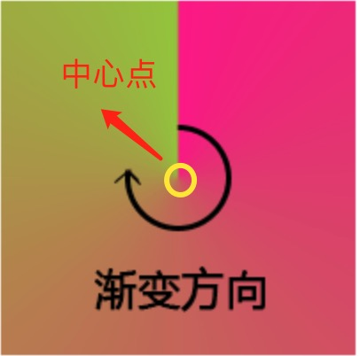

# 一、概述

在当今的HTML页面中，页面的背景色默认为 “**白色**”，除了少许的表单元素及HTML5规范后才出现的一些新的 “**功能性**” 元素标签，其它元素是不具有背景色的（也可以理解为透明的）。要为页面内的元素添加漂亮的“装饰”，让页面表现得更加丰富，区别于人，除了“`border`”、“`outline`”、“`box-shadow`”外，“`background`”在里面也扮演着相当重要的角色，本章的主要内容就是围绕“background”这个属性进行的。

# 二、元素背景 *

- [background-color](https://developer.mozilla.org/zh-CN/docs/Web/CSS/background-color)：背景颜色；
  - 颜色拾取
    - 十六进制颜色参照表：https://www.sioe.cn/yingyong/yanse-rgb-16/
    - 颜色搭配：https://colordesigner.io/
    - QQ截图可以拾取颜色
- [background-image](https://developer.mozilla.org/zh-CN/docs/Web/CSS/background-image)：背景图片；
- [background-repeat](https://developer.mozilla.org/zh-CN/docs/Web/CSS/background-repeat)：背景图片的重复方式；
- [background-size](https://developer.mozilla.org/zh-CN/docs/Web/CSS/background-size)：背景图片的尺寸；
- [background-origin](https://developer.mozilla.org/zh-CN/docs/Web/CSS/background-origin)：背景图片的起始位置；
- [backgroun-position](https://developer.mozilla.org/zh-CN/docs/Web/CSS/background-position)：背景图片的初始位置；
- [background-attachment](https://developer.mozilla.org/zh-CN/docs/Web/CSS/background-attachment)：背景固定，可实现视差效果；
- [background-clip](https://developer.mozilla.org/zh-CN/docs/Web/CSS/background-clip)：背景裁切（制作相框）；
- [background](https://developer.mozilla.org/zh-CN/docs/Web/CSS/background)：组合值；

# 三、元素渐变

渐变是从一种颜色逐渐蜕变到另一种颜色，通过 background 属性可以实现元素的渐变效果。在CSS3中渐变主要有两种类型：**线性渐变** 和 **径向渐变**。线性渐变就是沿着一根轴线（水平、垂直或某个角度）改变颜色，从起点到终点颜色进行顺序渐变。

## 1. [线性渐变](https://developer.mozilla.org/zh-CN/docs/Web/CSS/gradient/linear-gradient) *

创建线性渐变你需要指定渐变的轴线和延轴线变化的多种颜色，颜色将按与轴线垂直的方向被绘制，多种颜色间将实现渐变平滑过渡。具体语法如下：

```css
<linear-gradient> = linear-gradient([ [ <angle> | to <side-or-corner> ] ,]? <color-stop>[, <color-stop>]+)
<side-or-corner> = [left | right] || [top | bottom]
<color-stop> = <color> [ <length> | <percentage> ]?
```

- 取值：

  下述值用来表示渐变的方向，可以使用角度或者关键字来设置：

  - \<angle>

    `0deg` 表示垂直向上，然后按顺时针方向增加角度，`90deg` 指向右边。

  - side-or-corner

    

    可以组合使用，如"to top left"就是到左上角。

    > 可以将轴线的绘制方式理解为：从元素的中心开始，延指定的角度向元素的两个方向扩展，轴线的结束点就是延指定角度前进与元素边框相交的点，而轴线的开始点就是延指定角度反方向前进与元素边框相交的点。

  下面我们来看一组示例：

```html
<div class="wrap">
    <section class="t1"></section>
    <section class="t2"></section>
    <section class="t3"></section>
    <section class="t4"></section>
</div>
```

```css
.wrap > section {
    width:  300px;
    height: 200px;
    display: inline-block;
}

.t1 {  background: linear-gradient(to top, red, green, blue);  }
.t2 {  background: linear-gradient(to right, red, green, blue);  }
.t3 {  background: linear-gradient(to bottom right, red, green, blue);  }
.t4 {  background: linear-gradient(45deg, red, green, blue);  }
```


  需要提出的是在支持CSS3最开始的版本，也就是现在来说叫老版本的主流浏览器（Chrome,Safari,fiefox），对角度的“理解”是不一样的，它们的开始角度0度是从水平的右方，也就是“三点钟方向”开始的。所以在遇到老版本的主流浏览器时要能正确的区分。

## 2. 重复线性渐变 *

重复线性渐变就是线性渐变的重复版本 **repeating-linear-gradient**，当你定义好了你的线性渐变方式后，重复线性渐变会基于轴线不断的重复你的渐变方式，直到占满整个背景。使用重复线性渐变的关键是你需要定义好颜色结点，需要注意的是你定义的最后一种颜色将和第一种颜色相接在一起，处理不当将导致颜色的急剧变化。

下面通过一些例子来说明重复线性渐变的使用方法。

```html
<div class="wrap">
    <section class="t1"></section>
    <section class="t2"></section>
    <section class="t3"></section>
</div>
```

```css
.wrap > section {
    width:  300px;
    height: 200px;
    display: inline-block;
}

.t1 {  background: repeating-linear-gradient(#000 0px, #fff 20px, #808080 40px);  }
.t2 {  background: repeating-linear-gradient(90deg, #000 0px, #fff 20px, #808080 40px);  }
.t3 {  background: repeating-linear-gradient(to top right, #000 0px, #fff 20px, #808080 40px);  }
```


### 颜色节点

颜色结点是沿着渐变轴线被放置的点，定义格式如下：

```css
<color-stop> = <color> [ <percentage> | <length> ]
```

首先制定颜色（color），然后指定位置，使用百分比值或者长度值表示。百分比值对应轴线长度的百分比，0%表示起始点，而100%表示结束点；长度值指从轴线的起始点开始向结束点方向计算的数值。颜色结点通常放置在起始点和结束点之间，但不是必需的，轴线可以在两个方向上无限扩展，而颜色结点可以放置在线上的任何位置。

在每个颜色结点，线呈现为颜色结点的颜色。在两个颜色结点之间，线呈现的为从一种颜色过渡到另一种颜色过渡过程。在第一个颜色结点之前，线呈现为第一个颜色结点的颜色，而在最后一个结点之后，线呈现为最后一个颜色结点的颜色。

以下步骤定义了处理颜色结点列表的行为，应用这些规则后，所有的颜色结点都将有一个明确的位置：

- **如果没有设置第一个颜色结点的位置，默认为0%；如果没有设置最后一个颜色结点的位置，默认设置为100%；**
- **如果一个颜色结点的位置小于了在它之前的任意一个颜色结点的位置，设置其位置等于它之前的所有颜色结点位置中最大的位置；**
- **如果存在一些颜色结点没有指定位置，那么，为那些相邻的没有指定位置的颜色结点，设置它们的位置使它们平均占据空间。**
- **如果多个颜色结点有相同的位置，它们产生一个从一种颜色到另一种颜色的急剧的转换。从效果来看，就是从一种颜色突然改变到另一种颜色。**

  为了理解上面的规则，下面是一些例子来帮助你的理解：

- repeating-linear-gradient(black, white 20%, gray)

  相当于

  repeating-linear-gradient(black 0%, white 20%, gray 100%)

  

- repeating-linear-gradient(black 40%, white,  gray, orange)

  相当于

  repeating-linear-gradient(black 40%, white 60%, gray 80%, orange 100%)

  

- repeating-linear-gradient(black -50%, white, gray)

  相当于

  repeating-linear-gradient(black -50%, white 25%, gray 100%)

  

- repeating-linear-gradient(black -50px, white, gray);
  相当于
  repeating-linear-gradient(black -50px, white calc(-25px + 50%),  gray 100%);

  

- repeating-linear-gradient(black 20px, white 0, gray 40px);

  相当于

  repeating-linear-gradient(black 20px, white 20, gray 40px);

  

- repeating-linear-gradient(purple, gray -50%, black 150%,  green);

  相当于

  repeating-linear-gradient(purple 0%, gray 0%, black 150%, green 150%);

  

- repeating-linear-gradient(black 30px, white 0px , red, blue 50px);

  相当于

  repeating-linear-gradient(black 30px, white 30px , red 40px, blue 50px);

  

### 条纹背景

  在讲解颜色结点时，我们提到“如果多个颜色结点有相同的位置，它们产生一个从一种颜色到另一种颜色的急剧的转换。从效果来看，就是从一种颜色突然改变到另一种颜色”。根据这个定义，我们只需要将多个颜色结点设置到同一个位置，就可以轻易的得到条纹背景效果。下面我们来看各种条纹背景是怎么产生的。

- 水平条纹背景

  将两种颜色的颜色结点位置设置为一样就可以产生条纹背景，如下：

  

  background: linear-gradient(black 50%, gray 50%);

  利用背景的重复机制，我们可以创造出更多的条纹：

  

  background: linear-gradient(black 50%, gray 0);

  background-size: 100% 20%;

  这样我们就利用将整个背景划分为了10个条纹，但每个条纹的高度并不一定要一样，只要改变比例就可以做到：

  

  background: linear-gradient(black 80%, gray 0);

  background-size: 100% 20%;

- 垂直条纹背景

  垂直条纹背景类似，只是需要转换一下宽和高的设置方式（`background-size`），如下：

  

  linear-gradient(to right, black 50%, gray 0);

  background-size: 25% 100%;

- 对角条纹背景

  我们可以使用重复线性渐变轻易的创建出对角条纹背景：

  

  

  repeating-linear-gradient(45deg, #808080, #808080 10%, #000 0, #000 20%);

## 3. [径向渐变](https://developer.mozilla.org/zh-CN/docs/Web/CSS/gradient/radial-gradient)

径向渐变就是从一个点开始向外扩展为一个圆形或者椭圆，因此，径向渐变首先需要确定一个中心点，然后是大小和形状。径向渐变的颜色节点同线性渐变一样，是一个颜色列表。下面是径向渐变的语法：

```css
<radial-gradient> = radial-gradient (
 [ [ <shape> || <size> ] [ at <position> ]? , |
  at <position>,
 ]?
 <color-stop> [ , <color-stop> ]+
)
```

下面是径向渐变的一个例子：


  *background: radial-gradient(30px circle at center center, #fff, #000);*

  下面是我们来具体看看 `radial-gradient` 的参数的含义。

- shape：shape可以是 `circle` 或 `ellipse`，决定了径向渐变最终形成的形状。

- size：决定渐变的大小。可以指定的具体的数值或者使用常量，circle和ellipse都支持的常量如下：

  1）、closest-side

  从渐变的中心出发到最近的一条边的距离作为渐变的大小。如果是椭圆，则以两个方向的最短距离为准。

  

  *background: radial-gradient(closest-side circle at center center, #fff, #000);*

  *background: radial-gradient(closest-side ellipse at center center, #fff, #000);*

  2）、farthest-side

  和closest-side类似，但是基于最远的边。

  

  *background: radial-gradient(farthest-side circle at center center, #fff, #000);*

  *background: radial-gradient(farthest-side ellipse at center center, #fff, #000);*

  3）、closest-corner

  从渐变的中心出发到最近的一条角的距离作为渐变的大小。如果是椭圆，渐变的大小的横宽比例同指定"closest-side"时的横宽比例。

  

  *background: radial-gradient(closest-corner circle at center center, #fff, #000);*

  *background: radial-gradient(closest-corner ellipse at center center, #fff, #000);*

  4）、farthest-corner

  和closest-corner类似，但是基于最远的角。如果是椭圆，渐变的大小的横宽比例同指定"farthest-side"时的横宽比例。

  

  *background: radial-gradient(farthest-corner circle at center center, #fff, #000);*

  *background: radial-gradient(farthest-corner ellipse at center center, #fff, #000);*

  5）、\<length>

  length为单个数字，指定圆的半径。不允许负值。

  6）、[ \<length> | \<percentage> ]{2}

  如果shape被忽略，或者指定为ellipse，则size可以采用上述方法设置，length为数字，percentage指定百分比，2个数值分别指定椭圆的宽和高。不允许负值。

- position

  决定渐变的中心。定义方法为：`x, y`

  x可选值：percentage、length、left、center、right；

  y可选值：percentage、length、top 、center、bottom ；

  如果忽略该值，则使用默认值center。

- color-stop

  颜色节点放置在渐变线上，渐变线从渐变的中心开始向右扩展。0%位于渐变线的起点，100%位于渐变线的终点（与渐变边界相交）。颜色节点值可以为负，虽然渐变线的负值区域不能直接呈现，但却可能影响到非负区域的颜色。颜色节点的使用方法同线性渐变。


  径向渐变实例：


  以下三种方式都能达到上面的效果

```css
background: radial-gradient(#fff, #808080);
background: radial-gradient(ellipse at center, #fff 0%, #808080 100%);
background: radial-gradient(farthest-corner at 50% 50%, #fff, #808080);
```


```css
background: radial-gradient(circle, #fff, #000);
```


```CSS
background: radial-gradient(farthest-side at left bottom, #000, #fff 50px, #808080);
```


```css
background: radial-gradient(closest-side at 20px 30px, #000, #fff, #808080);
```

## 4. 重复径向渐变

  类似于重复线性渐变，径向渐变也有自己的重复版本 *repeating-radial-gradient*，使用方式也是和重复线性渐变类似的。


```CSS
background: repeating-radial-gradient(#000, #fff 20px, #808080 40px);
```

## 5. 圆锥渐变

[**`conic-gradient()`**](https://developer.mozilla.org/zh-CN/docs/Web/CSS/gradient/conic-gradient) 函数创建一个由渐变组成的图像。圆锥渐变是颜色过渡围绕中心点旋转（而不是从中心向外辐射）。创建圆锥渐变，至少需要设置两个色标。



从图中可以看到，圆锥渐变的渐变方向和起始点。起始点是图形中心，然后以顺时针方向绕中心实现渐变效果。

兼容性：[查看这里 >>](https://caniuse.com/?search=conic-gradient())

语法形式：

```
background: conic-gradient([from angle] [at position,] color degree, color degree, ...);
```

| 值                                | 描述                                                         |
| :-------------------------------- | :----------------------------------------------------------- |
| from *angle*                      | 可选。起始角度。默认值为 0deg                                |
| at *position*                     | 可选。中心位置。默认居中。                                   |
| *color degree, ..., color degree* | 角渐变断点。该值包含一个颜色值，后跟一个可选的停止位置（ 0 到 360 之间的度数或 0% 到 100% 之间的百分比）。 |

示例：


```html
<!-- 1. 三种颜色的圆锥渐变 -->
<div class="box example1"></div>
<!-- 2. 三种颜色圆锥渐变，并设置每种渐变度数 -->
<div class="box example2"></div>
<!-- 3. 三种颜色圆锥渐变，并设置每种渐变百分比 -->
<div class="box example3"></div>
<!-- 4. 通过设置 border-radius: 50% 把圆锥渐变变成一个圆 -->
<div class="box example4"></div>
<!-- 5. 指定中心位置 -->
<div class="box example5"></div>
<!-- 6. 指定一个位置，并且设置一个角度： -->
<div class="box example6"></div>
```

```css
.box {
  width: 100px;
  height: 100px;
  display: inline-block;
}

.example1 {
  background: conic-gradient(red, green, blue);
}
.example2 {
  background: conic-gradient(red 45deg, green 90deg, blue 210deg);
}

.example3 {
  background: conic-gradient(red 30%, green 80%, blue 100%);
}

.example4 {
  background: conic-gradient(red, yellow, green, blue, black);
  border-radius: 50%;
}

.example5 {
  background-image: conic-gradient(at 60% 45%, red, yellow, green);
  border-radius: 50%;
}

.example6 {
  background-image: conic-gradient(from 90deg at 60% 45%, red, yellow, green);
  border-radius: 50%;
}
```


