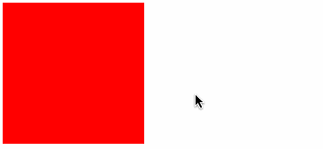
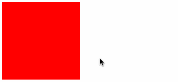
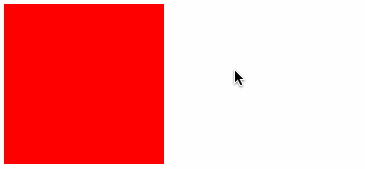

# 一、概述

在CSS中用于设置过渡特效的属性是 [transition](https://developer.mozilla.org/zh-CN/docs/Web/CSS/transition)，该属性允许CSS的属性值在一定的时间区间内平滑地过渡。

过渡可以为一个元素在不同状态之间切换的时候定义不同的过渡效果。比如在不同的伪元素之间切换，像是 [`:hover`](https://developer.mozilla.org/zh-CN/docs/Web/CSS/:hover)，[`:active`](https://developer.mozilla.org/zh-CN/docs/Web/CSS/:active) 或者通过 JavaScript 实现的状态变化。

> 注意：过渡属性只对样式属性值为 **数值** 时有效。

# 二、属性

- [transition-property](https://developer.mozilla.org/zh-CN/docs/Web/CSS/transition-property)：指定应用过渡属性的名称
- [transition-duration](https://developer.mozilla.org/zh-CN/docs/Web/CSS/transition-duration)：以秒或毫秒为单位指定过渡动画所需的时间
- [transition-timing-function](https://developer.mozilla.org/zh-CN/docs/Web/CSS/transition-timing-function)：速度曲线（高级应用：[贝塞尔曲线](http://yisibl.github.io/cubic-bezier/#0,0,1,1)）
- [transition-delay](https://developer.mozilla.org/zh-CN/docs/Web/CSS/transition-delay)：以秒（s）或毫秒（ms）为单位，表明动画过渡效果将在何时开始
- [transition](https://developer.mozilla.org/zh-CN/docs/Web/CSS/transition)：组合值

# 三、示例

## 1、单个属性变化

```html
<div class="box"></div>
```

```css
.box {
    width:  160px;
    height: 160px;
    background-color: #ff0000;
    /*过渡效果*/
    transition: background-color .5s linear 0s;
}
.box:hover {
    background-color: #000;
}
```



## 2、多个属性变化 → 单独设置

```html
<div class="box"></div>
```

```css
.box {
    width:  160px;
    height: 160px;
    background-color: #ff0000;
    /*过渡效果*/
    transition: background-color .5s ease-out 0s, border-radius .35s ease-in 0s;
}
.box:hover {
    background-color: #000;
    border-radius: 80px;
}
```



## 3、多个属性变化 → all

```html
<div class="box"></div>
```

```css
.box {
    width:  160px;
    height: 160px;
    background-color: #ff0000;
    /*过渡效果*/
    transition: all .25s linear 0s;
}
.box:hover {
    background-color: #000;
    border-radius: 80px;
    opacity: .25;
    /*缩放*/
    transform: scale(.5);
}
```



## 4、仿3D 凸起效果

```html
<div class="box">
    <span>CHINA</span>
</div>
```

```css
body {
    background-color: rgb(245, 245, 245);
}

div.box {
    width:  200px;
    height: 325px;
    background-color: #fff;

    /*过渡效果*/
    transition: all .25s linear;

    display: flex;
    justify-content: center;
    align-items: center;

    position: absolute;
    top: 0; right: 0; bottom: 0; left: 0;
    margin: auto;
}
div.box span {
    color: #ff0000;
    letter-spacing: 5px;
    font-size: 30px;
    font-weight: bold;
    text-shadow: 1px 1px 2px #000;

    transition: all .25s linear;
}

div.box:hover {
    transform: translateY(-1px);
    box-shadow: 2px 2px 10px 2px #808080;
}
div.box:hover > span {
    font-size: 35px;
}
```


