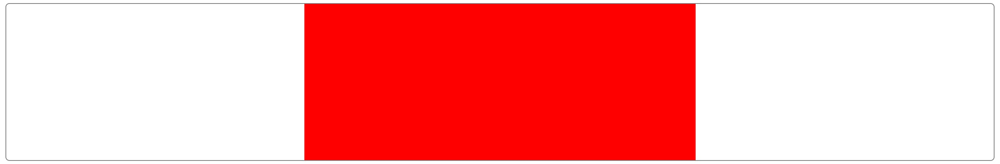
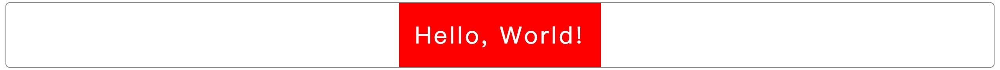
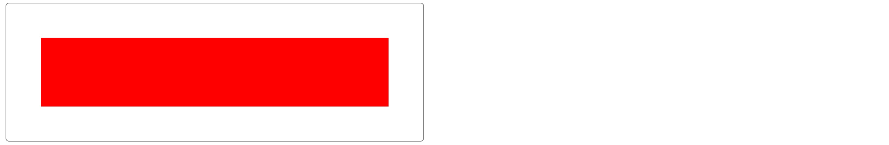
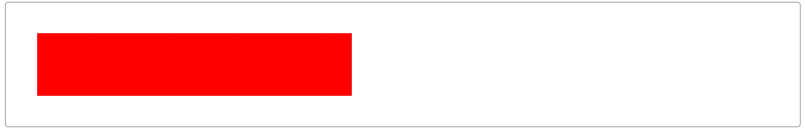
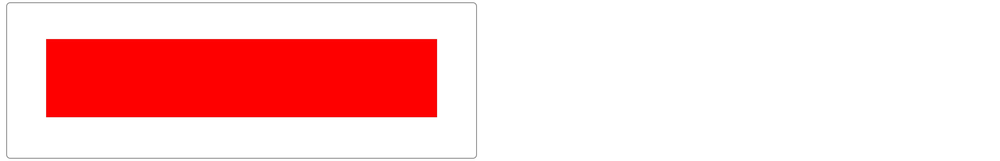

# # 概述

在布局中，我们经常会遇到关于 **元素对齐** 的情况，解决方案也有多种，本篇文章主要讲解居中的各种对齐方式的解决方案。

# # 水平居中

## 1、margin + 定宽

```html
<div class="parent">
    <div class="child"></div>
</div>
```

```css
.parent {
    border: 1px solid #808080;
    border-radius: 5px;
}
.child {
    width:  500px;
    height: 200px;
    background-color: #ff0000;

    margin: 0 auto;
}
```



> 提示：需指定子元素宽度

## 2、table + margin

```html
<div class="parent">
    <div class="child">Hello, World!</div>
</div>
```

```css
.parent {
    border: 1px solid #808080;
    border-radius: 5px;
}
.child {
    background-color: #ff0000;
    padding: 20px;

    color: #fff;
    font-size: 30px;
    letter-spacing: 3px;
 
    display: table;
    margin: 0 auto;
}
```



> 提示：无需指定子元素宽度，`display: table;`  在表现上类似 block 元素，但是宽度为内容宽。

## 3、inline-block + text-align

```html
<div class="parent">
    <div class="child"></div>
</div>
```

```css
.parent {
    border: 1px solid #808080;
    border-radius: 5px;

    /*移除因 inline-block 产生的间隙*/
    font-size: 0;
    -webkit-text-size-adjust: none;

    text-align: center;
}
.child {
    width:  500px;
    height: 200px;
    background-color: #ff0000;

    display: inline-block;
}
```


> 提示：使用 `inline-block` 会产生间距，可通过设置 `font-size: 0;` 解决这个问题。该居中对齐方式兼容性佳（甚至可以兼容 IE 6 和 IE 7）。

## 4、absolute + margin-left

```html
<div class="parent">
    <div class="child"></div>
</div>
```

```css
.parent {

    width:  100%;
    height: 200px;

    border: 1px solid #808080;
    border-radius: 5px;

    position: relative;
}
.child {
    width:  500px;
    height: 200px;
    background-color: #ff0000;

    position: absolute;
    left: 50%;
    margin-left: -250px; /*(width / 2)*/
}
```


> 提示：子元素宽度固定，由于绝对定位会脱离文档流，因此需要设置父元素的宽度/高度。相比后面讲到的使用 transform，这种方法的兼容性更好。

## 5、absolute + transform

```html
<div class="parent">
    <div class="child"></div>
</div>
```

```css
.parent {

    width:  100%;
    height: 200px;

    border: 1px solid #808080;
    border-radius: 5px;

    position: relative;
}
.child {
    width:  500px;
    height: 200px;
    background-color: #ff0000;

    position: absolute;
    left: 50%;
    transform: translateX(-50%);
}
```


> 提示：transform 为css3属性，存在兼容问题。

## 6、flex + justify-content

```html
<div class="parent">
    <div class="child"></div>
</div>
```

```css
.parent {

    width:  100%;
    height: 200px;

    border: 1px solid #808080;
    border-radius: 5px;

    display: flex;
    justify-content: center;
}
.child {
    width:  500px;
    height: 200px;
    background-color: #ff0000;
}
```


> 提示：只需设置父节点属性，无需设置子元素，flex布局存在兼容性问题。

# # 垂直居中

## 1、table-cell + vertical-align

```css
<div class="parent">
    <div class="child"></div>
</div>
```

```css
.parent {
    height: 200px;

    border: 1px solid #808080;
    border-radius: 5px;
    padding: 0 50px;

    display: table-cell;
    vertical-align: middle;
}
.child {
    width:  500px;
    height: 100px;
    background-color: #ff0000;
}
```



> 提示：容器的宽度有子元素的宽度决定。兼容性好(IE 8以下版本需要调整页面结构至 table)

## 2、absolute + margin-top

```html
<div class="parent">
    <div class="child"></div>
</div>
```

```css
.parent {
    width: 100%;
    height: 200px;

    box-sizing: border-box;
    border: 1px solid #808080;
    border-radius: 5px;
    padding: 0 50px;

    position: relative;
}
.child {
    width:  500px;
    height: 100px;
    background-color: #ff0000;

    position: absolute;
    top: 50%;
    margin-top: -50px;
}
```



## 3、absolute + transform

```html
<div class="parent">
    <div class="child"></div>
</div>
```

```css
.parent {
    width: 100%;
    height: 200px;

    box-sizing: border-box;
    border: 1px solid #808080;
    border-radius: 5px;
    padding: 0 50px;

    position: relative;
}
.child {
    width:  500px;
    height: 100px;
    background-color: #ff0000;

    position: absolute;
    top: 50%;
    transform: translateY(-50%);
}
```


> 提示：绝对定位脱离文档流，不会对后续元素的布局造成影响。但如果绝对定位元素是唯一的元素则父元素也会失去高度。transform 为 CSS3 属性，有兼容性问题。

## 4、**flex + align-items**

```html
<div class="parent">
    <div class="child"></div>
</div>
```

```css
.parent {
    width: 100%;
    height: 200px;

    box-sizing: border-box;
    border: 1px solid #808080;
    border-radius: 5px;
    padding: 0 50px;

    display: flex;
    align-items: center;
}
.child {
    width:  500px;
    height: 100px;
    background-color: #ff0000;
}
```


# # 水平垂直居中

## 1、absolute + transform

```html
<div class="parent">
    <div class="child"></div>
</div>
```

```css
.parent {
    width: 100%;
    height: 200px;

    box-sizing: border-box;
    border: 1px solid #808080;
    border-radius: 5px;
    padding: 0 50px;

    position: relative;

}
.child {
    width:  500px;
    height: 100px;
    background-color: #ff0000;

    position: absolute;
    top:  50%;
    left: 50%;
    transform: translate(-50%, -50%);
}
```


## 2、absolute + margin

```html
<div class="parent">
    <div class="child"></div>
</div>
```

```css
.parent {
    width: 100%;
    height: 200px;

    box-sizing: border-box;
    border: 1px solid #808080;
    border-radius: 5px;
    padding: 0 50px;

    position: relative;

}
.child {
    width:  500px;
    height: 100px;
    background-color: #ff0000;

    position: absolute;
    top: 0; right: 0; bottom: 0; left: 0;
    margin: auto;
}
```


## 3、inline-block + text-align + table-cell + vertical-align

```html
<div class="parent">
    <div class="child"></div>
</div>
```

```css
.parent {
    height: 200px;

    box-sizing: border-box;
    border: 1px solid #808080;
    border-radius: 5px;
    padding: 0 50px;

    /*水平居中*/
    text-align: center;
    /*垂直居中*/
    display: table-cell;
    vertical-align: middle;

}
.child {
    width:  500px;
    height: 100px;
    background-color: #ff0000;

    display: inline-block;
}
```



> 提示：高度由子元素决定，该方法兼容性佳。

## 4、flex + justify-content + align-items

```html
<div class="parent">
    <div class="child"></div>
</div>
```

```css
.parent {
    width:  100%;
    height: 200px;

    box-sizing: border-box;
    border: 1px solid #808080;
    border-radius: 5px;
    padding: 0 50px;

    display: flex;
    /*水平居中*/
    justify-content: center;
    /*垂直居中*/
    align-items: center;

}
.child {
    width:  500px;
    height: 100px;
    background-color: #ff0000;
}
```


> 提示：兼容性问题。


