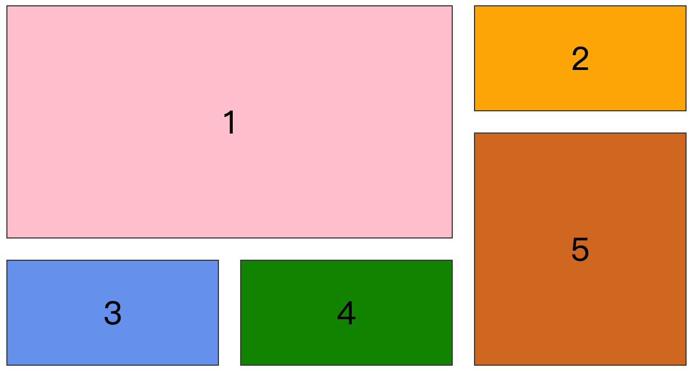
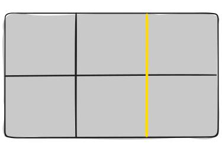
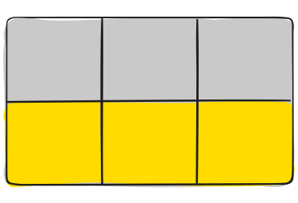

# 概述

[Grid 布局 >>](https://developer.mozilla.org/zh-CN/docs/Web/CSS/CSS_grid_layout) 擅长于将一个页面划分为几个主要区域，以及定义这些区域的大小、位置、层次等关系。

像表格一样，网格布局让我们能够按行或列来对齐元素。然而在布局上，网格比表格更可能做到或更简单。例如，网格容器的子元素可以自己定位，以便它们像 CSS 定位的元素一样，真正的有重叠和层次。



上图这样的布局，就是 Grid 布局的拿手好戏。Grid 布局由两个核心组成，分别是 **网格容器** 和 **网格项**。

本文参考：https://css-tricks.com/snippets/css/complete-guide-grid/

# 兼容性

截至目前，几乎所有的主流浏览器均已支持网格布局，详细数据可在 [caniuse >>](https://caniuse.com/?search=grid) 查看

# 相关术语

在深入研究网格概念之前，理解术语是很重要的。由于这里涉及的术语在概念上都有点相似，如果您不首先记住网格规范定义的含义，就很容易将它们相互混淆。不过别担心，它们并不多。

## 网格容器

网格容器是只使用了 `grid` 或 `inline-grid`属性 的元素，这是所有网格项的直接父项，在下面的例子中，`div.container` 就是一个网格容器

```html
<div class="container" style="display: grid;">
  <div class="item">1</div>
  <div class="item">2</div>
  <div class="item">3</div>
</div>
```

## 网格项

网格容器的直接子元素。下面的 `div.item` 元素就是网格项，但 `span.sub-item`不是。

```html
<div class="container" style="display: grid">
  <div class="item">1</div>
  <div class="item"><span class="sub-item">sub</span></div>
  <div class="item">3</div>
</div>
```

## 网格线

构成网格结构的分隔线。它们可以是垂直的(“列网格线”)，也可以是水平的(“行网格线”)，位于行或列的两侧。这里的黄线是一个列网格线的例子。



## 网格单元

两个相邻行和两个相邻列网格线之间的空间。它是网格的一个“单元”。这里是行网格线1和2，列网格线2和3之间的网格单元格。


## 网格轨道

两个相邻网格线之间的空间。 你可以把它们想象成网格的列或行。 下面是第二行和第三行网格线之间的网格轨道。



## 网格区域

总空间由四条网格线包围。网格区域可以由任意数量的网格单元组成。这里是行网格线1和3，列网格线1和3之间的网格区域。


# 技巧

要开始使用，你首先需要将一个容器元素定义为网格，使用 display: grid，然后通过 grid-template-columns 和 grid-template-rows 设置列和行的大小，接着使用 grid-column 和 grid-row 将其子元素放置到网格中。与 flexbox 类似，网格项的源顺序并不重要，你可以通过 CSS 将它们放置在任何位置，这使得使用媒体查询来重新排列网格变得非常简单。

要熟练掌握一门技术，核心就是找到其最基本的套路，然后不断练习从而可以在之后的实践过程中减少决策的时间。所以，这一部分主要就是介绍网格布局构建过程中的一些常用套路。 

这里我们要解决的问题是，如何利用最基本的规则来构建出理想的布局模型。在布局过程中，归根结底需要处理的就两种页面元素：**父容器** 和 **子元素**。前者主要用来设置基础的布局框架，相当于建筑中的设计蓝图，而后者就是用来进行个性化的布局调整。

因此，我推荐的网格布局的套路就是：**3+2构建法**

**“3+2构建法”** 指在使用网格布局构建页面时，将整个过程简化为五个核心步骤。这五个步骤分为两部分，一部分针对父容器，一部分针对子元素。这里的 “3” 和 “2” 分别代表步骤的数量。

1. **父容器**：设置网格布局的基础框架，需要经历三个步骤：
   - **定框架**：即设定网格布局的整体结构，比如列和行的数量、网格的尺寸等。
   - **设间隔**：定义网格间的间距，包括行间距和列间距。
   - **找对齐**：确保内容在父容器中对齐的方式，比如居中、靠左、靠右等。
2. **子元素**：设置网格中的个性化内容，需要两个步骤：
   - **摆位置**：决定子元素在网格中的位置。
   - **找对齐**：确定子元素内容在单元格中的对齐方式，比如居中、对齐顶端或底端等。

**“3+2构建之法”** 就是将整个网格布局的构建归纳为这五个关键步骤，通过这种简化的套路，可以帮助你在布局时减少思考和决策时间，更加高效地完成设计。

# 父属性·网格容器

## display

将元素定义为网格容器，并为其内容建立新的网格格式上下文。

```css
.container {
  display: grid | inline-grid;
}
```

- `grid`： 创建块级的 Grid 容器
- `inline-grid`：创建行内级的 Grid 容器

> 提示：float、display: inline-block、display: table-cell、vertical-align 和column-* 属性对网格项没有影响。

## grid-template-columns、grid-template-rows

用空格分隔的值列表定义网格的列和行。这些值表示轨道大小，它们之间的间距表示网格线。 

```CSS
.container {
  grid-template-columns: <track-size> ... | <[line-name]> <track-size> ...;
  grid-template-rows: <track-size> ... | <[line-name]> <track-size> ...;
}
```

- `<track-size>`： 可以是长度值，百分比，或者等份网格容器中可用空间（使用 `fr` 单位）
- `<line-name>`：网格线名称

示例：

```CSS
.container {
  grid-template-columns: ...  ...;
  /* e.g. 
      1fr 1fr
      minmax(10px, 1fr) 3fr
      repeat(5, 1fr)
      50px auto 100px 1fr
  */
  grid-template-rows: ... ...;
  /* e.g. 
      min-content 1fr min-content
      100px 1fr max-content
  */
}
```

网格线会自动从这些分配中被赋予正数编号（-1 表示最后一行的替代编号）


但是你可以选择显式地为这些网格线命名。注意网格线名称使用的方括号语法：

```css
.container {
  grid-template-columns: [first] 40px [line2] 50px [line3] auto [col4-start] 50px [five] 40px [end];
  grid-template-rows: [row1-start] 25% [row1-end] 100px [third-line] auto [last-line];
}
```


请注意，一条网格线可以拥有多个名称。例如，这里第二条线将同时拥有两个名称：row1-end 和 row2-start：

```css
.container {
  grid-template-rows: [row1-start] 25% [row1-end row2-start] 25% [row2-end];
}
```

如果你的定义包含重复的部分，你可以使用 repeat() 语法来简化操作：

```css
.container {
  grid-template-columns: repeat(3, 20px [col-start]);
}
```

这相当于如下写法：

```css
.container {
  grid-template-columns: 20px [col-start] 20px [col-start] 20px [col-start];
}
```

如果多条网格线共享相同的名称，它们可以通过网格线名称和计数来引用。

```css
.item {
  grid-column-start: col-start 2;
}
```

fr 单位允许你将轨道的大小设置为网格容器中剩余空间的一部分。例如，下面的代码会将每个项目的宽度设置为网格容器的三分之一：

```css
.container {
  grid-template-columns: 1fr 1fr 1fr;
}
```

剩余空间是在所有非弹性项目占用的空间之后计算的。在这个示例中，可供 fr 单位使用的总剩余空间不包括这 50 像素：

```css
.container {
  grid-template-columns: 1fr 50px 1fr 1fr;
}
```

## grid-template-areas

通过引用使用 grid-area 属性指定的网格区域名称来定义网格模板。重复网格区域的名称会使内容跨越多个单元格。句号表示一个空单元格。该语法本身可以直观地展示网格的结构。

值：

- `<grid-area-name>`：使用 grid-area 指定的网格区域名称
- `.` ：句号表示一个空的网格单元格
- `none`：没有定义任何网格区域

```css
.container {
  grid-template-areas: 
    "<grid-area-name> | . | none | ..."
    "...";
}
```

示例：

```css
.item-a {
  grid-area: header;
}
.item-b {
  grid-area: main;
}
.item-c {
  grid-area: sidebar;
}
.item-d {
  grid-area: footer;
}

.container {
  display: grid;
  grid-template-columns: 50px 50px 50px 50px;
  grid-template-rows: auto;
  grid-template-areas: 
    "header header header header"
    "main main . sidebar"
    "footer footer footer footer";
}
```

这将创建一个宽四列、高三行的网格。整个顶部行将由头部区域组成。中间行将包含两个主要区域、一个空单元格和一个侧边栏区域。最后一行则全部是底部区域。


在你的声明中，每一行需要具有相同数量的单元格。

你可以使用任意数量的相邻句点来声明一个空单元格。只要句点之间没有空格，它们就代表一个单元格。

请注意，你并没有使用这种语法来命名线条，只是在命名区域。当你使用这种语法时，区域两端的线条实际上是自动命名的。如果你的网格区域名称是 foo，那么该区域的起始行线和起始列线的名称将是 foo-start，最后一行线和最后一列线的名称将是 foo-end。这意味着某些线条可能会有多个名称，例如上面示例中的最左边的线条，将会有三个名称：header-start、main-start 和 footer-start。

## grid-template

一个简写方式可以在单个声明中同时设置 grid-template-rows、grid-template-columns 和 grid-template-areas。

```css
.container {
  grid-template: none | <grid-template-rows> / <grid-template-columns>;
}
```

值：

- `none`：将这三个属性（grid-template-rows、grid-template-columns 和 grid-template-areas）全部设置为它们的初始值
- `<grid-template-rows> / <grid-template-columns>`：分别将 grid-template-columns 和 grid-template-rows 设置为指定的值，并将 grid-template-areas 设置为 none。

它还接受一种更复杂但非常实用的语法来同时指定这三个属性。以下是一个示例：

```css
.container {
  grid-template:
    [row1-start] "header header header" 25px [row1-end]
    [row2-start] "footer footer footer" 25px [row2-end]
    / auto 50px auto;
}
```

这相当于如下写法：

```css
.container {
  grid-template-rows: [row1-start] 25px [row1-end row2-start] 25px [row2-end];
  grid-template-columns: auto 50px auto;
  grid-template-areas: 
    "header header header" 
    "footer footer footer";
}
```

由于 grid-template 不会重置隐式网格属性（如 grid-auto-columns、grid-auto-rows 和 grid-auto-flow），而在大多数情况下你可能希望重置这些属性，因此建议使用 grid 属性来代替 grid-template。

## column-gap、row-gap

指定网格线的大小。你可以将其理解为设置列或行之间的间隙宽度（也就是“沟槽”的宽度）

```css
.container {
  /* standard */
  column-gap: <line-size>;
  row-gap: <line-size>;
}
```

- `<line-size>`：间隔值

示例：

```css
.container {
  grid-template-columns: 100px 50px 100px;
  grid-template-rows: 80px auto 80px; 
  column-gap: 10px;
  row-gap: 15px;
}
```


## gap

这是 row-gap 和 column-gap 的简写形式，用于同时设置行间距和列间距。

```css
.container {
  /* standard */
  gap: <grid-row-gap> <grid-column-gap>;
}
```

示例：

```css
.container {
  grid-template-columns: 100px 50px 100px;
  grid-template-rows: 80px auto 80px; 
  gap: 15px 10px;
}
```

如果未指定 row-gap，则其值会与 column-gap 相同。

## justify-items

在行轴（inline axis，横向）上对齐网格项（与 align-items 不同，后者是在块轴（block axis，纵向）上对齐）。此值适用于容器内的所有网格项。

```css
.container {
  justify-items: start | end | center | stretch;
}
```

- `start`：将项目与其单元格的起始边缘对齐（左侧对齐）
- `end`：将项目与其单元格的结束边缘对齐（右侧对齐）
- `center`：将项目居中对齐在其单元格内（水平居中对齐）
- `stretch`：填满整个单元格的宽度（默认值）

语法形式如下：

```css
.container {
  justify-items: start | end | center | stretch;
}
```

示例：

```css
.container {
  justify-items: start;
}
```


```CSS
.container{
  justify-items: end;
}
```


```css
.container{
  justify-items: center;
}
```


```css
.container{
  justify-items: stretch;
}
```


> 注意：这种行为也可以通过 justify-self 属性在单个网格项上进行设置。

## align-items

在块轴（column，纵向）上对齐网格项（与 justify-items 不同，后者是在行轴（row，横向）上对齐）。此值适用于容器内的所有网格项。

```css
.container {
  align-items: start | end | center | stretch;
}
```

- `start`：将项目与单元格的起始边缘对齐（顶部对齐）
- `end`：将项目与单元格的结束边缘对齐（底部对齐）
- `center`：将项目居中对齐在单元格内（垂直居中对齐）
- `stretch`：填满单元格的整个高度（默认值）
- `baseline`：将项目沿文本基线对齐。对于多行文本，baseline 有两个修饰符：first baseline 和 last baseline，它们分别使用第一行或最后一行的基线。

> 提示：*align-items* 与 *justify-items* 效果类似，只是方向不同，*align-items* 控制垂直方向的对齐方式，*justify-items* 控制水平方向的对齐方式。

示例：

```css
.container {
  align-items: start;
}
```


```css
.container {
  align-items: end;
}
```


```css
.container {
  align-items: center;
}
```


```css
.container {
  align-items: stretch;
}
```


这种行为也可以通过 align-self 属性在单个网格项上进行设置。

还有两个修饰关键字：safe 和 unsafe（用法类似于 align-items: safe end）。safe 关键字的含义是：“尝试以这种方式对齐，但如果这会导致项目移动到无法访问的溢出区域，则不要对齐。” 而 unsafe 则允许内容移动到无法访问的区域，即使这会导致“数据丢失”。

## place-items

`place-items` 是设置 `align-items` 和 `justify-items` 的简写形式。其语法形式如下：

```css
.container {
  place-items: <align-items> / <justify-items>
}
```

> 提示：如果省略第二个值，则将第一个值同时分配给这两个属性。

## justify-content

有时你的网格总大小可能小于其网格容器的大小。如果所有网格项的尺寸都使用非弹性单位（如 px）定义，这种情况就可能发生。在这种情况下，你可以设置网格在网格容器内的对齐方式。该属性会沿着行轴（inline axis，横向）对齐网格（不同于 align-content，它是沿着块轴（block axis，纵向）对齐网格的）。

```css
.container {
  justify-content: start | end | center | stretch | space-around | space-between | space-evenly;    
}
```

- `start`：将网格对齐到网格容器的起始边缘（左侧对齐）
- `end`：将网格对齐到网格容器的结束边缘（右侧对齐）
- `center`：将网格居中对齐在网格容器内（水平居中对齐）
- `stretch`：调整网格项大小，使网格填满网格容器的整个宽度
- `space-around`：在每个网格项之间放置相同的空间，两端的空隙是这些空间的一半
- `space-between`：在每个网格项之间放置相等的空间，两端没有空隙
- `space-evenly`：在每个网格项之间放置相同的空间，包括两端

示例：

```css
.container {
  justify-content: start;
}
```


```css
.container {
  justify-content: end;
}
```


```CSS
.container {
  justify-content: center;
}
```


```CSS
.container {
  justify-content: stretch;
}
```


```css
.container {
  justify-content: space-around;
}
```


```CSS
.container {
  justify-content: space-between;
}
```


```CSS
.container {
  justify-content: space-evenly;
}
```


## align-content

有时你的网格总大小可能会小于网格容器的大小。如果所有网格项的尺寸都使用非弹性单位（如 px）定义，这种情况可能发生。在这种情况下，你可以设置网格在网格容器内的对齐方式。该属性会沿着块轴（block axis，纵向）对齐网格（不同于 justify-content，它是沿着行轴（row，横向）对齐网格的）。

```css
.container {
  align-content: start | end | center | stretch | space-around | space-between | space-evenly;    
}
```

- `start`：将网格对齐到网格容器的起始边缘（顶部对齐）
- `end`：将网格对齐到网格容器的结束边缘（底部对齐）
- `center`：将网格居中对齐在网格容器内（垂直居中对齐）
- `stretch`：调整网格项大小，使网格填满网格容器的整个高度
- `space-around`：在每个网格项之间放置相同的空间，两端的空隙是这些空间的一半
- `space-between`：在每个网格项之间放置相等的空间，两端没有空隙
- `space-evenly`：在每个网格项之间放置相同的空间，包括两端

示例：

```css
.container {
  align-content: start;    
}
```


```css
.container {
  align-content: end;    
}
```


```css
.container {
  align-content: center;    
}
```


```css
.container {
  align-content: stretch;    
}
```


```css
.container {
  align-content: space-around;    
}
```


```css
.container {
  align-content: space-between;    
}
```


```css
.container {
  align-content: space-evenly;    
}
```


## place-content 

`place-content` 是设置 `align-content` 和 `justify-content` 的简写形式。语法形式如下：

```css
.container {
  place-content: <align-content> / <justify-content>;
}
```

> 提示：如果省略第二个值，则将第一个值同时分配给这两个属性。

## grid-auto-columns、grid-auto-rows

指定自动生成的网格轨道（也称为隐式网格轨道）的大小。当网格项数量超过网格中的单元格数，或某个网格项被放置在显式网格之外时，会创建隐式轨道。（参见显式网格与隐式网格的区别）

```css
.container {
  grid-auto-columns: <track-size> ...;
  grid-auto-rows: <track-size> ...;
}
```

- `<track-size>`：可以是长度值、百分比，或网格中剩余空间的一部分（使用 fr 单位）。

为了说明隐式网格轨道是如何创建的，可以这样想：当你的网格定义了固定数量的行和列时，如果添加了超出这些行列范围的网格项，浏览器会自动生成额外的轨道来容纳这些网格项，这些额外的轨道就是隐式网格轨道。

```css
.container {
  grid-template-columns: 60px 60px;
  grid-template-rows: 90px 90px;
}
```


这会创建一个 2x2 的网格。

但是现在想象一下，你使用 grid-column 和 grid-row 来像这样定位你的网格项：

```css
.item-a {
  grid-column: 1 / 2;
  grid-row: 2 / 3;
}
.item-b {
  grid-column: 5 / 6;
  grid-row: 2 / 3;
}
```


我们让 .item-b 从第 5 列线开始，到第 6 列线结束，但我们并没有定义第 5 列线或第 6 列线。由于引用了不存在的线，系统会创建宽度为 0 的隐式轨道来填补这些空缺。我们可以使用 grid-auto-columns 和 grid-auto-rows 来指定这些隐式轨道的宽度。

```css
.container {
  grid-auto-columns: 60px;
}
```


## grid-auto-flow

如果你有未明确放置在网格中的网格项，自动布局算法将会自动为它们分配位置。这个属性可以控制自动布局算法的工作方式。

```css
.container {
  grid-auto-flow: row | column | row dense | column dense;
}
```

- `row`：告诉自动布局算法依次填充每一行，必要时添加新行（默认值）。
- `column`：告诉自动布局算法依次填充每一列，必要时添加新列。
- `dense`：告诉自动布局算法如果后续出现较小的网格项，尝试填补网格中较早出现的空隙。

> 请注意，dense 只会改变网格项的视觉顺序，可能会导致它们的显示顺序与文档顺序不一致，这对无障碍性来说是不利的。

示例：

请看以下 HTML 代码：

```html
<section class="container">
  <div class="item-a">item-a</div>
  <div class="item-b">item-b</div>
  <div class="item-c">item-c</div>
  <div class="item-d">item-d</div>
  <div class="item-e">item-e</div>
</section>
```

你定义了一个有五列和两行的网格，并将 grid-auto-flow 设置为 row（这也是默认值）：

```css
.container {
  display: grid;
  grid-template-columns: 60px 60px 60px 60px 60px;
  grid-template-rows: 30px 30px;
  grid-auto-flow: row;
}
```

在将项目放置到网格上时，你只为其中两个指定了位置：

```css
.item-a {
  grid-column: 1;
  grid-row: 1 / 3;
}
.item-e {
  grid-column: 5;
  grid-row: 1 / 3;
}
```

因为我们将 grid-auto-flow 设置为 row，我们的网格将如下所示。注意我们没有放置的三个项目（item-b、item-c 和 item-d）是如何在可用的行中流动的：


如果我们将 grid-auto-flow 设置为 column，item-b、item-c 和 item-d 将沿着列向下流动：

```css
.container {
  display: grid;
  grid-template-columns: 60px 60px 60px 60px 60px;
  grid-template-rows: 30px 30px;
  grid-auto-flow: column;
}
```


# 子属性·网格项

## grid-column-start、grid-column-end、grid-row-start、grid-row-end

通过引用特定的网格线来确定网格项在网格中的位置。grid-column-start/grid-row-start 是项开始的线，而 grid-column-end/grid-row-end 是项结束的线。

```css
.item {
  grid-column-start: <number> | <name> | span <number> | span <name> | auto;
  grid-column-end: <number> | <name> | span <number> | span <name> | auto;
  grid-row-start: <number> | <name> | span <number> | span <name> | auto;
  grid-row-end: <number> | <name> | span <number> | span <name> | auto;
}
```

- **`<line>`** – 可以是一个数字，表示一个编号的网格线，也可以是一个名称，表示一个命名的网格线。
- **`span <number>`** – 项将跨越指定数量的网格轨道。
- **`span <name>`** – 项将跨越，直到遇到下一个具有指定名称的线。
- **`auto`** – 表示自动放置、自动跨度或默认跨度为一。

示例：

```css
.item-a {
  grid-column-start: 2;
  grid-column-end: five;
  grid-row-start: row1-start;
  grid-row-end: 3;
}
```


```css
.item-b {
  grid-column-start: 1;
  grid-column-end: span col4-start;
  grid-row-start: 2;
  grid-row-end: span 2;
}
```


如果没有声明 grid-column-end / grid-row-end，项将默认跨越一个轨道。

项可以重叠。你可以使用 z-index 来控制它们的堆叠顺序。

## grid-column、grid-row

分别是 grid-column-start + grid-column-end 和 grid-row-start + grid-row-end 的简写。

```css
.item {
  grid-column: <start-line> / <end-line> | <start-line> / span <value>;
  grid-row: <start-line> / <end-line> | <start-line> / span <value>;
}
```

- **`<start-line>` / `<end-line>`**：每个属性都接受与长格式相同的所有值，包括 span。

示例：

```css
.item-c {
  grid-column: 3 / span 2;
  grid-row: third-line / 4;
}
```


如果没有声明结束线值，该项目将默认跨越 1 个轨道。

## grid-area

给项目一个名称，以便可以通过使用 grid-template-areas 属性创建的模板进行引用。或者，该属性也可以用作 grid-row-start + grid-column-start + grid-row-end + grid-column-end 的更短的简写形式。

```css
.item {
  grid-area: <name> | <row-start> / <column-start> / <row-end> / <column-end>;
}
```

- **`<name>`** – 你选择的名称
- **`<row-start>` / `<column-start>` / `<row-end>` / `<column-end>`** – 可以是数字或命名的线

示例：

作为给项目分配名称的一种方式：

```css
.item-d {
  grid-area: header;
}
```

作为 grid-row-start + grid-column-start + grid-row-end + grid-column-end 的简短写法：

```css
.item-d {
  grid-area: 1 / col4-start / last-line / 6;
}
```


## justify-self

在单元格内沿着行轴（inline axis）对齐网格项（与 align-self 沿列轴（block axis）对齐相对）。此值适用于单个单元格内的网格项。

```css
.item {
  justify-self: start | end | center | stretch;
}
```

- **`start`** – 将网格项与单元格的起始边缘对齐
- **`end`** – 将网格项与单元格的结束边缘对齐
- **`center`** – 将网格项居中对齐到单元格内
- **`stretch`** – 填充单元格的整个宽度（这是默认值）

示例：

```css
.item-a {
  justify-self: start;
}
```


```css
.item-a {
  justify-self: end;
}
```


```css
.item-a {
  justify-self: center;
}
```


```css
.item-a {
  justify-self: stretch;
}
```


要为网格中的所有项目设置对齐方式，可以通过网格容器的 justify-items 属性来实现这一行为。

## align-self

在单个网格单元内，沿着块（列）轴对齐网格项（与 justify-self 相对，后者沿着行轴对齐）。此值适用于单个网格项内的内容。

```css
.item {
  align-self: start | end | center | stretch;
}
```

- **`start`** – 将网格项对齐到单元格的起始边缘
- **`end`** – 将网格项对齐到单元格的结束边缘
- **`center`** – 将网格项居中对齐在单元格内
- **`stretch`** – 填充整个单元格的高度（这是默认值）

示例：

```css
.item-a {
  align-self: start;
}
```


```css
.item-a {
  align-self: end;
}
```


```css
.item-a {
  align-self: center;
}
```


```css
.item-a {
  align-self: stretch;
}
```


要对齐网格中的所有项，这种行为也可以通过 align-items 属性在网格容器上设置。

## place-self

place-self 在一个声明中同时设置 align-self 和 justify-self 属性。

```css
.item {
  place-self: <align-self> / <justify-self>
}
```

- **`auto`** – 布局模式的“默认”对齐方式
- **`<align-self>` / `<justify-self>`** – 第一个值设置 align-self，第二个值设置 justify-self。如果省略第二个值，第一个值将被赋值给两个属性。

示例：

```css
.item-a {
  place-self: center;
}
```


```css
.item-a {
  place-self: center stretch;
}
```


> 提示：除了 Edge 以外，所有主要浏览器都支持 place-self 简写属性。

# 特殊单位和函数

## fr 单位

您可能会在 CSS 网格布局中使用大量分数单位，例如 1fr。它们基本上表示“剩余空间的一部分”。因此，像这样的声明：

```css
grid-template-columns: 1fr 3fr;
```

这意味着，大致上是 25% 和 75%。但这些百分比值比分数单位要更加严格。例如，如果您为这些基于百分比的列添加了内边距，那么就会破坏 100% 的宽度（假设使用的是 content-box 盒模型）。分数单位在与其他单位组合时也更加灵活，正如您可以想象的那样：

```css
grid-template-columns: 50px min-content 1fr;
```

## 尺寸关键词

在设置行和列的大小时，您可以使用所有常用的长度单位，比如 px、rem、%、等，但您也可以使用以下关键词：

- `min-content`：内容的最小尺寸。想象一下文本“E pluribus unum”，最小尺寸可能是单词“pluribus”的宽度。
- `max-content`：内容的最大尺寸。想象上面的句子，最大尺寸是整个句子的长度。
- `auto`：这个关键词与 fr 单位非常相似，但在分配剩余空间时，它们在尺寸上会“输给” fr 单位。
- `fr`：见上文。

## 尺寸函数

- `fit-content()`：该函数使用可用空间，但绝不会少于最小内容（min-content），也绝不会超过最大内容（max-content）
- `minmax()`：这个函数显而易见地设置了长度的最小和最大值。这在与相对单位结合使用时非常有用。例如，您可能希望某一列只能缩小到一定程度
- `min()`
- `max()`

## repeat

repeat() 函数可以减少输入的工作量：

```css
grid-template-columns:
  1fr 1fr 1fr 1fr 1fr 1fr 1fr 1fr;

/* easier: */
grid-template-columns:
  repeat(8, 1fr);

/* especially when: */
grid-template-columns:
  repeat(8, minmax(10px, 1fr));
```

但是当 repeat() 与关键词结合使用时，它可以变得更加灵活：

- `auto-fill`：尽可能多地在一行中填充列，即使这些列是空的
- `auto-fit`：将现有的列填入空间。优先扩展列以填充空间，而不是留空列。

这是所有 CSS Grid 中最著名的代码片段之一，也是 CSS 中的经典技巧之一：

```css
grid-template-columns: 
  repeat(auto-fit, minmax(250px, 1fr));
```

这两个关键字之间的区别在 [这里 >>](https://css-tricks.com/auto-sizing-columns-css-grid-auto-fill-vs-auto-fit/) 详细说明

# 奇淫技巧

https://css-tricks.com/snippets/css/complete-guide-grid/#aa-css-grid-tricks

## 流体列

流体宽度的列，根据可用空间自动调整为更多或更少的列，无需媒体查询！

```css
.grid {
  display: grid;
  grid-template-columns: repeat(auto-fill, minmax(200px, 1fr));
  /* This is better for small screens, once min() is better supported */
  /* grid-template-columns: repeat(auto-fill, minmax(min(200px, 100%), 1fr)); */
  gap: 1rem;
}
```


