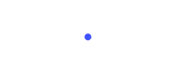
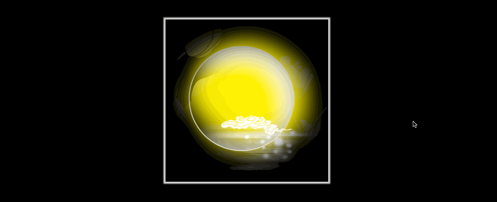
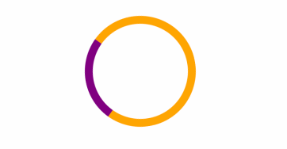

# 一、概述

`Animation` 和 `transition` 大部分属性是相同的，他们都是随时间改变元素的属性值，他们的主要区别是 `transition` 需要触发一个事件才能改变属性，而`animation` 不需要触发任何事件的情况下才会随时间改变属性值，并且 transition 为2帧，从 `from .... to` ，而 animation 可以一帧一帧的。

# 二、属性

## 1、animation-name

该属性用于定义动画的名称，以供需要使用该动画的 `animation` 属性调用，该名称完全是由用户自定义的，但也应该要“语义化”一些，方便调用者能更直观地了解此处定义动画的实际作用，而且切忌出现特殊符号（浏览器解析会存在差异），如一个改变元素颜色动画的名称定义应该是：                                                                                                                                                                                                                                 

- 定义动画

  ```css
  @keyframes changeColor {
  	/* 各关键帧执行的css属性 */
  }
  ```

- 设置动画

  ```css
  div {
  	animation-name: changeColor;
  }
  ```

> 提示：定义动画的“关键帧”有两种方式，一种为“英文单词”定义模式，一种为“百分数”定义模式。
>
> - 英文单词模式
>
>   该模式只包含两个关键帧，即开始帧“from”，表示动画开始时执行的CSS属性，和结束帧“to”，表示动画结束时执行的CSS属性。
>
> - 百分数模式
>
>   该模式相对“英文单词”定义关键帧的模式更为详细，能够支持理论上从“0%”到“100%”之间的所有帧的定义，“0%”相当于“from”，表示动画开始帧，“100%”相当于“to”，表示动画结束帧。该模式由于控制的精细度高，书写修改容易，甚至可以通过“定义百分比的跳跃”或“CSS属性值的跳跃”来实现动画的“匀速”、“加速”、“减速”，“变速”等动画速率的变化，非常地灵活，所以这种写法也是现今最主流的定义动画关键帧的方式。
>
> ```css
> @keyframes changeColor {
> 	from {color: #000;}
>      to {color: #ccc;}
> }
>
> @keyframes changeColor {
> 	0% {color: red;}
>     50% {color: green;}
>    100% {color: blue;}
> }
> ```

## 2、animation-duration

该属性用于定义动画执行的时间，即一段动画从开始到动画结束所经历的时间，单位为秒“s”或毫秒“ms”，默认值为“0”，即不执行任何动画，所以在定义设置一个动画的时候始终都要设置该属性，并给定一个大于“0”的时间。

## 3、animation-timing-function

该属性定义元素随着时间的推进执行动画的速率变化（线性规律）。主要有以下值：

- `ease`：默认值，逐渐变慢；
- `linear`：匀速
- `ease-in`：加速
- `ease-out`：减速
- `ease-in-out`：先加速，再减速
- `cubic-bezier([参数])`：可以定义一个时间曲线，可以为其配置四个参数，前两个参数为“x1”和“x2”，定义“开始控制点”，后两个参数为“y1”和“y2”，定义“结束控制点”。而“开始点”和“结束点”是通过这两条“转换点控制轴”分别去调整两个点来实现曲线的变化的。

## 4、animation-delay

该属性定义动画延迟时间，即延时一段时间之后再执行动画，其单位为秒或毫秒；

- `默认0`：立即执行动画
- 正值：延迟指定时间后，开始执行动画
- `负值`：立即执行，但跳过指定时间后进入动画

## 5、animation-iteration-count

该属性用于设置动画播放的次数，它可以设置三种类型的值：

- `1（默认值）`：表示在执行某事件后只执行1次动画。
- `[number]`：任意正整数，表示在执行某事件后只执行[number]次动画。
- `infinite`：表示在执行某事件后“无限次”执行动画。

## 6、animation-direction

该属性用于设置元素动画是否能够周期性地逆向播放，逆向动画播放的进行时间和“正向播放”一致，时间速度曲线会按照“100%（to）”到“0%（from）”的方向进行。

- `normal`：默认值；
- `alternate`：逆向执行；

## 7、animation-play-state

该属性用于设置动画播放状态，其值为：

- `running`：播放动画；
- `paused`：暂停动画；

## 8、animation-fill-mode

若不将动画的 `animation-iteration-count` 属性设置为 `infinite` 值的话，动画在播放完成后会还原到元素没有“挂载”动画播放效果之前的状态，在有的应用场景里这样似乎没有问题，但在有些应用场景下，这样的设定会让人有一种“瞎忙活”或“功败垂成”的感觉。而 `animation-fill-mode` 属性的出现克服了这个问题，它可以预设值动画播放前的“第一帧”和保留动画播放完成后的“最后一帧”，可以通过以下值进行设置：

- `backwards`：让元素保持动画第一帧定义里所设置的CSS属性，直到动画开始执行。
- `forwards`：让元素保持动画播放结束后最后一帧定义里所设置的CSS属性。
- `both`：让元素保持动画第一帧里定义的CSS属性，直到动画开始，动画播放完成后又保持动画最后一帧的属性。

## 9、animation

动画组合值写法，其语法形式为：

```css
animation: 动画名称 持续时间 线性规律 延迟时间 播放次数 周期逆向播放 播放/暂停 首帧预设/末帧保留；
```

> 提示：动画名称与持续时间为必需属性，其他属性可根据实际需要省略。

# 三、示例

## 1、光晕效果

```html
<div class="box">
    <span>CHINA</span>
</div>
```

```css
body {
    background-color: #000;
}

/*定义动画*/
@keyframes shine {
    0%    { box-shadow: 0px 0px 5px  0px  #fff; }
    70%   { box-shadow: 0px 0px 20px 10px #ff0000; }
    100%  { box-shadow: 0px 0px 5px  0px  #fff; }
}

div.box {
    width:  200px;
    height: 200px;
    border-radius: 50%;

    display: flex;
    justify-content: center;
    align-items: center;

    position: absolute;
    top: 0; right: 0; bottom: 0; left: 0;
    margin: auto;

    animation: shine 1s linear infinite;
}
div.box span {
    color: #ff0000;
    letter-spacing: 5px;
    font-size: 30px;
    font-weight: bold;
    text-shadow: 1px 1px 2px #fff;
}
```


## 2、气泡效果

```html
<div class="box"></div>
```

```css
.box {
	width:  40px;
	height: 40px;
	background-color: blue;
	border-radius: 50%;
	margin: 100px auto;
	-webkit-animation: fadeOut 1.0s infinite ease-in-out;
	animation: fadeOut 1.0s infinite ease-in-out;
}
@-webkit-keyframes fadeOut {
	from { -webkit-transform: scale(0.0); }
	to   { -webkit-transform: scale(1.0); opacity: 0; }
}
@keyframes fadeOut {
	from { transform: scale(0.0); }
	to   { transform: scale(1.0); opacity: 0; }
}
```



## 3、嫦娥奔月

```html
<div class="translateBox">
    <div class="img"></div>
</div>
```

```css
body {
    background: #000;
}
.translateBox {
    width:  400px;
    height: 400px;
    margin: 100px auto;
    background: url("../imgs/bg.png");
    background-size: contain;
    cursor: pointer;

    -webkit-box-shadow: 0 0 3px 5px  #d3d3d3;
    -moz-box-shadow: 0 0 3px 5px  #d3d3d3;
    box-shadow: 0 0 3px 5px  #d3d3d3;

    position: relative;
}

.translateBox .img {
    width:  calc(100% / 2);
    height: calc(100% / 2);
    background: url("../imgs/change.png");
    background-size: contain;
    opacity: 0;


    transition: opacity 1s ease-in-out 0.5s, transform 1s ease-in-out;
    -webkit-transform: scale(.5, .5);
    transform: scale(.5, .5);


    position: absolute;
    top:  -90px;
    left: -90px;
}

.translateBox:hover .img {
    opacity: 1;

    -webkit-transform: translate(170px, 180px);
    transform: translate(170px, 180px);

    transition: opacity 1s ease-in-out, transform 1s ease-in-out .2s;
}
```



# 四、动画技巧

## 1、延迟调用

```html
<div class="box">
	<div class="line line1"></div>
	<div class="line line2"></div>
	<div class="line line3"></div>
	<div class="line line4"></div>
	<div class="line line5"></div>
</div>
```

```css
.box {
	width:  60px;
	height: 30px;
	margin: 100px auto;
	text-align: center;
}

.box > .line {
	display: inline-block;
	width: 6px;
	height: 100%;
	background-color: green;

	-webkit-animation: strechDelay 1s linear infinite;
	animation: strechDelay 1s linear infinite;
	
}
.box > .line2 {
	-webkit-animation-delay: -0.9s;
	animation-delay: -0.9s;
}
.box > .line3 {
	-webkit-animation-delay: -0.8s;
	animation-delay: -0.8s;
}
.box > .line4 {
	-webkit-animation-delay: -0.7s;
	animation-delay: -0.7s;
}
.box > .line5 {
	-webkit-animation-delay: -0.6s;
	animation-delay: -0.6s;
}

@-webkit-keyframes strechDelay {
	0%, 40%, 100% { -webkit-transform: scaleY(.4); }
	20%   { -webkit-transform: scaleY(1.0);}
}
@keyframes strechDelay {
	0%, 40%, 100% { transform: scaleY(.4); }
	20%   { transform: scaleY(1.0);}
}
```


## 2、进度指示

```html
<div class="box"></div>
```

```css
.box {
	width:  120px;
	height: 120px;
	margin: 100px auto;

	border: 10px solid orange;
	border-left-color: purple;
	border-radius: 50%;

	animation: loading 1.2s linear infinite;
	-webkit-animation: loading 1.2s linear infinite;
}


@-webkit-keyframes loading {
	from {
		-webkit-transform: rotate(0deg);
	}
	to {
		-webkit-transform: rotate(360deg);
	}
}
@keyframes loading {
	from {
		transform: rotate(0deg);
	}
	to {
		transform: rotate(360deg);
	}
}
```



## 3、hover 特效

```html
<a href="javascript:;" class="wrap">
	<div class="img"></div>
	<div class="mask">
		<div class="info">
			<h3>周杰伦</h3>
			<p>十一月的肖邦</p>
		</div>
	</div>
	<div class="border"></div>
</a>
```

```css
.wrap, .img, .mask, .border {
	width:  300px;
	height: 300px;
	border-radius: 50%;
}
.wrap {
	position: relative;
	display: block;
}
.img {
	background: url('jay.jpeg') no-repeat 50% 50%;
	background-size: cover;
}
.mask, .border {
	position: absolute;
	left: 0;
	top: 0;
}
.mask {
	text-align: center;
	color: rgba(255, 255, 255, 0);
	transition: all .5s ease-in;
}
.info {
	margin-top: 50%;
	transform: translateY(-50%);
}
.border {
	border: 10px solid #072256;
	border-left-color: #E07514;
	border-top-color: #E07514;
	box-sizing: border-box;
	transition: all .5s ease-in;
}

.wrap:hover .mask {
	background: rgba(0, 0, 0, .5);
	color: rgba(255, 255, 255, 1);
}
.wrap:hover .border {
	transform: rotate(180deg);
}
```


