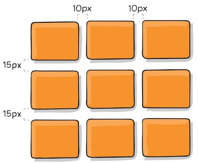
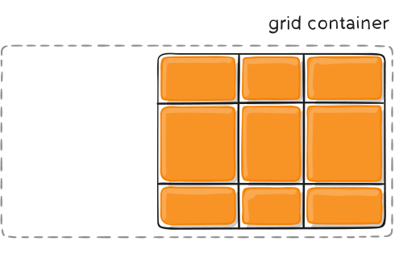
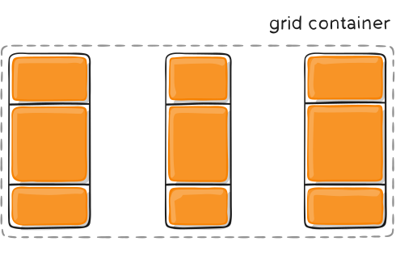
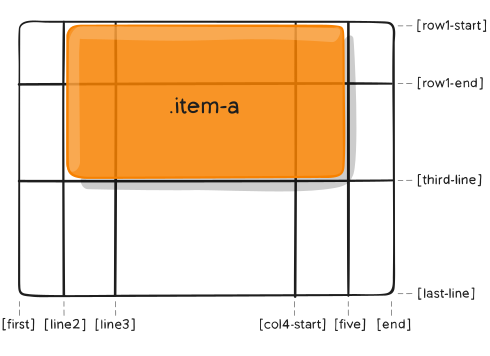
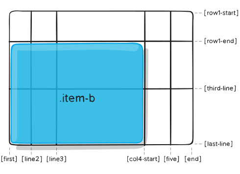

# # 概述

Grid 布局是网站设计的基础，CSS Grid 是创建网格布局最强大和最简单的工具。它是一个二维的基于网格的布局系统，其目的只在于完全改变我们设计基于网格的用户界面的方式。 CSS一直用来布局网页，但一直都不完美。 一开始我们使用table 做布局，然后转向浮动、定位以及inline-block，但所有这些方法本质上都是 Hack 的方式，并且遗漏了很多重要的功能（例如垂直居中）。 Flexbox的出现在一定程度上解决了这个问题，但是它的目的是为了更简单的一维布局，而不是复杂的二维布局（Flexbox和Grid实际上一起工作得很好）。 只要我们一直在制作网站，我们就一直在为解决布局问题不断探索， 而Grid是第一个专门为解决布局问题而生的CSS模块。

CSS Grid 布局由两个核心组成部分是 **container**（父元素）和 **items**（子元素）。 container 是实际的 grid(网格)，items 是 grid(网格) 内的内容。

# # 基础

一开始你需要使用 *display：grid；* 把容器元素定义为一个网格，使用 *grid-template-columns* 和*grid-template-rows* 设置列和行大小，然后使用 *grid-column*  和 *grid-row* 把它的子元素放入网格。 与flexbox类似，网格子元素的原始顺序不重要。 你的可以在 CSS 里以任意顺序放置它们，这使得使用媒体查询重新排列网格变得非常容易。 想象一下，我们需要定义整个页面的布局，然后为了适应不同的屏幕宽度完全重新排列，我们只需要几行CSS就能实现这个需求。 网格是有史以来最强大的CSS模块之一。

截至2017年3月，许多浏览器都提供了原生的、不加前缀的对CSS Grid的支持，比如 Chrome（包括Android），Firefox，Safari（包括iOS）和Opera。 另一方面，Internet Explorer 10和11支持它，但需要使用过时的语法。 Edge浏览器已经宣布将支持标准的Grid语法，但暂未支持

> 浏览器支持的详细数据可在[Caniuse](https://caniuse.com/#feat=css-grid)查看。其中里面的数字表示该版本以上的浏览器支持Grid。

# # 重要术语

## 1. Grid Container

设置了 `display: gird ` 的元素。 这是所有grid item的直接父项。 在下面的例子中，`.container` 就是是 grid container。

```html
<div class="container">
  <div class="item item-1"></div>
  <div class="item item-2"></div>
  <div class="item item-3"></div>
</div> 
```

## 2. Grid Item

Grid 容器的直接子元素。下面的 `.item` 元素就是 grid item，但 `.sub-item`不是。

```html
<div class="container">
  <div class="item"></div> 
  <div class="item">
    <p class="sub-item"></p>
  </div>
  <div class="item"></div>
</div>
```

## 3. Grid Line

这个分界线组成网格结构。 它们既可以是垂直的（“column grid lines”），也可以是水平的（“row grid lines”），并位于行或列的任一侧。 下面例中的黄线就是一个列网格线。

## 4. Grid Track

两个相邻网格线之间的空间。 你可以把它们想象成网格的列或行。 下面是第二行和第三行网格线之间的网格轨道。

## 5. Grid Cell

两个相邻的行和两个相邻的列网格线之间的空间。它是网格的一个“单元”。 下面是行网格线1和2之间以及列网格线2和3的网格单元。

## 6. Grid Area 

四个网格线包围的总空间。 网格区域可以由任意数量的网格单元组成。 下面是行网格线1和3以及列网格线1和3之间的网格区域。

# # 网格容器属性

## 01. display

将元素定义为 grid container

```css
.container {
  display: grid | inline-grid | subgrid;
}
```

- grid： 生成一个块级（block-level）网格
- inline-grid：生成一个行级（inline-level）网格
- subgrid：如果是嵌套网格，你可以使用这个属性来表示你想从它的父节点获取它的行/列的大小，而不是指定它自己的大小。

> 注意：`column`, `float`, `clear`, 以及 `vertical-align` 对一个 grid container 没有影响

## 02. grid-template-columns / grid-template-rows

使用空格分隔的值列表，用来定义网格的列和行。这些值表示网格轨道(Grid Track) 大小（宽/高），它们之间的空格表示网格线。 

```js
.container {
    display: grid;
    grid-template-columns: 200px 200px 200px;
    grid-template-rows: 100px 100px;
}
```


上述代码表示3列2行的网格，每一列的宽度为200px，高度为100px。

值：
– `<track-size>`： 可以是长度值，百分比，或者等份网格容器中可用空间（使用 `fr` 单位）
– `<line-name>`：你可以选择的任意名称

当你在 网格轨道(Grid Track) 值之间留出空格时，网格线会自动分配正数和负数名称：

```css
.container {
    display: grid;
    grid-template-columns: 40px 50px auto 50px 40px;
    grid-template-rows: 25% 100px auto;
}
```


但是你可以明确的指定网格线(Grid Line)名称，例如 \<line-name> 值。请注意网格线名称的括号语法：

```js
.container {
    display: grid;
    grid-template-columns: [first] 40px [line2] 50px [line3] auto [col4-start] 50px [five] 40px [end];
    grid-template-rows: [row1-start] 25% [row1-end] 100px [third-line] auto [last-line];
}
```


> 注意：网格线名称可以有多个，多个名称使用空格隔开。

如果你的定义包含多个重复值，则可以使用 `repeat()` 表示法来简化定义：

```css
.container {
    display: grid;
    grid-template-columns: repeat(3, 100px);
    grid-template-rows: 50px 50px;
}
```

`fr` 单元允许你用等分网格容器剩余可用空间来设置网格轨道(Grid Track) 的大小 。例如，下面的代码会将每个网格项设置为网格容器宽度的三分之一：

```js
.container {
    display: grid;
    grid-template-columns: repeat(3, 1fr);
    grid-template-rows: 50px 50px;
}
```

剩余可用空间是除去所有非灵活网格项 **之后** 计算得到的。在这个例子中，可用空间总量减去 50px 后，再给 `fr` 单元的值 3 等分：

```css
.container {
    display: grid;
    grid-template-columns: repeat(3, 1fr) 50px;
    grid-template-rows: 50px 50px;
}
```

## 03. grid-template-areas

通过引用 [`grid-area`](https://www.css88.com/archives/8510#prop-grid-area) 属性指定的网格区域(Grid Area) 名称来定义网格模板。重复网格区域的名称导致内容跨越这些单元格。一个点号（`.`）代表一个空单元格。这个语法本身可视作网格的可视化结构。

值：

- `<grid-area-name>`：由网格项的 [`grid-area`](https://www.css88.com/archives/8510#prop-grid-area) 指定的网格区域名称
- `.`（点号） ：代表一个空的网格单元
- `none`：不定义网格区域

## 04. grid-gap

指定网格线(grid lines)的大小。你可以把它想象为设置列/行之间的间距。其语法形式如下：

```css
.container {
  grid-gap: <grid-row-gap> <grid-column-gap>;
}
```


```css
.container {
  grid-template-columns: 100px 50px 100px;
  grid-template-rows: 80px auto 80px; 
  grid-gap: 15px 10px;
}
```



只能在 列/行 之间创建间距，网格外部边缘不会有这个间距。

> 注意：这个属性将删除 `grid-` 前缀，就是将 `grid-gap` 重命名为 `gap`。 Chrome 68+，Safari 11.2 Release 50+ 和Opera 54+ 已经支持无前缀的属性。

## 05. justify-items

沿着 *inline*（行/水平/X）轴线对齐网格项（grid items）。此值适用于容器内的所有网格项。

值：

- `start`：将网格项对齐到其单元格的左侧起始边缘（左侧对齐）
- `end`：将网格项对齐到其单元格的右侧结束边缘（右侧对齐）
- `center`：将网格项对齐到其单元格的水平中间位置（水平居中对齐）
- `stretch`：填满单元格的宽度（默认值）

语法形式如下：

```css
.container {
  justify-items: start | end | center | stretch;
}
```

代码示例如下：

```css
.container {
  justify-items: start;
}
```


```CSS
.container{
  justify-items: end;
}
```


```css
.container{
  justify-items: center;
}
```


```css
.container{
  justify-items: stretch;
}
```


> 注意：这些行为也可以通过每个单独网格项(grid items) 的 [`justify-self`](https://www.css88.com/archives/8510#prop-justify-self) 属性设置

## 06. align-items

沿着 *block*（列/垂直/Y）轴线对齐网格项（grid items）。此值适用于容器内的所有网格项。

值：

- `start`：将网格项对齐到其单元格的顶部起始边缘（顶部对齐）
- `end`：将网格项对齐到其单元格的底部结束边缘（底部对齐）
- `center`：将网格项对齐到其单元格的垂直中间位置（垂直居中对齐）
- `stretch`：填满单元格的高度（默认值）

语法形式：

```css
.container {
  align-items: start | end | center | stretch;
}
```

> 提示：*align-items* 与 *justify-items* 效果类似，只是方向不同，*align-items* 控制垂直方向的对齐方式，*justify-items* 控制水平方向的对齐方式，这里不再演示。

## 07. place-items

`place-items` 是设置 `align-items` 和 `justify-items` 的简写形式。其语法形式如下：

```css
.container {
  place-items: <align-items> <justify-items>
}
```

如果省略第二个值，则将第一个值同时分配给这两个属性。

> 注意：除 Edge 之外的所有主要浏览器都支持 `place-items` 简写属性。

## 08. justify-content

有时，你的网格合计大小可能小于其网格容器（grid container）大小。 如果你的所有 网格项（grid items）都使用像 `px` 这样的非灵活单位设置大小，就可能出现这种情况。在这种情况下，您可以设置网格容器内的网格的对齐方式。此属性沿着 *inline*（行/水平/X）轴线对齐网格。

值：

- `start`：将网格对齐到网格容器(grid container) 的左侧起始边缘（左侧对齐）
- `end`：将网格对齐到 网格容器 的右侧结束边缘（右侧对齐）
- `center`：将网格对齐到 网格容器 的水平中间位置（水平居中对齐）
- `stretch`：调整 网格项(grid items) 的宽度，允许该网格填充满整个 网格容器 的宽度
- `space-around`：在每个网格项之间放置一个均匀的空间，左右两端放置一半的空间
- `space-between`：在每个网格项之间放置一个均匀的空间，左右两端没有空间
- `space-evenly`：在每个网格项目之间放置一个均匀的空间，左右两端放置一个均匀的空间

语法形式：

```css
.container {
  justify-content: start | end | center | stretch | space-around | space-between | space-evenly;    

```

代码示例：

```css
.container {
  justify-content: start;
}
```


```css
.container {
  justify-content: end;
}
```



```CSS
.container {
  justify-content: center;
}
```


```CSS
.container {
  justify-content: stretch;
}
```


```css
.container {
  justify-content: space-around;
}
```


```CSS
.container {
  justify-content: space-between;
}
```



```CSS
.container {
  justify-content: space-evenly;
}
```


## 09. align-content

该属性与 *justify-content* 完全类似，二者都是在网格合计大小小于其网格容器大小时指定网格在网格容器中的对齐方式。唯一的区别在  *justify-content* 控制的是水平方向的对齐方式，而 *align-content* 控制的是垂直方向的对齐方式。这里不再累述。

## 10. place-content 

`place-content` 是设置 `align-content` 和 `justify-content` 的简写形式。语法形式如下：

```css
.container {
  place-content:<align-content> <justify-content>;
}
```

如果省略第二个值，则将第一个值同时分配给这两个属性。

> 注意：除 Edge 之外的所有主要浏览器都支持 `place-content` 简写属性。

## 11. grid-auto-columns / grid-auto-rows


# # 网格项属性

## 1. grid-column-start / grid-column-end / grid-row-start / grid-row-end

通过引用特定网格线（grid lines） 来确定 网格项（grid item）在网格内的位置。 [`grid-column-start`](https://www.css88.com/archives/8510#prop-grid-column-row-start-end) / [`grid-row-start`](https://www.css88.com/archives/8510#prop-grid-column-row-start-end) 是网格项开始的网格线，[`grid-column-end`](https://www.css88.com/archives/8510#prop-grid-column-row-start-end) / [`grid-row-end`](https://www.css88.com/archives/8510#prop-grid-column-row-start-end) 是网格项结束的网格线。

值：

- `<line>` ：可以是一个数字引用一个编号的网格线，或者一个名字来引用一个命名的网格线
- `span <number>` ：该网格项将跨越所提供的网格轨道数量
- `span <name>` ：该网格项将跨越到它与提供的名称位置
- `auto`：表示自动放置，自动跨度，默认会扩展一个网格轨道的宽度或者高度

```css
.item {
  grid-column-start: <number> | <name> | span <number> | span <name> | auto
  grid-column-end: <number> | <name> | span <number> | span <name> | auto
  grid-row-start: <number> | <name> | span <number> | span <name> | auto
  grid-row-end: <number> | <name> | span <number> | span <name> | auto
}
```

代码示例：

```css
.item-a {
  grid-column-start: 2;
  grid-column-end: five;
  grid-row-start: row1-start
  grid-row-end: 3;
}
```



```css
.item-b {
  grid-column-start: 1;
  grid-column-end: span col4-start;
  grid-row-start: 2
  grid-row-end: span 2
}
```



如果没有声明指定 [`grid-column-end`](https://www.css88.com/archives/8510#prop-grid-column-row-start-end) / [`grid-row-end`](https://www.css88.com/archives/8510#prop-grid-column-row-start-end)，默认情况下，该网格项将占据 1 个轨道。

项目可以相互重叠。您可以使用 `z-index` 来控制它们的重叠顺序。

## 2. grid-column / grid-row

分别为 [`grid-column-start`](https://www.css88.com/archives/8510#prop-grid-column-row-start-end) + [`grid-column-end`](https://www.css88.com/archives/8510#prop-grid-column-row-start-end) 和 [`grid-row-start`](https://www.css88.com/archives/8510#prop-grid-column-row-start-end) + [`grid-row-end`](https://www.css88.com/archives/8510#prop-grid-column-row-start-end) 的简写形式。

值：

- `<start-line> / <end-line>`：每个网格项都接受所有相同的值，作为普通书写的版本，包括跨度

语法如下：

```css
.item {
  grid-column: <start-line> / <end-line> | <start-line> / span <value>;
  grid-row: <start-line> / <end-line> | <start-line> / span <value>;
}
```

代码示例：

```css
.item-c {
  grid-column: 3 / span 2;
  grid-row: third-line / 4;
}
```


> 注意：如果没有声明分隔线结束位置，则该网格项默认占据 1 个网格轨道。

## 3. grid-area

为网格项提供一个名称，以便可以被使用网格容器 [`grid-template-areas`](https://www.css88.com/archives/8510#prop-grid-template-areas) 属性创建的模板进行引用。 另外，这个属性可以用作[`grid-row-start`](https://www.css88.com/archives/8510#prop-grid-column-row-start-end) + [`grid-column-start`](https://www.css88.com/archives/8510#prop-grid-column-row-start-end) + [`grid-row-end`](https://www.css88.com/archives/8510#prop-grid-column-row-start-end) + [`grid-column-end`](https://www.css88.com/archives/8510#prop-grid-column-row-start-end)的简写。

值：

- `<name>`：你所选的名称
- `<row-start> / <column-start> / <row-end> / <column-end>`：数字或分隔线名称

语法：

```css
.item {
  grid-area: <name> | <row-start> / <column-start> / <row-end> / <column-end>;
}
```

示例：

作为为网格项分配名称的一种方法：

```css
.item-d {
  grid-area: "header"
}
```

作为[`grid-row-start`](https://www.css88.com/archives/8510#prop-grid-column-row-start-end) + [`grid-column-start`](https://www.css88.com/archives/8510#prop-grid-column-row-start-end) + [`grid-row-end`](https://www.css88.com/archives/8510#prop-grid-column-row-start-end) + [`grid-column-end`](https://www.css88.com/archives/8510#prop-grid-column-row-start-end) 属性的简写形式：

```css
.item-d {
    grid-area: 1 / col4-start / last-line / 6
}
```


## 4. justify-self

沿着 *inline*（行/水平/X）轴线对齐网格项（ 相反的属性是 [`align-self`](https://www.css88.com/archives/8510#prop-align-self) ，沿着 *block*（列）轴线对齐）。此值适用于单个网格项内的内容。

值：

- `start`：将网格项对齐到其单元格的左侧起始边缘（左侧对齐）
- `end`：将网格项对齐到其单元格的右侧结束边缘（右侧对齐）
- `center`：将网格项对齐到其单元格的水平中间位置（水平居中对齐）
- `stretch`：填满单元格的宽度（默认值）

语法形式：

```css
.item {
  justify-self: start | end | center | stretch;
}
```

该属性和容器中指定 *justify-items* 是一致，区别在于 *justify-items* 是统一设置所有items的布局，而 *justify-self* 是设置指定某个item的布局，这里不再演示具体效果。

## 5. align-self

沿着 *block*（列/垂直/Y）轴线对齐网格项(grid items)（ 相反的属性是 [`justify-self`](https://www.css88.com/archives/8510#prop-justify-self) ，沿着 *inline*（行）轴线对齐）。此值适用于单个网格项内的内容。

该属性和 *justify-self* 属性一致，二者都是设置某个指定item在网格中的位置，区别在于 *justify-self* 是设置水平位置，而 *align-self* 是设置垂直位置。

## 6. place-self

`place-self` 是设置 `align-self` 和 `justify-self` 的简写形式。

值：

- `auto` – 布局模式的 “默认” 对齐方式。
- `<align-self> <justify-self>`：第一个值设置 `align-self` 属性，第二个值设置 `justify-self`属性。如果省略第二个值，则将第一个值同时分配给这两个属性。


