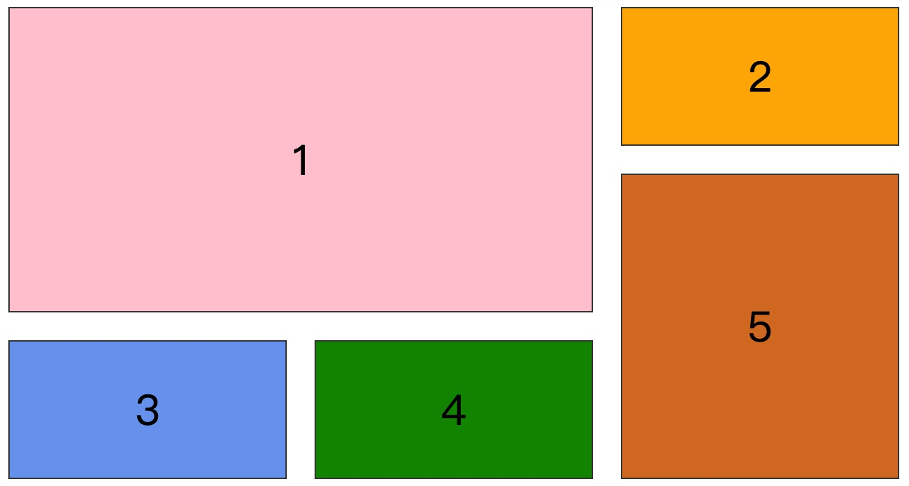
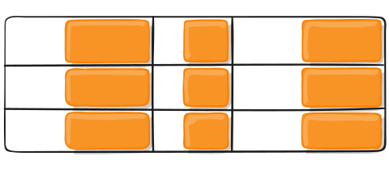
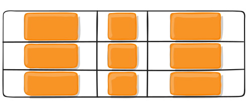

# 一、概述

Grid 布局是网站设计的基础，CSS Grid 是创建网格布局最强大和最简单的工具。它是一个二维的基于网格的布局系统，其目的只在于完全改变我们设计基于网格的用户界面的方式。 CSS一直用来布局网页，但一直都不完美。 一开始我们使用table 做布局，然后转向浮动、定位以及inline-block，但所有这些方法本质上都是 Hack 的方式，并且遗漏了很多重要的功能（例如垂直居中）。 Flexbox的出现在一定程度上解决了这个问题，但是它的目的是为了更简单的一维布局，而不是复杂的二维布局（Flexbox和Grid实际上一起工作得很好）。 只要我们一直在制作网站，我们就一直在为解决布局问题不断探索， 而Grid是第一个专门为解决布局问题而生的CSS模块。



上图这样的布局，就是 Grid 布局的拿手好戏。

CSS Grid 布局由两个核心组成，分别是 **container**（父元素）和 **items**（子元素）。 container 是实际的 grid（网格），items 是 grid（网格）内的内容。

# 二、基础

一开始你需要使用 `display：grid` 把容器元素定义为一个网格，使用 `grid-template-columns` 和 `grid-template-rows` 设置列和行大小，然后使用 `grid-column`  和 `grid-row` 把它的子元素放入网格。 与flexbox类似，网格子元素的原始顺序不重要。 你可以在 CSS 里以任意顺序放置它们，这使得使用媒体查询重新排列网格变得非常容易。 想象一下，我们需要定义整个页面的布局，然后为了适应不同的屏幕宽度完全重新排列，我们只需要几行CSS就能实现这个需求。 网格是有史以来最强大的CSS模块之一。

截至2017年3月，许多浏览器都提供了原生的、不加前缀的对CSS Grid的支持，比如 Chrome（包括Android），Firefox，Safari（包括iOS）和Opera。 另一方面，Internet Explorer 10和11支持它，但需要使用过时的语法。 Edge浏览器已经宣布将支持标准的Grid语法，但暂未支持

> 提示：浏览器支持的详细数据可在[Caniuse](https://caniuse.com/#feat=css-grid)查看。其中里面的数字表示该版本以上的浏览器支持Grid。

# 三、概念

## 1. Grid Container

网格容器->设置了 `display: gird ` 的元素。 这是所有grid item的直接父项。 在下面的例子中，`.container` 就是是 grid container。

```html
<ul class="container" style="display:grid;">
  <li class="item item-1"></li>
  <li class="item item-2"></li>
  <li class="item item-3"></li>
</ul> 
```

## 2. Grid Item

网格项 -> Grid 容器的直接子元素。下面的 `.item` 元素就是 grid item，但 `.sub-item`不是。

```html
<ul class="container" style="display:grid;">
  <li class="item"></li> 
  <li class="item"><p class="sub-item"></p></li>
  <li class="item"></li>
</ul>
```

## 3. Grid Line

划分网格的线，称为"网格线"（grid line）。水平网格线划分出行，垂直网格线划分出列。

正常情况下，`n`行有`n + 1`根水平网格线，`m`列有`m + 1`根垂直网格线，比如三行就有四根水平网格线。


## 4. Grid Track

两个相邻网格线之间的空间。 你可以把它们想象成网格的列或行。 下面是第二行和第三行网格线之间的网格轨道。


## 5. Grid Cell

两个相邻的行和两个相邻的列网格线之间的空间。它是网格的一个“单元”。 下面是行网格线1和2之间以及列网格线2和3的网格单元。


## 6. Grid Area 

四个网格线包围的总空间。 网格区域可以由任意数量的网格单元组成。 下面是行网格线1和3以及列网格线1和3之间的网格区域。


# 四、技巧

要熟练掌握一门技术，核心就是找到其最基本的套路，然后不断练习从而可以在之后的实践过程中减少决策的时间。所以，这一部分主要就是介绍网格布局构建过程中的一些常用套路。 这里我们要解决的问题是，如何利用最基本的规则来构建出理想的布局模型。在布局过程中，归根结底需要处理的就两种页面元素：父容器和子元素。前者主要用来设置基础的布局框架，相当于建筑中的设计蓝图，而后者就是用来进行个性化的布局调整。因此我个人归纳了在使用网格布局过程中的套路是：针对父容器元素进行设置需要三个步骤：定框架、设间隔和找对齐，对子元素来说有两个步骤：摆位置和找对齐。我把它们统称为 **“32构建之法”**。

# 四、容器属性

## 01. display

定义网格：

```css
.container { display: grid | inline-grid; }
```

https://jsbin.com/qatitav/edit?html,css,output

https://jsbin.com/guvivum/edit?html,css,output

> 注意，设为网格布局以后，容器子元素（项目）的`float`、`display: inline-block`、`display: table-cell`、`vertical-align`和`column-*`等设置都将失效。

## 02. grid-template-columns、grid-template-rows

使用以空格分隔的多个值来定义网格的列和行。这些值表示网格轨道大小（宽/高），它们之间的空格表示网格线。 

```CSS
.container {
  grid-template-columns: <track-size> ... | <[line-name]> <track-size> ...;
  grid-template-rows: <track-size> ... | <[line-name]> <track-size> ...;
}
```

– `<track-size>`： 可以是长度值，百分比，或者等份网格容器中可用空间（使用 `fr` 单位）
– `<line-name>`：网格线名称

示例：

```CSS
.container {
    display: grid;
    grid-template-columns: 200px 200px 200px;
    grid-template-rows: 100px 100px;
}
```


提示：

- 当你在 网格轨道(Grid Track) 值之间留出空格时，网格线会自动分配正数和负数名称，计数从1或-1开始。
- 你可以用中括号明确指定网格线名称，如果要设置多个名称用空格隔开。
- 如果你的定义包含多个重复值，则可以使用 `repeat()` 表示法来简化定义。
- 你可以使用 `fr` 单位平分剩余空间。

## 03. grid-template

该属性用于简写 *grid-template-columns* 和 *grid-template-rows*，其语法形式如下：

```css
.container {
	grid-template: grid-template-rows / grid-template-columns
}
```

## 04. grid-template-areas

通过引用 [`grid-area`](https://www.css88.com/archives/8510#prop-grid-area) 属性指定的网格区域名称来定义网格模板。重复网格区域的名称导致内容跨越这些单元格。一个点号（`.`）代表一个空单元格。这个语法本身可视作网格的可视化结构。

值：

- `<grid-area-name>`：由网格项的 [`grid-area`](https://www.css88.com/archives/8510#prop-grid-area) 指定的网格区域名称
- `.`（点号） ：代表一个空的网格单元
- `none`：不定义网格区域

```html
<div class="container">
    <header class="head">头部</header>
    <div class="ct">内容</div>
    <aside class="aside">侧边栏</aside>
    <footer class="foot">尾部</footer>
</div>
```

```css
.container {
    color: #fff;
    display: grid;
    grid-template-rows: 100px 400px 100px;
    grid-template-columns: 80% calc(20% - 10px);
    grid-gap: 10px;
    grid-template-areas:
        "header header"
        "ct aside"
        "footer footer";
}

/* 头部 */
.head {
    background: orange;
    grid-area: header;
}

/* 尾部 */
.foot {
    background: pink;
    grid-area: footer;
}

/* 内容 */
.ct {
    background: green;
    grid-area: ct;
}

/* 侧边栏 */
.aside {
    background: cornflowerblue;
    grid-area: aside;
}
```

效果如下：


## 05. grid-gap

设置网格间距，其语法形式如下：

```css
.container {
  grid-gap: <grid-row-gap> <grid-column-gap>;
}
```

```css
.container {
    margin: 50px 20px;
    display: grid;
    grid-template-columns: repeat(3, 200px);
    grid-template-rows: repeat(2, 100px);
    grid-gap: 30px 50px;
}
```


> 提示：只能在 列/行 之间创建间距，网格外部边缘不会有这个间距。

## 06. justify-items

设置子元素在网格单元格里沿着主轴的对齐方式。

值：

- `start`：将网格项对齐到其单元格的左侧起始边缘（左侧对齐）
- `end`：将网格项对齐到其单元格的右侧结束边缘（右侧对齐）
- `center`：将网格项对齐到其单元格的水平中间位置（水平居中对齐）
- `stretch`：填满单元格的宽度（默认值）

语法形式如下：

```css
.container {
  justify-items: start | end | center | stretch;
}
```

代码示例如下：

```css
.container {
  justify-items: start;
}
```


```CSS
.container{
  justify-items: end;
}
```



```css
.container{
  justify-items: center;
}
```



```css
.container{
  justify-items: stretch;
}
```


> 注意：这些行为也可以通过每个单独网格项(grid items) 的 [`justify-self`](https://www.css88.com/archives/8510#prop-justify-self) 属性设置

## 07. align-items

设置子元素在网格单元格里沿着交叉轴的对齐方式。

值：

- `start`：将网格项对齐到其单元格的顶部起始边缘（顶部对齐）
- `end`：将网格项对齐到其单元格的底部结束边缘（底部对齐）
- `center`：将网格项对齐到其单元格的垂直中间位置（垂直居中对齐）
- `stretch`：填满单元格的高度（默认值）

语法形式：

```css
.container {
  align-items: start | end | center | stretch;
}
```

> 提示：*align-items* 与 *justify-items* 效果类似，只是方向不同，*align-items* 控制垂直方向的对齐方式，*justify-items* 控制水平方向的对齐方式，这里不再演示。

## 08. place-items

`place-items` 是设置 `align-items` 和 `justify-items` 的简写形式。其语法形式如下：

```css
.container {
  place-items: <align-items> <justify-items>
}
```

> 提示：如果省略第二个值，则将第一个值同时分配给这两个属性。

> 注意：除 Edge 之外的所有主要浏览器都支持 `place-items` 简写属性。

## 09. justify-content

有时，你的网格合计大小可能小于其网格容器（grid container）大小。 如果你的所有 网格项（grid items）都使用像 `px` 这样的非灵活单位设置大小，就可能出现这种情况。在这种情况下，您可以设置网格容器内的网格的对齐方式。此属性沿着 *inline*（行/水平/X）轴线对齐网格。

值：

- `start`：将网格对齐到网格容器(grid container) 的左侧起始边缘（左侧对齐）
- `end`：将网格对齐到 网格容器 的右侧结束边缘（右侧对齐）
- `center`：将网格对齐到 网格容器 的水平中间位置（水平居中对齐）
- `stretch`：调整 网格项(grid items) 的宽度，允许该网格填充满整个 网格容器 的宽度
- `space-around`：在每个网格项之间放置一个均匀的空间，左右两端放置一半的空间
- `space-between`：在每个网格项之间放置一个均匀的空间，左右两端没有空间
- `space-evenly`：在每个网格项目之间放置一个均匀的空间，左右两端放置一个均匀的空间

语法形式：

```css
.container {
  justify-content: start | end | center | stretch | space-around | space-between | space-evenly;    

```

代码示例：

```css
.container {
  justify-content: start;
}
```


```css
.container {
  justify-content: end;
}
```


```CSS
.container {
  justify-content: center;
}
```


```CSS
.container {
  justify-content: stretch;
}
```


```css
.container {
  justify-content: space-around;
}
```


```CSS
.container {
  justify-content: space-between;
}
```


```CSS
.container {
  justify-content: space-evenly;
}
```


## 10. align-content

该属性与 *justify-content* 完全类似，二者都是在网格合计大小小于其网格容器大小时指定网格在网格容器中的对齐方式。唯一的区别在  *justify-content* 控制的是水平方向的对齐方式，而 *align-content* 控制的是垂直方向的对齐方式。这里不再累述。

## 11. place-content 

`place-content` 是设置 `align-content` 和 `justify-content` 的简写形式。语法形式如下：

```css
.container {
  place-content:<align-content> <justify-content>;
}
```

如果省略第二个值，则将第一个值同时分配给这两个属性。

> 注意：除 Edge 之外的所有主要浏览器都支持 `place-content` 简写属性。

# 五、网格项属性

## 01. grid-column、grid-row

通过指定特定的网格线来确定网格项在网格中的位置。

```css
.item {
	grid-row: grid-row-start / grid-row-end:;
	grid-column: grid-column-start/ grid-column-end;
}
```

## 02. grid-area

为网格项提供一个名称，以便可以被使用网格容器 [`grid-template-areas`](https://www.css88.com/archives/8510#prop-grid-template-areas) 属性创建的模板进行引用。 另外，这个属性可以用作[`grid-row-start`](https://www.css88.com/archives/8510#prop-grid-column-row-start-end) + [`grid-column-start`](https://www.css88.com/archives/8510#prop-grid-column-row-start-end) + [`grid-row-end`](https://www.css88.com/archives/8510#prop-grid-column-row-start-end) + [`grid-column-end`](https://www.css88.com/archives/8510#prop-grid-column-row-start-end)的简写。

值：

- `<name>`：你所选的名称
- `<row-start> / <column-start> / <row-end> / <column-end>`：数字或分隔线名称

语法：

```css
.item {
  grid-area: <name> | <row-start> / <column-start> / <row-end> / <column-end>;
}
```

## 03. justify-self

单独设置某个子元素沿着 **inline**轴线对齐网格项，类似于 `justfy-items`。

## 04. align-self

单独设置某个子元素沿着 **inline**轴线对齐网格项，类似于 `align-items`。

## 05. place-self

类似于`lace-items` ，是设置 `align-self` 和 `justify-self` 的简写形式。

# 六、参考链接

<https://css-tricks.com/snippets/css/complete-guide-grid/>


